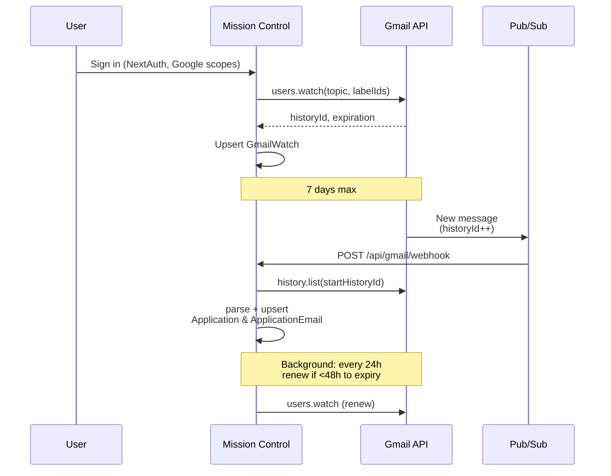
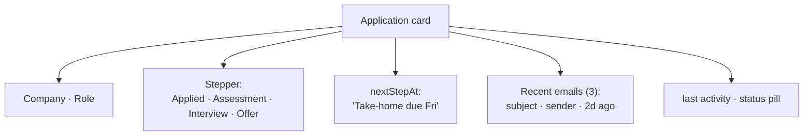

# Applications dash — user stories & target architecture

The Applications dash tracks job/internship applications and surfaces progress
based on the user's actual Gmail traffic. Pub/Sub-driven email parsing already
exists; what's missing is the connective tissue between parsed emails and the
UI, plus a reliable way to keep the Gmail watch alive.

This document is the source of truth for what the feature should do. Update it
when behavior changes.

## User stories

These are written from the user's perspective ("I" = the signed-in user).

### Pipeline visibility

1. **As a user**, I see every application I've started in a Kanban grouped by
   status (Applied / Assessment / Interviewing / Offer / Archive), so I can tell
   at a glance where each one stands.
2. **As a user**, I can tell which stage each application has reached *and*
   which stages are still ahead of it, via a small stepper on the card —
   e.g. `Applied · Assessment · Interview · Offer` with the reached steps
   highlighted.
3. **As a user**, when an application has been rejected, the stepper is
   collapsed into a clear `Rejected` state instead of showing a half-filled bar.

### Email-driven progress

4. **As a user**, when a recruiter emails me about an existing application
   (assessment link, interview invite, offer, rejection), within ~30s the
   matching card updates its status, `nextSteps`, and a new email row appears in
   the card's recent-emails list.
5. **As a user**, I can see the last 3–5 emails that drove the current state,
   each with subject, sender, and received-at timestamp, so I can verify *why*
   the system thinks I'm at this stage.
6. **As a user**, the card shows a small "last activity" indicator (e.g.
   `2 emails · 3d ago`) so stale applications visually fade.

### Next-step deadlines

7. **As a user**, when an email contains a date — interview slot, take-home
   deadline, offer-decision-by — that date is surfaced on the card as a
   highlighted "next step by" line, separate from the free-text `nextSteps`
   summary.
8. **As a user**, the same dates also appear in the existing **Upcoming
   Interviews** calendar widget, so I have one place to see what's due.

### Robustness

9. **As a user**, when my Pub/Sub watch silently expires (Google enforces a
   ~7-day max), the system renews it on its own — I should never have to
   re-authorize unless I revoke access.
10. **As a user**, if I doubt the auto-sync is working, the Account Status
    card tells me when emails were last received (per Pub/Sub) and when the
    watch was last renewed.

### Out of scope (for now)

- Manual application creation / editing in the UI.
- Manual linking of an email to a different application (correcting bad
  fuzzy matches).
- Multi-account Gmail.
- Surfacing rejection wording or sentiment beyond status.
- Reading emails that pre-date when the watch was first installed.

## Current state (as of 2026-05)

Implemented:

- `prisma/schema.prisma:107` — `Application { company, role, status, nextSteps,
  dateApplied, lastUpdateAt, … }`. No email link.
- `app/api/applications/route.ts` — `GET` only, returns rows for the session
  user.
- `app/api/gmail/webhook/route.ts` — Pub/Sub push receiver. Verifies OIDC,
  pulls `gmail.users.history.list`, filters subjects containing `application`
  or `interview`, calls `parseApplicationEmail()` (Gemini 3 Flash), and upserts
  by **substring company match**. Broadcasts an SSE event.
- `lib/email-parser.ts` — Zod-typed extraction: company, role, status,
  nextSteps, `extractedDates[]`. **`extractedDates` is currently discarded.**
- `components/views/ApplicationsView.tsx` — Kanban + Calendar + Account Status.
  No stepper, no email list, no per-card progress signal beyond the status
  string.

Missing:

- No table linking emails to applications.
- No per-application detail (emails, dates) in the API or UI.
- No `gmail.users.watch` install/renew pipeline — the webhook is wired up but
  may never fire, depending on whether `watch` was ever called for the user.
- Company matching is naive `contains()`; sibling applications at the same
  company collide.

## Target architecture

### Data model changes

Add to `prisma/schema.prisma`:

```prisma
model Application {
  // ... existing fields ...
  nextStepAt    DateTime?       // surfaced from parsed extractedDates
  emails        ApplicationEmail[]
}

model ApplicationEmail {
  id            String      @id @default(cuid())
  applicationId String
  messageId     String      @unique          // Gmail message id
  threadId      String?
  subject       String
  fromAddress   String
  receivedAt    DateTime
  snippet       String?                       // Gmail snippet, for the UI list
  parsedStatus  String?                       // status the parser returned for this email
  createdAt     DateTime    @default(now())

  application   Application @relation(fields: [applicationId], references: [id], onDelete: Cascade)

  @@index([applicationId, receivedAt])
}

model GmailWatch {
  userId       String   @id
  historyId    String                          // last historyId we saw / installed with
  expiresAt    DateTime                        // Google returns expiration in ms
  installedAt  DateTime @default(now())
  updatedAt    DateTime @updatedAt
}
```

`GmailWatch.userId` is `@id` (one watch per user — Gmail enforces this anyway).

### API additions

| Method | Path                                    | Purpose                                              |
| ------ | --------------------------------------- | ---------------------------------------------------- |
| GET    | `/api/applications`                     | Now returns `emails: ApplicationEmail[]` (last N) and `nextStepAt` per row. |
| POST   | `/api/gmail/watch`                      | Calls `gmail.users.watch` for the signed-in user, upserts `GmailWatch`. Idempotent — safe to call repeatedly. |
| GET    | `/api/gmail/watch`                      | Returns current watch state (`expiresAt`, `installedAt`) for the Account Status card. |

The webhook route stays at `/api/gmail/webhook` but is updated (see below).

### Webhook changes (`app/api/gmail/webhook/route.ts`)

1. Drop the subject-substring filter. Send every new message into the parser
   and let the LLM decide if it's application-related (parser returns
   `null`/throws → skip).
2. After a successful parse + upsert, insert an `ApplicationEmail` row linking
   the Gmail `messageId`/`threadId`/`subject`/`from`/`internalDate`/`snippet`
   to the `Application`.
3. Map `parsed.extractedDates[0]` → `Application.nextStepAt` when present and
   in the future.
4. Update `GmailWatch.historyId` to the highest `historyId` seen so the next
   delivery resumes from the right point.

### Watch lifecycle



Renewal is the *only* tricky piece. Two options:

- **A — lazy renewal at request time**: every `GET /api/applications` checks
  `GmailWatch.expiresAt`; if `<48h`, fire-and-forget `users.watch()`. Simple,
  no scheduler, but only runs while the user is active.
- **B — scheduled renewal**: a cron route (e.g. Vercel cron / launch-ms.sh
  process) that walks `GmailWatch` rows and renews any expiring soon.

Start with **A**. Add B only if users report drops after long absences.

### UI changes (`components/views/ApplicationsView.tsx` + new components)

`renderKanbanItem` gains a fixed-height footer block:



New components, all under `components/widgets/applications/`:

- `ApplicationStepper.tsx` — pure prop-driven stepper for the 4 forward states
  + a `Rejected` collapsed variant.
- `ApplicationEmailList.tsx` — vertical list, max 3 rows, `subject`/`from`/
  relative time. Empty state: "No emails linked yet."
- `ApplicationNextStep.tsx` — formats `nextStepAt` as a relative-day pill
  (`Due in 3d`, `Overdue 1d`).

The Account Status card gets a sub-line:
`Watch active · expires in 5d · last email 12m ago` driven by
`GET /api/gmail/watch` + the latest `ApplicationEmail.receivedAt`.

### Matching robustness

For now, keep `contains()` but normalize both sides:

- Lowercase, strip punctuation, collapse whitespace, drop common suffixes
  (`Inc`, `LLC`, `Corp`, `Co`).
- Add a fallback: match by sender domain → known company alias map (small
  in-memory table to start; promote to a Prisma table only if the alias list
  grows).

True fuzzy matching (Levenshtein, embeddings) is out of scope here — a manual
"link this email to …" UI is a better lever and is tracked under the
out-of-scope section above.

## Phase 1 — minimal fix (this branch)

Goal: emails appear next to applied items with a working progress indicator.

1. Schema: add `ApplicationEmail`, `GmailWatch`, `Application.nextStepAt`.
   `npx prisma migrate dev --name application-emails`.
2. Webhook: link emails → `ApplicationEmail`, set `nextStepAt`.
3. New routes: `POST /api/gmail/watch`, `GET /api/gmail/watch`. Update `GET
   /api/applications` to include `emails` (last 5) and `nextStepAt`.
4. UI: `ApplicationStepper`, `ApplicationEmailList`, `ApplicationNextStep`.
   Wire into `ApplicationsView.renderKanbanItem`.
5. Lazy watch renewal in `GET /api/applications` (Option A above).
6. Update `docs/apis.md` and `docs/architecture.md` to point here.

Phase 2+ (manual link UI, scheduled renewal, alias table) lives in this doc's
"Out of scope" list and gets promoted into its own implementation doc when
prioritized.
