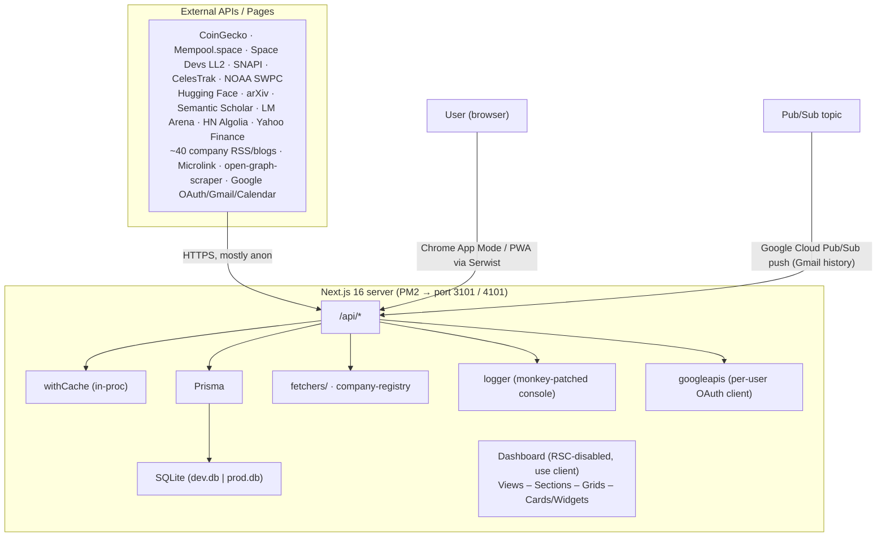
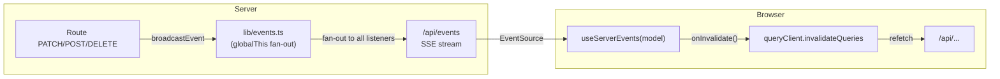
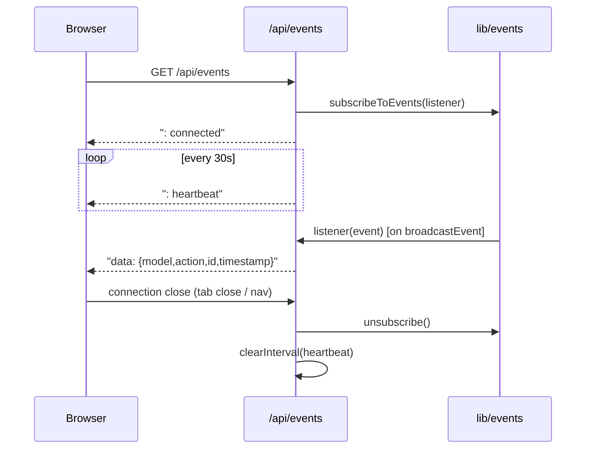
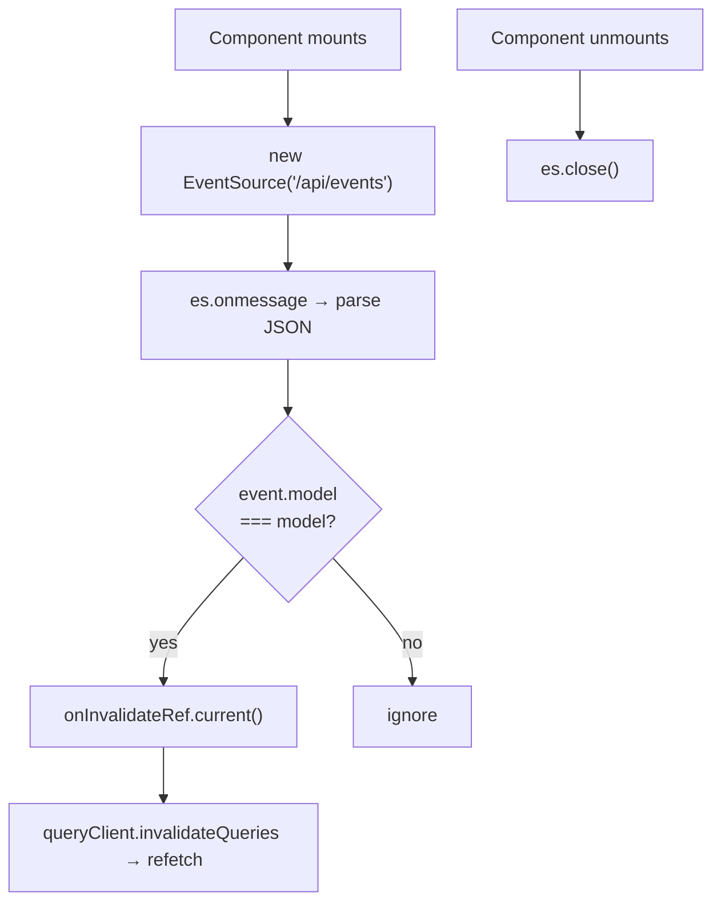
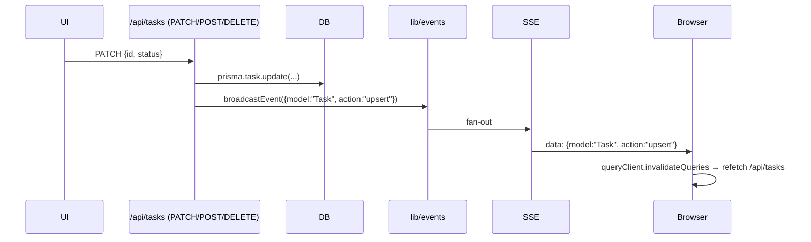
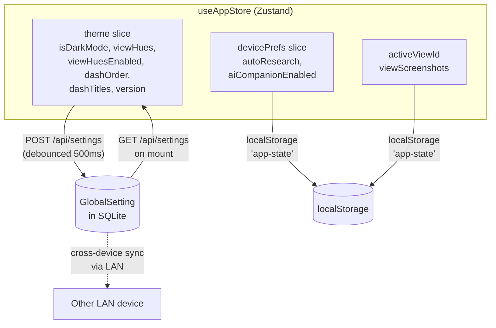
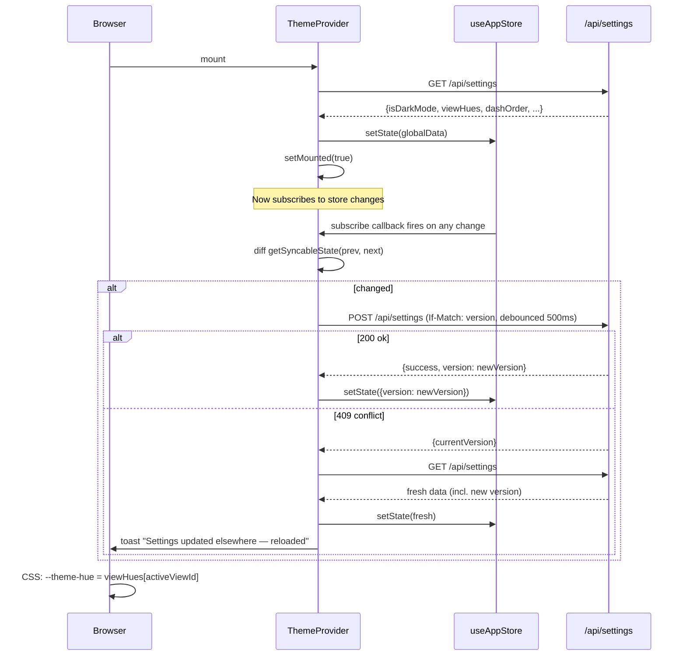
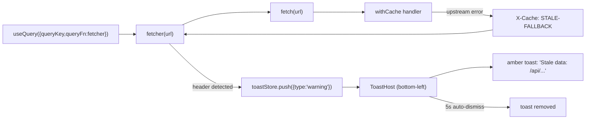
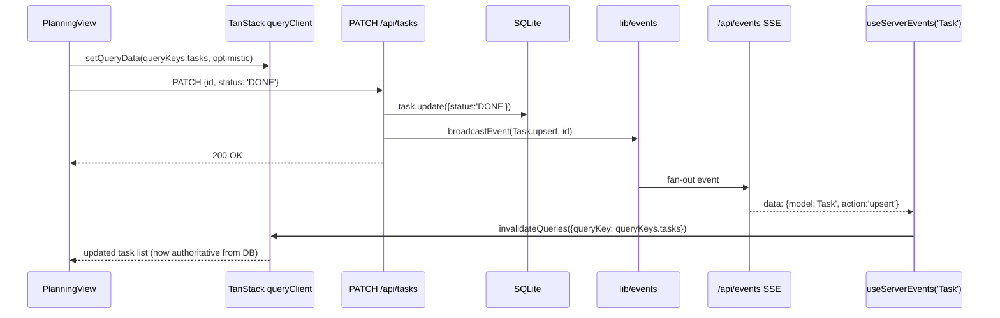

# Architecture Design Review

> **Document scope.** This is a synthesis review of the Mission Control system as it exists in the repository today. It complements the surface-level documents in `docs/` (`apis.md`, `frontend_terminology.md`, `hosting.md`) by describing the system as a whole — its goals, layers, data flows, integration points, deployment model, observability, and the trade-offs and risks embedded in the current design. Where this document and the surface docs disagree, this document reflects what the code actually does.

---

## 1. Goals and Operating Context

Mission Control is a **single-user, self-hosted dashboard** that aggregates real-time and curated information across several life/work domains and exposes interactive control over a subset of them. It is not a SaaS product: it runs on the author's Mac mini at home, is reached locally (and intended to be reached from the LAN/PWA), and is consumed primarily through a Chrome "App Mode" window opened by `launch-ms.sh`.

The intentional design constraints that shape every other decision below are:

1. **Single user, single host.** Auth, session model, DB, caches, and hosting are all designed around one operator. There is no multi-tenancy, no horizontal scaling story, no role model.
2. **Always-on background process.** The production server is a persistent PM2 process; the UI is a thin client over it. Server uptime is part of the user experience.
3. **Hardware budget is small.** Mac mini RAM is the binding resource. Dev is capped at 2 GB old-space, prod at 1 GB (`package.json` scripts). Every "is it worth caching" decision is biased toward "yes."
4. **External APIs are flaky and rate-limited.** Most data does not originate here. The system's job is to wrap, normalize, cache, and degrade gracefully around a long tail of third-party APIs and HTML pages.
5. **The author is the only consumer.** "Documented" can mean "in `docs/`," secrets can live in `.env`, and a feature can ship behind a `console.log`. This is reflected in the level of error-handling and validation throughout.

Everything that looks "weird" in the codebase — markdown-as-source-of-truth, in-process pub/sub for logs, an in-memory cache that survives HMR via `globalThis`, hand-written HTML scrapers per company — is downstream of these constraints.

---

## 2. System Context



The system has **one inbound integration that is not user-driven**: Google Cloud Pub/Sub pushes Gmail history events to `POST /api/gmail/webhook`. Everything else is initiated by the browser polling or fetching on demand.

---

## 3. Layered Architecture

The codebase is organized along the lines defined in `docs/frontend_terminology.md`. The full layering, including the server-side mirror, is:

| Layer | Location | Responsibility |
|---|---|---|
| **Hosting / Process** | `launch-ms.sh`, PM2 | Process supervision, environment loading, port management, Chrome app launcher |
| **Framework** | `next.config.ts`, `instrumentation.ts`, `middleware.ts` | Next.js (webpack), Serwist PWA wrapping, request logging, in-process logger init |
| **Persistence** | `prisma/`, `lib/prisma.ts` | SQLite via Prisma; dual DB files for dev/prod; query-level logging via `$extends` |
| **Domain libraries** | `lib/` | `cache`, `auth`, `googleapis`, `email-parser`, `company-registry`, `fetchers/*`, `logger`, plus the resume-gen + profile + LLM subsystems (`ai/`, `profile/`, `resumes/`, `notifications/`, `postings/`, `watchlists/`, `applications/`) — see §4.2 + §8.4 + §8.5 |
| **HTTP API** | `app/api/**/route.ts` | Thin route handlers; dispatch to lib code; wrap with `withCache` where useful |
| **App shell** | `app/layout.tsx`, `app/page.tsx`, `app/globals.css`, `app/sw.ts` | Root providers, font loading, PWA SW, OKLCH theme variables |
| **Dashboard** | `components/Dashboard.tsx` | Slide carousel of dashes, global overlays (Launchpad, Library, AI Companion), bottom nav |
| **Views** | `components/views/*` | One per "dash" — owns data fetching for its section |
| **Sections** | `components/Section.tsx` | Thematic groupings inside a view, optional sub-headered groups |
| **Grids** | `components/grids/CardGrid.tsx` | Layout-only container; supports CSS-grid or CSS-columns masonry |
| **Cards** | `components/cards/*` | Bounded content units; receive data as props |
| **Widgets** | `components/widgets/*` | Stand-alone data/UX components (Kanban, Calendar, Graph, LaunchCalendar) |
| **Windows / Overlays** | `components/Window.tsx`, `components/overlays/*` | Floating/sliding UI that escapes the grid |
| **UI primitives** | `components/ui/*` | Card, ReloadButton, Scrollbar, PaperActions, TaskItem, CarouselControls |
| **State providers** | `components/providers/*` | NextAuth `SessionProvider`, `QueryProvider` (TanStack), `CacheInvalidationListener`, `ThemeProvider`, unified Zustand store (`useAppStore`) |

A read-through of any feature touches at least four of these layers (e.g., FinanceView → CardGrid → AssetPriceCard → `/api/finance` → `withCache` → CoinGecko + Prisma).

---

## 4. Data Architecture

### 4.1 Storage choice

Persistence is **SQLite via Prisma**, with two separate database files swapped by environment:

- `prisma/dev.db` — selected by `.env.development`
- `prisma/prod.db` — selected by `.env.production`

This is appropriate for the single-host use case but means **every restart of `next dev` and `next start` works on a different dataset** unless the user is careful. There is no migration story across environments other than re-running `prisma migrate dev`.

### 4.2 Schema overview

The Prisma schema groups into ten roughly orthogonal subdomains:

| Subdomain | Models | Purpose |
|---|---|---|
| **NextAuth** | `User`, `Account`, `Session`, `VerificationToken` | Standard NextAuth + Prisma adapter; stores Google refresh/access tokens on `Account` |
| **Applications pipeline** | `Application`, `ApplicationEvent`, `Contact` | Job/internship/admissions tracker; owned by user; fed by Gmail webhook + manual edits. `Application.normalizedCompany` + `senderDomain` are the dedup keys. `ApplicationEvent.notifiedAt` + `gcalSyncedAt` are per-event side-effect checkpoints. |
| **Profile + resume sources** | `Profile`, `WorkRole`, `Project`, `Education`, `ResumeUpload` | The user's structured profile (one `Profile` per user, with arrays of work roles / projects / education entries — each storing `bullets` as JSON-stringified `Bullet[]` and an optional per-entity `scratchpad` string of user-voice notes). `ResumeUpload` archives every raw PDF/DOCX/TXT/JSON the user has imported, with parsed text in `extractedText` for LLM grounding. Each entity (work role / project / education) also carries a `pinKeywords` JSON array — posting-category-conditional always-include (see §8.5). |
| **Generated resumes** | `GeneratedResume` | One row per tailored resume the user has produced. Stores `postingInput` (URL/text), `postingTitle`/`postingCompany`, `profileSnapshot` (full ProfileWire JSON at gen time), `selections` (flat bullet array post-prune), `skillsGap`, `tagline`, `templateKey`, `format`, `artifactPath` → `data/resumes/<id>.<ext>`, optional `applicationId` link to the Application this resume was sent for. Status field gates the rendered/error states. |
| **Job discovery** | `Watchlist`, `JobPosting`, `Notification` | `Watchlist` rows declare what to crawl (careers page / Greenhouse / Lever / Ashby / Workday / LinkedIn / Indeed / company directory). `JobPosting` is the deduped result row across crawls (`(watchlistId, externalId)` unique, plus `(boardKind, externalId)` cross-watchlist dedup). `Notification` is the in-app bell + email dispatcher target with a `dedupKey` for daily-bucketed notifs. |
| **Calendar sync** | `GcalSyncState` | Per-user pagination state for the Google Calendar sync job. Stores the `nextSyncToken` so a daily tick only pulls the delta. |
| **Webhook dedup** | `WebhookDelivery` | First action in `/api/gmail/webhook` is `INSERT OR IGNORE` on `messageId`; P2002 → "redelivery → 200" without re-running ingest. Daily prune at 30 days. |
| **Research library** | `SavedPaper`, `SelectedHistoricalPaper`, `SelectedReviewPaper` | User's saved papers + per-week deduplication ledgers for "paper of the week" features |
| **Tasks / Goals** | `Task`, `LifeGoal` | Both DB-native. The `Task` table is the source of truth (a previous `docs/todo.md` ↔ DB sync was removed; the archived file lives at `docs/todo.archive.md`). |
| **Settings + Cache** | `GlobalSetting`, `CacheEntry` | One settings row keyed `"global"` with typed columns for theme prefs + a `version` integer for optimistic concurrency. `CacheEntry` is the durable L2 backing for `withCache` (gated by `CACHE_BACKEND=sqlite`); the scheduler prunes expired rows. |

Notable race-safety + dedup invariants baked into the schema (don't paper over by bypassing):
- `Application` has both `normalizedCompany` (LLM-class company name) and `senderDomain` (Gmail From-header host) as dedup keys; ingest tries company first, falls back to senderDomain on miss so CSULB / Cal State Long Beach / California State University Long Beach all collapse to one row.
- `ApplicationEvent` has `notifiedAt` + `gcalSyncedAt` so re-ingest of the same Gmail message only fires side-effects (email, calendar sync) once per event.
- `Notification.dedupKey @unique` — `dispatchNotification` returns null when the dedupKey is already taken; callers passing dedupKey MUST handle null. Use `utcDateBucket()` from `lib/notifications/dispatch.ts` for date buckets.
- `Watchlist.directoryKey` — when set, `config` is hydrated at read time from `COMPANY_DIRECTORY` via `lib/watchlists/hydrate.ts`. Manual PATCH to `config` clears the key so user overrides stick.
- Ordering for tasks is by `Task.position` (integer), backfilled from the old `lineNumber` column when the markdown sync was removed.

Bullets inside `WorkRole.bullets` / `Project.bullets` / `Education.bullets` are stored as a JSON-stringified `Bullet[]` with the shape `{id, text, tags[], autoTags[], removedTags[], pinnedTags[], locked, excluded}` — see `lib/profile/types.ts`. The JSON shape evolves without migrations; `parseBullets` filters malformed entries and `hydrateBulletDefaults` back-fills new fields with `[]`.

### 4.3 Data flow patterns

The codebase uses **five distinct data-flow patterns**, each appropriate to a different class of data:

1. **External-API-only, fully cached** — most space/AI/research/news endpoints. `withCache(handler, ttl)` is the only persistence; on error, last-good is served. Examples: `/api/space/launches`, `/api/research`, `/api/ai/llmleaderboard`, `/api/company-news`.
2. **External + DB ledger** — `selectedReviewPaper` and `selectedHistoricalPaper` deduplicate weekly picks, and the historical/review endpoints check DB first before re-querying arXiv. The DB is a *commitment log*, not a cache.
3. **Pulsar-fronted financial data** — `/api/finance` and `/api/finance/history` proxy to a sibling PM2 process (`salsquared/pulsar`) over REST; `lib/pulsar-ws-relay.ts` keeps a long-lived WebSocket open against `${PULSAR_URL}/ws/prices` and rebroadcasts each tick as a `FinanceTick` SSE event so connected clients invalidate their `'finance'` query within seconds. Pulsar owns ingestion (CoinGecko, Mempool, Yahoo, FRED, ExchangeRate); mission-control owns no crypto state itself.
4. **DB-native CRUD + SSE invalidation** — `Task`, `LifeGoal`, `Application`/`ApplicationEvent`, etc. The route writes the DB and immediately broadcasts a typed `ServerEvent` on the in-process bus; connected SSE clients invalidate the matching TanStack query and refetch. No file-side projection or watcher to keep in sync.
5. **External event-driven** — Google Cloud Pub/Sub pushes Gmail history events to `/api/gmail/webhook`, which decodes the base64 envelope, calls `gmail.users.history.list`, fetches new messages, and runs them through `parseApplicationEmail` (Gemini 3.5 Flash via `@ai-sdk/google`) to upsert `Application` rows. This is the only inbound integration.

Pattern 1 is the dominant one: **most endpoints are stateless cache-fronted external proxies.**

---

## 5. API Layer

### 5.1 Catalog (by feature area)

A complete inventory is maintained in `docs/apis.md`. The brief by-feature breakdown:

- **Auth** — `[...nextauth]` only. Google provider; offline access; Gmail r/o + Gmail send + Calendar events scopes.
- **System** — `/api/system` (telemetry — CPU, RSS, uptime, DB ping, cache stats), `/api/system/logs` (SSE stream), `/api/system/logs/historical` (PM2 log tail), `/api/system/cache/invalidate` (operator-triggered `withCache` invalidation).
- **AI** — `/api/ai` (HN Algolia AI stories), `/api/ai/llmleaderboard` (LM Arena scrape).
- **Research** — `/api/research`, `/research/hf`, `/research/historical`, `/research/review`, `/research/import`, `/research/saved`. Backed by Hugging Face Daily Papers, arXiv RSS, Semantic Scholar batch enrichment.
- **Finance** — `/api/finance`, `/api/finance/history`. Both proxy Pulsar (`PULSAR_URL`); mission-control no longer talks to CoinGecko/Mempool/Yahoo directly. `FinanceTick` SSE events from `lib/pulsar-ws-relay.ts` push live updates to the frontend.
- **Space** — `/api/space` (SNAPI), `/space/launches` (Space Devs LL2), `/space/satellites` (CelesTrak), `/space/solar` (NOAA SWPC), `/space/moon` (deterministic ephemeris + hardcoded phenomena).
- **Company news** — `/api/company-news?company=<id>`. Adapter-dispatched (see §6).
- **Applications / Calendar / Gmail** — `/api/applications` (kanban CRUD + filters), `/api/applications/events` (per-app event log), `/api/applications/events/adopt` (link existing Calendar event), `/api/applications/pipeline-picker` (resume-card filter to INTERESTED + has-sourceUrl), `/api/applications/backfill` (one-time 6-month inbox scan), `/api/calendar/event` (Google Calendar; accepts session **or** `SERVICE_TOKEN_PULSAR` + `?onBehalfOf=<userId>`), `/api/gmail/webhook` (Pub/Sub push, OIDC-verified).
- **Profile (resume source-of-truth)** — `/api/profile` (GET + PATCH on top-level fields: headline, tagline, location, email, phone, links, skills, hobbies, languages). Per-entity CRUD: `/api/profile/work-roles` (POST/PATCH/DELETE), `/api/profile/projects`, `/api/profile/education`. Plus `/api/profile/snapshots` (M7.5 — versioned snapshots with rollback deferred), `/api/profile/import` (multi-resume upload → LLM extract → append-merge), `/api/profile/tagline/draft` (posting-agnostic AI tagline draft), `/api/profile/bullets/assist` (per-bullet fill / rewrite via wand icon), `/api/profile/bullets/tags/suggest` (per-bullet on-demand tag refresh), `/api/profile/bullets/scratchpad` (per-entity user-voice notes overlay). All session-gated.
- **Resumes (tailored generation)** — `POST /api/resumes` runs the full relevance pipeline (see §8.5) and returns `{ generatedResume, bytes }`. `GET /api/resumes` returns the user's resume archive (optional `?applicationId=` filter + `?limit=` clamp). `GET /api/resumes/[id]` returns one row. `GET /api/resumes/[id]/download` streams the PDF/DOCX artifact from `data/resumes/`. `POST /api/resumes/diff` compares two generated resumes side-by-side.
- **Watchlists (job discovery)** — `/api/watchlists` (CRUD), `/api/watchlists/[id]` (single row), `/api/watchlists/[id]/run` (operator-triggered "run now" — DB mutex via `inFlightAt` to prevent cross-process duplicate fetches). Discovery results land as `JobPosting` rows; the scheduler runs the `job-watcher` job hourly.
- **Notifications (in-app bell + email dispatcher)** — `/api/notifications` (list, mark-read), `/api/notifications/[id]` (single). Backed by `Notification` rows with `dedupKey @unique` (see §4.2). `dispatchNotification` is the entry point; emails go through Gmail Send API when `EMAIL_ENABLED=1`.
- **Tasks / Goals / Settings** — `/api/tasks` (DB CRUD: GET/POST/PATCH/DELETE), `/api/goals` (DB CRUD on `LifeGoal`), `/api/settings` (typed `GlobalSetting` columns with `version`-based optimistic concurrency via `If-Match`).
- **Events** — `/api/events` is the SSE channel for every model invalidation (`Task`, `Goal`, `SavedPaper`, `Application`, `CalendarEvent`, `Setting`, `FinanceTick`, `Cache`, `Profile`, `GeneratedResume`, `Notification`, `Watchlist`, `JobPosting`).

### 5.2 Cross-cutting concerns

- **Middleware** (`proxy.ts` — Next 16 renamed `middleware.ts`) — only logs `/api/*` requests via `console.info`. The matcher is narrow on purpose; broadening it sweeps assets and pages into the in-app log viewer.
- **Caching** (`lib/cache.ts`) — two-tier: an L1 process-memory `Map<string, {data, expiry}>` and an L2 `CacheEntry` SQLite table (gated by `CACHE_BACKEND=sqlite`), both keyed by `pathname + sorted query` (the `?v=...` cache buster is stripped before keying and forces a refresh). In-flight dedup: a second concurrent miss for the same key awaits the existing promise. On handler error or non-2xx response, the last good entry is served and rewritten with a 60 s retry TTL. Operator-triggered invalidation via `invalidateCacheKey`/`invalidateCacheByPrefix` clears L1+L2 and broadcasts a `Cache` SSE event so connected clients refetch. `Cache-Control` is `no-store` in dev and `max-age + stale-while-revalidate` in prod. Stats survive HMR via `globalThis`.
- **Auth gating** — three guards in `lib/auth-guards.ts`: `requireSession()` (NextAuth session required), `requireLocalOrSession(req)` (LAN traffic skips auth, public hostnames require session), and `requireSessionOrService(req, config)` (accepts either a session or a configured service token + matching `?onBehalfOf=<userId>`, used today by `/api/calendar/event`). The Gmail webhook verifies a Google-issued OIDC JWT against `PUBSUB_AUDIENCE` via `lib/google-oidc.ts`.
- **Logging** — every route logs `[EXTERNAL API]`, `[DATABASE]`, `[CACHE HIT|MISS|FALLBACK]` lines through the patched `console`, which the SSE log stream re-broadcasts.

### 5.3 Conventions worth preserving

- `?v=<timestamp>` is the standard "force refresh" idiom across the frontend, handled inside `withCache`.
- Routes that fetch external data should be wrapped in `withCache`; bare `fetch` per request is the exception.
- Server-side logs go through `console.{info,warn,error}` so the SSE stream picks them up; introducing a separate logger would silently bypass the in-app log viewer.

---

## 6. Company News Subsystem

Out of all the per-feature subsystems, the company-news pipeline is the most engineered and deserves its own section. It is the answer to "given ~55 companies that publish through wildly different channels, how do we surface a uniform `NewsArticle[]` for each?"

### 6.1 Per-company adapter files

Every company is one file at `lib/companies/<id>.ts` that default-exports a `CompanyAdapter` (`lib/companies/adapter.ts`):

```typescript
interface CompanyAdapter {
    id: string;
    name: string;
    view: 'space' | 'ai' | 'both';
    category: string;
    ttlSeconds?: number;
    upstreamHost?: string;          // for log tagging
    fetch: () => Promise<NewsArticle[]>;
}
```

`lib/companies/index.ts` is the barrel — explicit alphabetical imports of every per-company default export, assembled into `ADAPTERS: CompanyAdapter[]`. Compile-time discovery, not runtime glob: harder to mis-wire, easier to type-check.

### 6.2 Strategy factories

Adapter files don't write fetch logic — they call factories from `lib/companies/factories.ts` that wrap the strategy modules in `lib/fetchers/`:

- **`rssAdapter({ rssUrl, ... })`** → `lib/fetchers/rss-fetcher.ts`. Parses an RSS/Atom feed; enriches each item with an OG image via `open-graph-scraper`. Used for NASA, ESA, Nvidia, Hugging Face, Microsoft Research, etc.
- **`scrapeAdapter({ scrapeUrl, articleRegex, baseUrl, ... })`** → `lib/fetchers/scrape-fetcher.ts`. Fetches a listing page, extracts `(slug, innerHTML)` pairs via a configurable `articleRegex`, optionally pulls title and date sub-regexes from the inner HTML, then enriches each via OGS. Used for Anthropic, xAI, Mistral, Qualcomm, Apple ML, ARM, Rocket Lab.
- **`snapiAdapter({ snapiQuery })`** → `lib/fetchers/snapi-fetcher.ts`. Spaceflight News API search by `title_contains`. Used as a "what is third-party space press saying" feed for prime contractors and agencies that don't have RSS.
- **`googleNewsAdapter({ googleNewsQuery })`** → `lib/fetchers/google-news-fetcher.ts`. Wraps Google News RSS search with a 7-day window; used as the fallback for paywalled or scrape-resistant sources (SemiAnalysis, foundries, Roscosmos, ByteDance).
- **`customAdapter({ fetcher, upstreamHost? })`** — for sources whose shape doesn't fit any of the above. Bespoke fetchers live in `lib/companies/custom-fetchers.ts`:
  - `fetchSpaceX` — SpaceX has its own JSON updates API.
  - `fetchOpenAI` — RSS + Microlink for images (Cloudflare blocks OGS).
  - `fetchGroq` — scrapes both `/blog` and `/newsroom` in parallel and merges by date; shifts midnight-UTC timestamps to noon-UTC to avoid timezone-rollback display bugs.
  - `fetchCerebras` — listing scrape with positional date/title pairing.
  - `fetchMetaAI` — listing scrape with proximity-based date/URL pairing because individual posts lack OG date metadata.

### 6.3 TTL discipline

Three tier presets (`TTL_STANDARD = 1h`, `TTL_LOW_VOLUME = 24h`, `TTL_VERY_LOW = 7d`) are assigned per adapter based on observed publishing cadence. Companies that post daily get the standard 1 h; small startups posting monthly get 7 d. The route's `withCache` wrapper currently uses a single per-route TTL — the per-adapter `ttlSeconds` is informational, ready for a future per-key cache layer.

### 6.4 Operational implications

- **Adding a new company is one new file** under `lib/companies/<id>.ts` plus one alphabetical `import` line in `index.ts`. No edits to a central registry table.
- **Custom fetchers are deliberately *bespoke*** — they're so per-source that abstracting them would be premature; `customAdapter` just hands the fetch function through.
- **Failure mode is per-source.** A failing scraper doesn't break the view; the route returns whatever succeeds and the `withCache` layer keeps the last-good payload behind it. `lib/fetchers/errors.ts:ScraperBrokenError` (MVP1 Task 2B) lights up the InternalView fetcher-health tile when an adapter returns 0 items from a non-empty response.
- **Single adapters are unit-testable.** `scripts/tests/probes/test-cerebras-fetcher.ts`, `test-meta-blog.ts`, and `test-mistral.ts` import the per-company default export directly and call `.fetch()` — no need to go through the route or the index.
- The barrel is also consumed by the **frontend** — `AIView` and `SpaceView` import `ADAPTERS` to know what to render and how to group cards. The same file is the catalog for both fetcher dispatch *and* UI grouping.

---

## 7. Frontend Architecture

### 7.1 Shell: Dashboard as a slide carousel

`components/Dashboard.tsx` is the only top-level client component (`app/page.tsx` mounts it with `ssr: false`). It owns a `BASE_DASHES: DashConfig[]` array — currently seven entries: Space, Crypto/Finance, AI News, Internal Systems, Physics, Applications, Planning & Strategy. At any moment one dash is rendered full-screen; navigation is `←/→` buttons or the **Launchpad** overlay.

Three global overlays are owned by Dashboard:

- **LaunchpadOverlay** — grid view of all dashes with 0.25× live previews of each (real components, scaled via CSS transform inside a `pointer-events: none` mask so internal charts/inputs don't capture drags). Edit mode toggles drag-to-reorder + inline title editing. Local `localOrder` state during a drag prevents thrashing the global Zustand store and the `/api/settings` upstream sync on every frame; the `setDashOrder` call only fires on `dragend`.
- **SavedPapersOverlay** — right-sliding library panel scoped to the current dash's topic via `getTopic()`. Tabs for Waitlist / Favorites / Read / Import; the Import flow calls `POST /api/research/import` for preview, then `POST /api/research/saved` to persist.
- **AICompanion** — bottom-right floating Window receiving the current dash id as `activeContext`. **Currently a stub**: maintains local message state with a hardcoded delayed response (`AICompanion.tsx:36-42`). It does not call any API. This is the most prominent place where the UI's ambition exceeds the implementation; the surrounding work (auth scopes, Pub/Sub, Gemini integration in `email-parser.ts`) suggests the eventual implementation will use the same `@ai-sdk/google` plumbing.

### 7.2 The Dash registration contract

Adding a dash requires:

1. An entry in `BASE_DASHES` (id, title, component).
2. A topic mapping in `getTopic()` if the dash has saved papers.
3. A default title and hue in `useAppStore`'s `defaultDashTitles` and `viewHues` (in `components/providers/state/index.ts`).

`syncAvailableDashes()` runs on every Dashboard mount and reconciles persisted state with current code: it purges stale ids, appends new ones, and force-pins `internal-systems` to the end of `dashOrder`. This means the store cannot accumulate dead state across code changes.

### 7.3 Per-view data ownership

Data fetching goes through **TanStack Query**, mounted via `components/providers/QueryProvider.tsx`. Typed routes go through `lib/api-client.ts` (`api.tasks.list()`, `api.goals.update(...)`, etc., each backed by a Zod response schema in `lib/schemas/`); read-only external-proxy routes without schemas (research, company-news, finance history, space data) use the loose `lib/fetcher-client.ts:fetcher` as the `queryFn`. Both paths surface stale-fallback toasts when `withCache` returns `X-Cache: STALE-FALLBACK`.

`hooks/useServerEvents.ts` opens one `EventSource('/api/events')` per consumer; on each event whose model matches the subscription, the callback calls `queryClient.invalidateQueries({ queryKey: [model] })` and TanStack refetches with built-in dedup. `components/providers/CacheInvalidationListener.tsx` (mounted inside `QueryProvider`) listens for `Cache` events and invalidates **all** queries — heavy-handed but simple, and TanStack dedupes the resulting refetches.

A handful of views still set up intervals on top of the SSE-driven invalidation:

| View | Interval | What |
|---|---|---|
| `InternalView` | 5 s | `/api/system` `useQuery` + EventSource for `/api/system/logs` |
| `FinanceView` | 5 min | `useQuery({ refetchInterval })` as a safety-net behind the live `FinanceTick` push from `lib/pulsar-ws-relay.ts` |
| `SpaceView`, `AIView`, `PhysicsView` | none | `useQuery` per route + `useQueries` for per-company news; rely on server-side cache TTLs |
| `ApplicationsView` | none | `useQuery({ enabled: session })`; `useServerEvents('Application' | 'CalendarEvent')` invalidates |
| `PlanningView` | none | `useQuery` for tasks + goals; `useServerEvents('Task' | 'Goal')` invalidates |

Optimistic UI is used for state that the user mutates directly: `PlanningView` task status changes, `ResearchPaperCard` save toggles, `SavedPapersOverlay` deletes, `GoalCard` toggles. The pattern is `queryClient.setQueryData(...)` for the optimistic write and a captured `prev` snapshot to roll back on error before invalidating.

### 7.4 State management

A single unified Zustand store (`components/providers/state/index.ts:useAppStore`) with three slices distinguished by persistence policy:

- **`theme` slice** — `isDarkMode`, `viewHues` (per-view 0–360° hue), `viewHuesEnabled`, `dashOrder`, `dashTitles`, `defaultDashTitles`, `version`. **Synced to `/api/settings`** (DB-backed) so customizations follow the user across LAN devices. `ThemeProvider` hydrates from the API on mount and pushes a debounced (500 ms) POST on each change, with optimistic-concurrency via the `version` field sent as `If-Match`; on 409 it refetches and toasts "Settings updated elsewhere — reloaded."
- **`devicePrefs` slice** — `autoResearch`, `aiCompanionEnabled`. Persisted with Zustand `persist` middleware to `localStorage` under `'app-state'`. These are device-local on purpose — they gate behaviors that should not be active on every device simultaneously.
- **Per-device fields** — `activeViewId`, `viewScreenshots` also in `localStorage` under `'app-state'`. Each device remembers its own last-viewed dash and screenshot cache.
- **NextAuth session** — `useSession()` in views that need the logged-in user (Applications, Internal for sign-in/out controls).

Backward-compat re-exports in `themeStore.ts` and `settingsStore.ts` point at `useAppStore` so older callsites keep working unchanged.

The result: **nothing about the UI requires global polling, websockets, or a Redux-like store**. The most "live" view is InternalView via SSE; everything else is fetch-on-mount with cache discipline on the server.

### 7.5 Theming

`app/globals.css` defines the design system in **OKLCH color space** parameterized by a single CSS custom property `--theme-hue: <angle>`. `ThemeProvider` writes that variable on every active-view change (`viewHuesEnabled ? viewHues[activeViewId] : 250`), and the 1 s CSS transition on `--theme-hue` makes per-dash color shifts smooth. Dark/light is toggled by adding/removing the `light` class on `<html>` and setting `colorScheme`. Light mode has a long `!important` override block because the rest of the app uses Tailwind opacity-on-black/white shorthands that need explicit inverts.

The PWA service worker (`app/sw.ts`, generated to `public/sw.js` via `@serwist/next`) is **disabled in dev** and unregistered defensively by an inline script in `app/layout.tsx` to prevent a stale dev SW from hijacking subsequent loads.

---

## 8. Cross-Cutting Subsystems

### 8.1 In-process logger

`lib/logger.ts` + `instrumentation.ts` install a 500-entry ring buffer on `globalThis` and **monkey-patch** `console.{log,info,warn,error}` and `process.stdout/stderr.write` to push every line into it. `getLogs()` and `subscribeToLogs(listener)` expose synchronous access plus a fan-out for the SSE consumer. The `inConsoleCall` re-entrancy guard prevents double-logging when the patched `console.log` itself writes to stdout.

This design has three notable consequences:

1. **Every `console.*` call from anywhere — including third-party libraries — appears in the in-app log viewer.** This is desired (it's how `[DATABASE]` and `[CACHE]` lines show up without explicit hooks) but it means a noisy dependency could flood the buffer.
2. **The buffer is global to the process, not per-request.** SSE clients see *all* server logs, not just their own. Acceptable for single-user.
3. **The fact that it's a `globalThis` ring buffer means it survives HMR**, so the Internal Systems view doesn't reset its history on every save in dev.

### 8.2 In-process cache

`lib/cache.ts` wraps HTTP responses in two tiers. **L1** is a `globalThis` `Map<string, {data, expiry}>`; **L2** is a SQLite `CacheEntry` table accessed via `lib/repositories/cache-entries.ts` (gated by `CACHE_BACKEND=sqlite`). `withCache(handler, { ttlSeconds, upstreamHost? })` wraps a route handler; the wrapper:

1. Computes a cache key from `pathname + sorted query`, dropping the `v` param (and treating its presence as "force refresh").
2. On L1 hit, returns the cached `NextResponse.json` with `X-Cache: HIT` and TTL-aware `Cache-Control`.
3. On L1 miss, falls through to L2 (when enabled); promotes any L2 hit back into L1.
4. On full miss, calls the handler. If a second concurrent request races for the same key, it awaits the in-flight promise (in-flight dedup — no thundering herd).
5. If the handler succeeds with JSON, the response is cloned, the body is parsed, and stored to both tiers.
6. On handler **throw** *or* non-OK response: if a stale entry exists, it's served with `X-Cache: STALE-FALLBACK` and re-stored with a 60 s "retry window" so a flapping upstream doesn't get hammered.

`upstreamHost` is tagged on every cache log line so the InternalView fetcher-health card can group activity by real upstream rather than by route path. **Operator-triggered invalidation** via `invalidateCacheKey(key)` or `invalidateCacheByPrefix(prefix)` clears L1+L2, broadcasts a `Cache` SSE event so connected TanStack clients invalidate their queries, and is wired to a per-row Refresh button on InternalView's cache analytics card.

There's still no LRU eviction or size cap on L1 — for the single-user case those gaps are fine. The scheduler process owns periodic L2 pruning via `scheduler/jobs/cache-prune.ts`.

### 8.3 Auth and Google integrations

`lib/auth.ts` configures NextAuth with the Prisma adapter and a single Google provider. The provider asks for `access_type=offline` and the scopes `openid email profile https://www.googleapis.com/auth/gmail.readonly https://www.googleapis.com/auth/gmail.send https://www.googleapis.com/auth/calendar.events`. The long-lived **refresh token is stored on the `Account` row** by the Prisma adapter.

`lib/googleapis.ts:getGoogleAuthClient(userId)` rebuilds an OAuth2 client from that refresh token on demand. All server-side Gmail and Calendar code goes through this helper:

- `/api/gmail/webhook` calls it after looking up the user by `emailAddress` from the Pub/Sub envelope.
- `/api/calendar/event` calls it after pulling `userId` from the query string.

Adding a new Google scope requires bumping the `scope` string in `authOptions` and re-consenting — there's no incremental authorization flow.

### 8.4 LLM subsystem

The system uses Google Gemini across **14 distinct callsites**, all routed through `lib/ai/gemini.ts:chatJSON` (which wraps `@google/genai` with retries, rate limiting, JSON-mode response, schema validation via Zod, and structured tracing) — with one exception, `lib/email-parser.ts:parseApplicationEmail` which uses the Vercel AI SDK (`generateObject` + `@ai-sdk/google`) and traces manually via `lunary.trackEvent`. The full inventory + per-callsite model + max-tokens lives in [`docs/llm-calls.md`](./llm-calls.md). At a glance:

| Track | Callsites |
|---|---|
| **Gmail ingest** | `email-parser` (parse inbound emails into Application upserts) |
| **Posting parsing** | `posting-parse` (raw posting → structured `{title, company, keywords[]}` with per-keyword `importance(1-5)`) |
| **Resume generation** | `resume-rewrite` (Flash — quality-sensitive bullet rewrite), `resume-tagline` (LLM-supplied posting-aware tagline + section/entity ordering), `bullet-tags-from-posting` (auto-tag bullets with posting keywords at gen time), `scratchpad-synth` (synthesize fresh bullets from per-entity scratchpad text when the profile under-covers a posting) |
| **Profile editing** | `bullet-assist-fill` / `bullet-assist-rewrite` (per-bullet draft + rewrite via wand icon), `bullet-tags-from-profile` (per-bullet on-demand tag refresh), `tagline-draft` (posting-agnostic profile-level tagline draft), `profile-import` (per-file mechanical extraction from uploaded resume PDF/DOCX/TXT/JSON), `profile-synthesize` (Flash — consolidates all per-file extractions + existing profile into the canonical master resume) |
| **Posting discovery** | `discovery-suggest` (suggest similar companies), `employment-type-classifier` (5-class enum picker per posting) |

**Three-tier model fleet** (`lib/ai/gemini.ts:MODEL_FLASH` / `MODEL_LITE` / `MODEL_LITE_CHEAP`). Most callsites use `MODEL_LITE` (`gemini-3.1-flash-lite`); only `resume-rewrite` + `profile-synthesize` use `MODEL_FLASH` (output ships directly to employers, quality dominates cost); `employment-type-classifier` uses `MODEL_LITE_CHEAP` (cheapest model, invisible-quality difference for a 5-class enum).

**Rate limiting.** `lib/ai/rate-limit.ts:acquireGeminiSlot()` is a process-shared token bucket (12 req/min default, 60 burst) gating every Gemini call. Both `chatJSON` and `email-parser` await it before each attempt; retries pay the rate cost too. New Gemini callers MUST go through one of those two helpers, never call the SDK directly.

**Observability (Lunary + Promptfoo, landed 2026-05-24, LOP-1 → LOP-11).** Every `chatJSON` callsite passes a stable kebab-case `name` (TypeScript enforces it). When `LUNARY_PUBLIC_KEY` is set in `.env`, `lib/ai/gemini.ts` wraps `chatJSON` with `lunary.wrapModel` so every call lands in the Lunary dashboard with tokens, latency, model id, system + user prompts. Without the key, the wrapping is bypassed at module init — true no-op in dev / CI / hermetic smokes.

**Prompt registry.** All 14 callsites load their system + user templates via `lib/ai/prompts.ts:loadPrompt(slug, vars)` — which prefers Lunary's `renderTemplate` (with versioning + dashboard-side editing) and falls back to disk-parsing `docs/llm-prompts/<slug>.md` when Lunary is offline or the key is unset. The disk `.md` files are the source-of-truth snapshot tracked in git; `scripts/sync-lunary-templates.ts` idempotently pushes them to Lunary (versions content-diffs only). When iterating on a prompt: either edit in Lunary's dashboard then mirror to the disk snapshot same-day so `git log -p` stays readable, OR edit the `.md` then run the sync script.

**Eval harness (Promptfoo).** `eval/suites/<slug>.yaml` carries fixtures + assertions per callsite; `eval/provider.ts` dispatches each fixture to the real `chatJSON`-wrapped lib functions so the eval exercises the exact production code path. Run via `npm run test:prompts`. Burns real Gemini tokens (~$0.01–0.05 per full-run) so it's NOT in the pre-push gate — manual responsibility of the prompt author. Adding a new callsite requires: (a) inventory row in `docs/llm-calls.md`, (b) prompt blob in `docs/llm-prompts/`, (c) handler in `eval/provider.ts:HANDLERS`, (d) at least one fixture in `eval/suites/<slug>.yaml`.

**Defensive parsing.** `chatJSON` validates the response against the supplied Zod schema; on parse failure it surfaces `AIError` with the response text window (head + position context) so the caller can decide whether to retry or fall back. Callers that are best-effort (resume-tagline, scratchpad-synth, auto-tag) catch `AIError` and degrade gracefully — the resume still generates if the tagline call fails; the auto-tag pass writes zero tags rather than aborting.

### 8.5 Resume-gen relevance pipeline

`POST /api/resumes` runs a 5-stage relevance pipeline before rendering, all in one route handler. The pipeline lives at `app/api/resumes/route.ts` and pulls from `lib/resumes/*` + `lib/profile/*`. Stages:

```mermaid
flowchart TD
    Start[posting URL or text]
    Start --> Parse["1. posting-parse (LLM)<br/>→ keywords: Array&lt;{keyword, importance(1-5)}&gt;"]
    Parse --> AutoTag["2. bullet-tags-from-posting (LLM)<br/>→ writes posting keywords as tags<br/>onto profile bullets that already<br/>evidence them (per-bullet judgment)"]
    AutoTag --> Select["3. selectBullets (deterministic)<br/>→ score: 2 × Σ importance(matched_tags)<br/>+ 1 × Σ importance(matched_kws)<br/>→ top-N per entity by score"]
    Select --> Synth["3.5 scratchpad-synth (LLM, optional)<br/>→ per-entity, synthesizes fresh bullets<br/>from user-voice scratchpad when<br/>the profile under-covers posting kws"]
    Synth --> Rewrite["4. rewriteBullets (LLM)<br/>→ pre-filters: bullets with both<br/>matchedTags=[] AND matchedKeywords=[]<br/>pass through verbatim, no LLM call"]
    Rewrite --> Tagline["4c. resume-tagline (LLM)<br/>→ tagline + sectionOrder +<br/>entityOrder (posting-aware layout)"]
    Tagline --> Extras["4d. selectProfileExtras<br/>→ filter Skills/Languages/Hobbies<br/>to items matching ≥ 1 posting kw"]
    Extras --> Reorder["4e. apply LLM ordering<br/>→ reorderSelectionByIds +<br/>pin-front re-sort"]
    Reorder --> Render["5. composeResumeProps + render<br/>(PDF via react-pdf OR<br/>DOCX via html-to-docx)"]
    Render --> OnePage{onePage<br/>option?}
    OnePage -->|yes| Prune["renderResumePDFOnePage:<br/>iteratively prune until 1pp<br/>(Phase 1: drop lowest-score<br/>removable entity;<br/>Phase 2: drop lowest-score<br/>non-locked bullet)"]
    OnePage -->|no| Persist
    Prune --> Persist["6. Persist GeneratedResume row<br/>+ write artifact to data/resumes/"]
```



**Key concepts** (most also documented under "Resume-gen relevance pipeline" in CLAUDE.md):

- **Keyword importance multiplier.** Posting keywords carry per-keyword `importance(1-5)` from `posting-parse`. `lib/resumes/select.ts:scoreBullet` multiplies its base weight (`TAG_WEIGHT = 2`, `SUBSTRING_WEIGHT = 1`) by the importance of the matched keyword. So `Space Systems` (importance 5) on a Rocket Lab posting outweighs `JavaScript` (importance 2) — the system distinguishes commodity skills from domain differentiators without hard-coded weights.

- **Case-insensitive match counting.** A bullet that somehow ended up with both `software engineering` (lowercase, user-typed) and `Software Engineering` (titlecase, auto-tag-added) tagged contributes ONE match for the `Software Engineering` posting keyword, not two. The fix landed 2026-05-26 alongside a one-shot backfill (`scripts/dedupe-bullet-tag-casings.ts`) that cleaned duplicate-casing pairs from existing data.

- **Posting-category-conditional pin (`pinKeywords`).** Per-entity JSON column on `WorkRole` / `Project` / `Education`. When `entityIsPinned(entity.pinKeywords, posting.keywords) === true` (whole-word case-insensitive intersection), the entity is **force-included** in selectBullets (bypasses `MIN_KEEP_SCORE`), **moved to position 0** of its section (overriding score-based + LLM ordering), and **added to** `getUnremovableEntityIds` so the one-page pruner can't drop it. No UI affordance yet — set pins via `scripts/set-entity-pin-keywords.ts`.

- **LLM-decided layout.** `resume-tagline` doubles as a "framing decisions" call: returns optional `sectionOrder` (`experience | projects | education | skills | languages | interests`) + optional `entityOrder` (per-section list of entity IDs). `tagline-tailor.ts` normalizes both fields (drops unknown IDs / dedupes / fills missing defaults) and the route applies them via `reorderSelectionByIds`. The `entityIdsBlock` prompt variable includes per-entity matched-tag + aggregate-score + sample-bullet evidence so the LLM ranks by substance, not name similarity. Pin-front pass runs AFTER the LLM reorder to re-assert "pinned entities lead their section."

- **`rewriteBullets` pre-filters no-match bullets.** Bullets with both `matchedTags.length === 0` AND `matchedKeywords.length === 0` are passed through verbatim — they have no posting-keyword lever for the LLM (rules 6 / 6a are no-ops) and a low-value rewrite risks cross-domain invention. Saves ~30% of Flash tokens on a typical profile.

- **One-page pruner has two phases.** `lib/resumes/one-page.ts:pruneOneStep`. **Phase 1** drops the lowest-aggregate-score *removable* entity (a section with only 1 entity is skipped — guarantees per-section spine survives). **Phase 2** fires when Phase 1 can't make further progress (e.g. user pinned multiple entities → unremovable set fills the page) — drops the lowest-aggregate-score non-locked bullet from any entity with `>= 2` bullets.

- **Skills / Languages / Interests are posting-filtered.** `selectProfileExtras(profile, keywords)` filters `profile.skills` (groups + items) / `profile.languages` (name) / `profile.hobbies` to items matching at least one posting keyword via whole-word lookup. Skill groups with zero matched items drop entirely. Rendered after Education in default `sectionOrder`. `computeSkillsGap` also folds these into its coverage haystack so a posting keyword satisfied by `profile.languages[].name` doesn't get flagged as missing.

- **Scoring math (canonical formula).** `score = TAG_WEIGHT × Σ importance(matchedTag) + SUBSTRING_WEIGHT × Σ importance(matchedKeyword)` per bullet. `TAG_WEIGHT = 2`, `SUBSTRING_WEIGHT = 1`. Matched count deduped case-insensitively. Locked bullets get `Number.POSITIVE_INFINITY`. Entity aggregate = `Σ max(0, bullet.score)`.

**When adding a new field that affects selection** (e.g. a new entity-level flag): (1) `prisma/schema.prisma` + migration; (2) Zod schemas in `lib/schemas/profile.ts` (response + POST + PATCH); (3) `lib/repositories/profile.ts` (parse/serialize helpers + CRUD interfaces + payload assembly); (4) API routes in `app/api/profile/{work-roles,projects,education}/route.ts`; (5) `lib/resumes/select.ts` (selector logic — widen generic constraints if you read it inside `selectFor`); (6) `lib/resumes/one-page.ts:getUnremovableEntityIds` if it affects pruning; (7) hermetic smoke. Skipping step 5 or 6 is the most common cause of "feature is in the DB but doesn't change resume gen."

---

## 9. Deployment and Operations

### 9.1 Process model

Production runs **three** related processes, each with a distinct scope:

| Process | PM2 name | Owner repo | Scope |
|---|---|---|---|
| Web tier | `mission-control` | this repo | HTTP API, dashboard, SSE event bus, OAuth |
| Scheduler | `mission-control-scheduler` | this repo | Non-financial recurring jobs (cache pruning today; weekly paper picks, notification digests, fetcher health rollups planned) |
| Pulsar | `pulsar-*` (per source) | `salsquared/pulsar` | Financial data ingestion only — CoinGecko, Mempool, Yahoo, FRED, ExchangeRate. Mission-control consumes via REST + WS |

**This three-process boundary is intentional and load-bearing.** Pulsar stays narrow — *only* financial fetches. The scheduler exists precisely so mission-control doesn't acquire its own ingestion creep by adding "small" recurring jobs to Pulsar "since it already exists." A grep of `pulsar/` for non-financial concepts (papers, notifications, cache, settings) should return zero matches; a grep of `scheduler/jobs/` for financial concepts (CoinGecko, BTC, ETH, Mempool) should also return zero matches. If either grep produces hits, the boundary is leaking.

- **Dev**: `npm run dev` — `NODE_OPTIONS='--max-old-space-size=2048' next dev -p 4101 --webpack`. Watches the file system; `next.config.ts` excludes `prisma/*.db`, `prisma/*.db-journal`, `public/sw.js`, `public/sw.js.map` from the watcher to prevent reload loops. The scheduler process is **not** started in dev — cache pruning won't run unless you launch `node_modules/.bin/tsx scheduler/index.ts` separately.
- **Prod**: `launch-ms.sh` orchestrates everything:
  1. `nvm use 24` + `cd` into the repo.
  2. `set -a && source .env` so the binary inherits secrets (the script comments note that `next start` doesn't auto-load `.env` like `next dev` does — this caused a real incident, recorded in `docs/todo.archive.md`).
  3. Starts `node_modules/next/dist/bin/next` (not `npm start`) under PM2 named `mission-control`, with `--max-old-space-size=1024`. Going through PM2 directly to the next binary avoids npm leaving an orphaned node process when PM2 deletes it.
  4. Starts `node_modules/.bin/tsx scheduler/index.ts` under PM2 named `mission-control-scheduler`, with `--max-old-space-size=512`. Run via tsx so we don't need a build step or path-alias rewrites; same Prisma client and same `prisma/prod.db` as the web tier.
  5. Polls until the web port binds (IPv4 *or* IPv6) — bound to `localhost:3101` because hardcoding `127.0.0.1` broke Chrome on Node 17+ which prefers IPv6.
  6. Opens `open -n -W -a "Google Chrome" --args --app="$APP_URL"` (Caddy `https://mc.local` if installed, falling back to `http://localhost:$PORT`).
- The Chrome window closing **does not stop the server**. PM2 keeps both processes running; logs accessed via `pm2 logs mission-control` and `pm2 logs mission-control-scheduler`.

Because the scheduler and web tier both write to `prisma/prod.db`, `lib/prisma.ts` applies the SQLite write-concurrency pragmas (`journal_mode = WAL`, `busy_timeout = 5000`, `synchronous = NORMAL`) on every `PrismaClient` instantiation. WAL is persistent in the file header; the others are per-connection. Without WAL, the two writers would race on `SQLITE_BUSY`.

### 9.2 Storage and configuration

- **DB files** in `prisma/` are gitignored. Dev and prod are *separate* files. There is no migration story between the two.
- **`.env` files** are gitignored. Two checked-in stubs (`.env.development`, `.env.production`) only contain `DATABASE_URL`. Real secrets (`GOOGLE_CLIENT_ID`, `GOOGLE_CLIENT_SECRET`, `NEXTAUTH_SECRET`, `GOOGLE_GENERATIVE_AI_API_KEY`, etc.) live in an untracked `.env`.
- **PM2 is not installed by `npm install`** — the `hosting.md` doc walks the user through `npm install -g pm2` and `pm2 startup` + `pm2 save`.

### 9.3 LAN access (planned)

There's an open task (in the `Task` DB) to "broadcast the server on the local network and make it mobile-compatible." Today the binding is `localhost`, which means LAN access requires either changing the bind address in `launch-ms.sh` or proxying. The PWA + service worker pieces are already in place for the install-as-app flow once the network bind is opened.

### 9.4 Inbound webhook path

The Gmail webhook is intended to be reached via **Cloudflare Tunnels** (`salsquared.xyz`) → Pub/Sub topic. This is the only way an external request gets to a Mac mini behind a residential NAT. Today the route works locally but the tunnel/Pub/Sub topic is an external prerequisite, not something the repo provisions.

---

## 10. Observability

The system has four observability surfaces:

1. **`console`-based ring buffer** (in-process) → `/api/system/logs` SSE → InternalView's "Event Log" panel. Provides ~500 most recent log lines with method/status colorization (`InternalView.tsx:formatLogMessage`). Server logs include request lines from `proxy.ts` middleware, `[DATABASE]` lines from the Prisma `$extends` middleware (prod only by default; dev gated on `DEBUG_PRISMA=1` due to SSE fan-out cost), `[CACHE HIT|MISS|FALLBACK]` lines from `withCache` (same prod/dev gating), `[EXTERNAL API]` lines from fetchers, `[AI] <slug> tokens=...` lines from every Gemini call, `[LUNARY] tracing enabled` when the key is set.
2. **Process telemetry** (in-process) → `/api/system` polled at 5 s. Reports CPU% (delta over the polling window), RSS in GB vs. the `--max-old-space-size` parsed from `package.json`, uptime, DB connectivity (`SELECT 1`), and cache hit/miss + active entries. Also reports Pulsar reachability + scheduler tier status.
3. **Cache stats** (in-process) — embedded in (2). Lists active entry keys with remaining TTL. This is the only way to introspect the cache state.
4. **Lunary LLM tracing** (external) — when `LUNARY_PUBLIC_KEY` is set, every Gemini call lands in the Lunary dashboard with tokens, latency, model, system + user prompts, and (for `chatJSON` callers) the typed response. Bypassed entirely at module init when the key is unset — true no-op in dev / CI / hermetic smokes. See §8.4.

**There is no other external observability**: no metric export, no error reporting (Sentry, etc.), no log persistence beyond the ring buffer (lost on restart), no distributed tracing. For a single-user system that's an explicit choice, but it means post-mortem debugging is limited to whatever was on screen + whatever Lunary captured for LLM-touched flows.

---

## 11. Security and Threat Model

This is a **personal, LAN-bound** system, but several integration points still warrant attention:

- **Pub/Sub webhook is OIDC-verified.** `/api/gmail/webhook` requires a Google-signed JWT (`lib/google-oidc.ts:verifyPubSubOIDC`) whose `iss` is `https://accounts.google.com`, whose audience matches `PUBSUB_AUDIENCE`, and whose RS256 signature validates against Google's JWKS. The webhook returns 500 if `PUBSUB_AUDIENCE` is unset (deliberate fail-loud) and 401 on any verification failure.
- **Calendar endpoint accepts session OR a configured service token.** `/api/calendar/event` derives `userId` from the NextAuth session by default; service callers (e.g. Pulsar) can present `Authorization: Bearer $SERVICE_TOKEN_PULSAR` plus `?onBehalfOf=<userId>` matching the configured user. Mismatched `onBehalfOf` returns 403; missing token + missing session returns 401. The whole service-token path is a no-op when `SERVICE_TOKEN_PULSAR` / `SERVICE_TOKEN_PULSAR_USER_ID` are unset, so the route fails closed.
- **`requireLocalOrSession` for LAN-skip.** `/api/goals`, `/api/research/saved`, `/api/settings`, `/api/tasks`, `/api/system/cache/invalidate` accept LAN traffic (host in `{localhost, 127.0.0.1, mc.local, ...}`) without a session, and require a session for any other host (e.g., a Cloudflare tunnel). The Caddy reverse proxy at `mc.local` is the LAN boundary.
- **HTML scrapers send a Mac UA and parse with regex.** Scrapers can break or hang on adversarial markup. The `withCache` STALE-FALLBACK behavior insulates the user from breakage but not from latency. The `ScraperBrokenError` sentinel (`lib/fetchers/errors.ts`) lights up InternalView's fetcher-health card when an adapter returns 0 items from a non-empty response. Timeouts on `fetch` are not consistently set; OGS calls do set a 4 s timeout.
- **LLM input is uncontrolled external content (multiple surfaces).** A malicious actor could attempt prompt injection through any of: (a) inbound Gmail subject/body (parsed by `parseApplicationEmail`), (b) job-posting URL the user pastes into the resume card (parsed by `posting-parse`), (c) raw resume PDF/DOCX text the user uploads (parsed by `profile-import`), (d) careers-page HTML the discovery crawler scrapes (parsed by `bullet-tags-from-posting` indirectly via posting keywords). For every callsite the Zod schema bounds the *shape* of the output but not its semantics; worst case is a wrong DB upsert (Gmail), a wrong field extracted from a posting (resume gen), or a poisoned bullet on the profile (import). Defense-in-depth: the resume-rewrite system prompt enforces "never invent" rules, and the auto-tag merge step has a server-side post-filter that re-enforces invariants the LLM might violate. The author trusts the LLM for shape, not semantics, on every callsite.
- **Stored OAuth tokens.** Refresh tokens live in `prisma/prod.db` unencrypted. SQLite file permissions are the only defense. Acceptable for a personal Mac; not acceptable for any kind of multi-user deployment.
- **Service worker + `dangerouslySetInnerHTML` in `layout.tsx`** — only runs in dev, contents are static, no user input. Not a real risk but worth noting because it's the only `dangerouslySetInnerHTML` in the codebase.

The general posture is "trust the LAN, distrust nothing else." LAN traffic is gated by `requireLocalOrSession`'s host check; tunnel traffic falls through to NextAuth.

---

## 12. Performance Considerations

- **Memory budget is 1 GB in prod, 2 GB in dev.** RSS usage is monitored continuously by InternalView; the budget is what package.json declares, parsed at request time and cached.
- **Prisma query logging is per-request.** Every operation logs `[DATABASE] Executing <op> on <model>`. Cheap but not free; would be the first thing to disable if log volume becomes a problem.
- **The cache is unbounded.** A pathological caller passing arbitrary query strings could grow the in-memory map without limit. In practice the surface area is small (≈ a dozen stable cache keys at steady state).
- **Some endpoints do heavy work on the request path.** `/api/space/launches` paginates LL2 results; HTML scrapers OGS-enrich every result item; `/api/research` enriches via Semantic Scholar batch lookups. The cache is what makes this acceptable.
- **OGS enrichment is sequential per article**, but `Promise.all` parallelizes within a fetch. A single failing OGS call can stall a fetch for the OGS timeout (4 s). That's bounded but visible on cold cache hits.
- **Prisma `$transaction` is used for the task sync** to make the "delete missing + upsert all" atomic. For a few hundred tasks this is fine; for thousands it would be the first place to look for slowness.

---

## 13. Trade-offs and Notable Design Decisions

| Decision | Trade-off |
|---|---|
| **SQLite in-process** | Zero-ops persistence, dual dev/prod files. No replication, no concurrent writers; `journal_mode = WAL` is the only concurrency primitive. |
| **DB-native tasks (no markdown sync)** | The DB and UI are the only ways to interact with tasks. Editing happens through the API; a previous `docs/todo.md` ↔ DB pipeline was removed to drop a moving part. The archived snapshot lives at `docs/todo.archive.md`. |
| **In-process cache, not Redis** | Simpler, one fewer service. Loses cache on restart (mitigated by `globalThis` survival across HMR). No cross-process sharing — non-issue for single PM2 process. |
| **Monkey-patched `console`** | Every log line in the universe ends up in the in-app viewer for free. Cost: third-party library noise pollutes the feed; you can't have a "raw" `console.log` without it being captured. |
| **TanStack Query everywhere** | Shared cache + dedup + invalidation API across all views. Cost: one extra dependency; query keys must be kept in sync with SSE event models for invalidation to land. |
| **No tests** | Small surface, single user, fast iteration. Cost: regressions go unnoticed until the user hits them. The `scripts/tests/` directory contains *manual* test scripts (per `.agents/rules/scripts.md`), not automated ones. |
| **Webpack instead of Turbopack** | Stable, predictable. The `--webpack` flag is explicit on `next dev`/`next build`. |
| **`reactStrictMode: false`** | No double-mounts in dev. Cost: bugs that strict mode would catch (effect cleanup omissions, unstable identifiers) survive. |
| **Inline custom fetchers in the company registry** | New RSS company is 5 lines, idiosyncratic ones live next to their config. Cost: `company-registry.ts` is 900 lines and growing. |
| **Stub AICompanion** | Ships the surface area of the feature without the spend on LLM calls / persistence. Cost: mismatch between marketing copy ("Systems online. Monitoring all frequencies.") and reality. |
| **All LLM through Gemini, three-tier model fleet** | Single provider keeps the prompt registry + Lunary tracing + Promptfoo eval coherent. Three-tier model split (Flash for resume-rewrite + profile-synthesize only; LITE_CHEAP for the 5-class classifier; LITE default for everything else) keeps cost predictable. Cost: vendor lock to Google AI; a Gemini outage takes down resume gen + Gmail ingest. Mitigated by graceful degradation at most callsites (failed tagline → fallback to profile.tagline; failed auto-tag → still generate). |
| **`pinKeywords` per entity instead of a separate "pin rule" table** | Pin lives next to the entity it pins — no FK to maintain, no orphan-pin problem when an entity is deleted. JSON-stringified column keeps the migration trivial. Cost: can't query "show me all entities pinned for keyword X" without scanning every entity (acceptable at single-user scale). |
| **Two databases, one schema** | Clean separation between dev and prod data. Cost: no upgrade story, easy to forget which one a script is hitting. |

---

## 14. Risks and Tech Debt

Roughly ordered by severity. Items closed by MVP1 + MVP2 are listed for context but no longer constitute risks.

1. **No automated tests beyond a small Vitest suite.** MVP1 6B introduced Vitest with parser + cache coverage; everything else (route handlers, repositories, schemas, the company-news adapters) is uncovered. `scripts/tests/*` are exploratory tsx scripts.
2. **HTML scrapers rot silently — but louder.** When LM Arena or Anthropic redesigns its page, the regex still breaks. MVP1 Task 2B's `ScraperBrokenError` sentinel surfaces this on the InternalView fetcher-health card within ~1 minute, but the operator still has to fix the regex. xAI, AMD, Google AI, ARM, and Qualcomm currently sit in this state (see MVP2 §0 Task 0B — moved to backlog rather than papered over with `google-news` fallbacks).
3. **AICompanion is a stub.** UI promises functionality that doesn't exist; this is the most user-visible mismatch. Gemini infrastructure is now mature (14 callsites, Lunary tracing, prompt registry — see §8.4) so wiring AICompanion to a real model is a small extension. Hidden behind the `aiCompanionEnabled` device-pref flag (default off) and a "PREVIEW — not connected to a real model yet" banner.
4. **L1 cache still has no eviction.** A bug or attacker that keeps minting unique query strings will grow the in-memory map without limit. The L2 SQLite tier prunes expired entries via the scheduler (`scheduler/jobs/cache-prune.ts`); L1 only invalidates by TTL or explicit `invalidateCacheKey`.
5. **`scope` migration in NextAuth requires re-consent.** Adding a new Google scope silently breaks the app for the user until they re-sign-in; there's no mid-session prompt.
6. **`reactStrictMode: true` re-enabled in MVP1 8B**, so the worst class of effect-cleanup bugs now surfaces in dev. But the interval+EventSource teardown in InternalView is the most cleanup-sensitive area; if it regresses, only manual testing catches it.
7. **Cross-tab state interference**, narrowed but not eliminated. The SSE event bus + TanStack invalidation closes most of the gap; settings has provably-safe optimistic concurrency via Phase D's `version` column. Two tabs editing the same `Task` field within the 500 ms debounce window can still surprise the user — the losing write wins because there's no per-row version.

**Closed in MVP2** (kept for traceability):

- ~~Pub/Sub webhook lacks signature verification~~ → Phase A1 (OIDC verification via `lib/google-oidc.ts`).
- ~~Calendar endpoint takes `userId` from the client~~ → MVP1 1C dropped the param; Phase A2 added the service-token + `onBehalfOf` path.
- ~~`/api/settings`, `/api/goals`, `/api/research/saved`, `/api/tasks` unauthenticated~~ → MVP1 1B added `requireSession`; later widened to `requireLocalOrSession` for LAN-skip.
- ~~Two `PrismaClient` instances~~ → MVP1 1D consolidated to `@/lib/prisma`.
- ~~`/api/finance` opportunistic `CryptoPrice` insert~~ → MVP1 7A migrated to Pulsar; MVP2 0A dropped the table.
- ~~Cache has no invalidation API~~ → MVP2 F1 added `invalidateCacheKey` / `invalidateCacheByPrefix` + SSE bridge.

---

## 15. Where to Extend

Concrete extension points implied by the design — these are the seams the codebase currently exposes:

- **A new dash** → `BASE_DASHES` entry + `getTopic()` mapping + a default title and hue in `useAppStore`'s `defaultDashTitles` / `viewHues`. `syncAvailableDashes` handles the rest.
- **A new company news source** → one new file at `lib/companies/<id>.ts` calling the appropriate strategy factory (`rssAdapter`, `scrapeAdapter`, `snapiAdapter`, `googleNewsAdapter`, or `customAdapter`) plus one alphabetical `import` line in `lib/companies/index.ts`.
- **A new news strategy** → new module under `lib/fetchers/`, plus a new factory in `lib/companies/factories.ts` that wraps it.
- **A new external API endpoint** → route under `app/api/...`, wrap with `withCache` if cacheable, log via `console.info('[EXTERNAL API] ...')` so the SSE viewer picks it up. If it's a write surface, define request + response Zod schemas under `lib/schemas/` and add wrappers to `lib/api-client.ts` so the frontend gets typed access.
- **A new Prisma model** → add to `prisma/schema.prisma`, generate the migration via `prisma migrate diff` + apply with `migrate deploy` (the bash environment is non-interactive — `migrate dev` blocks on prompts), wrap access in a new `lib/repositories/<model>.ts`. Routes import the repo functions, not `prisma` directly.
- **A new scheduled background job** → add `scheduler/jobs/<name>.ts` with an exported `async function run()` and register it in `scheduler/index.ts`'s `JOBS` array. The PM2 `mission-control-scheduler` process picks it up on next restart. Cron-based jobs need a cron library (or scheduler-side parsing) added when the first cron job lands.
- **AICompanion productionization** → reuse `chatJSON` from `lib/ai/gemini.ts` (or `@ai-sdk/google`'s `streamText` if streaming is needed). Pick a stable `name` slug, write the prompt to `docs/llm-prompts/<slug>.md`, add a row to `docs/llm-calls.md`, add a Promptfoo suite + provider handler in `eval/`. Gate behind the existing `aiCompanionEnabled` device-pref flag.
- **A new LLM callsite (general)** → see "Adding a new Gemini caller" in `docs/llm-calls.md`. Five touch-points: (a) pick a stable kebab-case slug; (b) add `docs/llm-prompts/<slug>.md`; (c) implement the caller via `chatJSON({name: slug, schema, ...})`; (d) add inventory row in `docs/llm-calls.md`; (e) at least one Promptfoo fixture in `eval/suites/<slug>.yaml` + handler in `eval/provider.ts:HANDLERS`. Run `scripts/sync-lunary-templates.ts` to push the prompt to Lunary.
- **A new resume-gen selector signal** (e.g. a new entity-level flag) → seven touch-points: (1) schema migration; (2) Zod schemas in `lib/schemas/profile.ts` (response + POST + PATCH); (3) `lib/repositories/profile.ts` (parse/serialize + CRUD interfaces); (4) API routes in `app/api/profile/{work-roles,projects,education}/route.ts`; (5) `lib/resumes/select.ts` (selector logic — widen generic constraints if you read it inside `selectFor`); (6) `lib/resumes/one-page.ts:getUnremovableEntityIds` if it affects pruning; (7) hermetic smoke. See §8.5.
- **A new bullet metadata field** → JSON-shape evolution only. Update the `Bullet` type in `lib/profile/types.ts`; add a default fallback in `lib/profile/bullets.ts:hydrateBulletDefaults` so legacy bullets back-compat; extend the Zod write schema in `lib/schemas/profile.ts:BulletWriteSchema` if user-controllable. No Prisma migration.
- **A new resume template** → add a new file under `lib/resumes/templates/`. The `templateKey` field on `GeneratedResume` is the dispatch axis (currently only `ats-plain`). New template authors a `composeResumeProps` + a `ResumeDoc` JSX component; renderers (`render-pdf.ts` + `render-docx.ts`) consume the JSX uniformly. Bump `lib/resumes/labels.ts:KNOWN_TEMPLATES` so the UI lets the user pick.
- **A new watchlist board kind** → add an entry to `WATCHLIST_KINDS` + a `lib/fetchers/<kind>-fetcher.ts` with a stable signature, plus a probe profile in `lib/postings/liveness.ts:PROBE_PROFILES`. The job-watcher dispatches by board kind.
- **Notification surface** (open todo) → push notifications would need a Web Push subscription stored alongside `User`. In-app notifs land via `dispatchNotification` already.
- **A new external service that needs to write to mission-control** → add a `ServiceTokenConfig` to the relevant route via `requireSessionOrService`. Operator generates a token and adds `SERVICE_TOKEN_<NAME>` + `SERVICE_TOKEN_<NAME>_USER_ID` to `.env`; the service includes `Authorization: Bearer ...` + `?onBehalfOf=<userId>` on every call.

---

## 16. Summary

Mission Control is a **single-host application that wraps three classes of work** for one user: (a) an aggregation layer over many noisy external APIs (finance, space, research, AI news, company news), (b) a job-application pipeline driven by Gmail webhook ingest + a posting discovery crawler, and (c) a resume-gen subsystem that uses a 14-callsite LLM pipeline + structured profile data to produce posting-tailored PDFs / DOCXs. It's presented through a single-page client carousel of "dashes" and persisted in SQLite.

Its architecture is shaped by four forces: a tight RAM budget, the unreliability of upstream sources, the fact that it has exactly one user, and the dependence on LLM calls for the job-application + resume tracks.

The key invariants that make it work:

- **Stale-while-revalidate everything**: `withCache` makes flaky upstream APIs an internal concern, not a user-facing one.
- **Console-as-bus**: every server-side `console.*` becomes an event in the in-app log viewer, no extra plumbing.
- **One source of truth per concern**: `useAppStore.theme`/`/api/settings` for cross-device prefs; `localStorage` for per-device prefs; the `Task` table for tasks (DB-native, no file mirror); the `Profile` + child entity tables for resume source data; `prisma` for everything else.
- **A registry, not a switch statement**: company news is a config table, not a tree of `if (company === ...)`. New sources are config; new shapes are code. Same posture for LLM callsites: `name` slug + `docs/llm-prompts/<slug>.md` + `eval/suites/<slug>.yaml` + handler in `eval/provider.ts`.
- **LLM as judgment, code as guard rail**: every LLM callsite has a Zod schema bounding output shape and (where it matters) a server-side post-filter re-enforcing invariants the LLM might violate (e.g. `mergeAutoTagProposals` strips proposals that would re-add tags from a bullet's `removedTags` blocklist even if the prompt told the LLM not to).
- **Resume relevance is a stack, not a single call**: posting-parse → bullet-auto-tag → score-based selection → optional scratchpad-synth → rewrite → tagline+ordering → posting-filtered extras → optional one-page prune. Each layer has a graceful fallback so a single LLM failure doesn't crater the request.

The most material open work is the **stub AICompanion**, the absence of any **automated tests beyond hermetic smokes**, and the **three M8.7 follow-ups** (Profile UI for pin-editing, commodity-only entity penalty, pin-priority ordering). Most other items in §14 are improvements rather than risks; together they describe a system that is comfortably correct for its current single-user, localhost deployment but would need meaningful hardening to face a wider blast radius.

---

## 17. Event State and Lifecycle Management

This section documents the real-time event system and state lifecycle introduced during MVP1. It covers the server-side event bus, the SSE transport, the unified client state store, and the stale-data toast pipeline.

---

### 17.1 Overview

The system has **one event-driven pipeline** that keeps the UI consistent without polling: mutations from any route (or an external Pub/Sub push) are broadcast on the in-process bus to all connected SSE clients, which call `queryClient.invalidateQueries({ queryKey: [model] })` to refetch from the server.



---

### 17.2 Server event bus (`lib/events.ts`)

The event bus is a **`globalThis`-backed `Set<EventListener>`**. Using `globalThis` is the same pattern as the logger ring buffer and in-process cache — it means the listener set survives Next.js HMR across hot reloads without losing connected SSE clients.

```typescript
// Shape of every event
interface ServerEvent {
    model: 'Task' | 'Goal' | 'SavedPaper' | 'Application' | 'CalendarEvent' | 'Setting' | 'FinanceTick' | 'Cache'
        | 'Profile' | 'GeneratedResume' | 'Notification' | 'Watchlist' | 'JobPosting';
    action: 'upsert' | 'delete' | 'invalidate';
    id?: string;        // omitted for 'invalidate' (whole model refresh)
    timestamp: number;
}
```

`broadcastEvent(event)` iterates the set synchronously — it's fire-and-forget. Subscribers that throw will surface as uncaught exceptions; the set is not cleared on error. This is fine given a single-user load.

`subscribeToEvents(listener)` returns an unsubscribe function used by the SSE route to clean up when the client disconnects.

---

### 17.3 SSE endpoint (`/api/events`)

`app/api/events/route.ts` opens a `ReadableStream` and:

1. Immediately enqueues a `: connected` SSE comment so the browser `EventSource` doesn't time out waiting for the first byte.
2. Calls `subscribeToEvents` and enqueues every `ServerEvent` as a `data:` frame carrying the JSON-serialized event.
3. Sets a 30-second `: heartbeat` interval to prevent proxy/load-balancer idle-timeouts from closing the connection.
4. Listens on `req.signal` (AbortSignal) to clear the heartbeat and unsubscribe when the connection closes.



There is **no reconnection logic on the server** — `EventSource` reconnects automatically (browser default back-off). On reconnect, the `useServerEvents` hook re-opens `EventSource('/api/events')` and the server sends `: connected` again; any mutations that occurred during the gap are not replayed, but TanStack's `refetchOnWindowFocus` and the next mutation event will close the gap.

---

### 17.4 Frontend hook (`hooks/useServerEvents.ts`)

```typescript
useServerEvents(model: ServerEventModel, onInvalidate: () => void)
```

The hook opens one `EventSource('/api/events')` per mount, filtered by `model`. It uses a `ref` to hold the latest `onInvalidate` callback so the effect closure never goes stale — the `EventSource` is opened once and the callback can change freely without reopening the stream.



**Current subscribers:**

| View / Component | model | TanStack queryKey invalidated |
|---|---|---|
| `PlanningView` | `Task` | `queryKeys.tasks` |
| `PlanningView` | `Goal` | `queryKeys.goals` |
| `ApplicationsView` | `Application` | `queryKeys.applications` |
| `ApplicationsView` | `CalendarEvent` | `queryKeys.applications` (re-fetches both) |
| `SavedPapersOverlay` | `SavedPaper` | `['saved-papers']` (partial-key match) |
| `FinanceView` | `FinanceTick` | `['finance']` |
| `CacheInvalidationListener` (mounted in `QueryProvider`) | `Cache` | **all** queries (`queryClient.invalidateQueries()` no-arg) |

---

### 17.5 Broadcast sites

Every mutating route calls `broadcastEvent` after a successful DB write:

| Source | Trigger | Model | Action |
|---|---|---|---|
| `app/api/tasks/route.ts` | PATCH, POST, DELETE | `Task` | `upsert` / `delete` |
| `app/api/goals/route.ts` | POST, PATCH, DELETE | `Goal` | `upsert` / `delete` |
| `app/api/research/saved/route.ts` | POST, DELETE | `SavedPaper` | `upsert` / `delete` |
| `app/api/calendar/event/route.ts` | POST, DELETE | `CalendarEvent` | `upsert` / `delete` |
| `app/api/gmail/webhook/route.ts` | POST (Pub/Sub push) | `Application` | `upsert` |
| `lib/pulsar-ws-relay.ts` | Pulsar WS `tick` message | `FinanceTick` | `upsert` (id is the assetId) |
| `lib/cache.ts` | `invalidateCacheKey` / `invalidateCacheByPrefix` | `Cache` | `invalidate` (id is the cache key, optionally with `*` suffix for prefix) |

`invalidate` means "something about this model changed — refetch everything." `upsert`/`delete` carry an `id` but the frontend currently treats all three the same way (calls `mutate()`).

---

### 17.6 Task lifecycle (DB-native, no file sync)

Tasks live entirely in the `Task` table. There is no longer a markdown file mirror: `docs/todo.md` is archived (`docs/todo.archive.md`) and the file watcher / parser / regenerator under `lib/tasks/` were removed in the DB-as-source-of-truth cutover.



Implications:
- No write loop, no echo suppression, no Mutex around file writes — the route is pure DB CRUD.
- Concurrent edits are handled by SQLite row locks; the Prisma client is the only writer.
- Ordering is by `Task.position` (integer, backfilled from the old `lineNumber` in the cutover migration); `nextPosition(parentId)` computes the next slot for inserts.

---

### 17.7 Unified client state store

The consolidated `useAppStore` (at `components/providers/state/index.ts`) has **three logical slices with different persistence policies**:



**Persistence policy per field:**

| Field | Persisted where | Rationale |
|---|---|---|
| `isDarkMode`, `viewHues`, `viewHuesEnabled`, `dashOrder`, `dashTitles` | `/api/settings` → SQLite | Cross-device: customizations follow the user across LAN devices |
| `version` | hydrated from `/api/settings` GET; sent as `If-Match` on POST | Optimistic-concurrency counter — deliberately excluded from the synced-state diff so updating it (after a successful save) doesn't trigger a re-save |
| `autoResearch`, `aiCompanionEnabled` | `localStorage` under `app-state` | Per-device: background behaviors should only be active on one device at a time |
| `activeViewId`, `viewScreenshots` | `localStorage` under `app-state` | Per-device: each device remembers its own last-viewed dash and its own screenshot cache. `Dashboard` mount also reads a legacy `'mc-active-view'` localStorage key once for migration, then clears it. |
| `defaultDashTitles` | not persisted | Derived from `BASE_DASHES`; recomputed on every `syncAvailableDashes` call |

The two legacy files (`themeStore.ts`, `settingsStore.ts`) are now thin re-exports: `export { useThemeStore, useAppStore } from './state'`. They exist only for backward compatibility with existing consumers and will be removed once all callsites are updated to import from `@/components/providers/state`.

---

### 17.8 Settings sync lifecycle (`ThemeProvider`)

`ThemeProvider` owns the **hydration and persistence** of the `theme` slice. It mounts once at the app root (inside `app/layout.tsx`).



Key details:
- The subscription only starts **after** `mounted = true` — this prevents the initial `setState(globalData)` hydration call from immediately firing a POST back to the server with the just-loaded data.
- Only the five "cross-device" fields are diffed and synced: `isDarkMode`, `viewHues`, `viewHuesEnabled`, `dashOrder`, `dashTitles`. `version` is hydrated and bumped but never appears in the diff (so updating it doesn't loop). `activeViewId` and `viewScreenshots` are kept in `localStorage` only and are deliberately excluded from the sync payload.
- The 500 ms debounce collapses rapid bursts (e.g. the user dragging a hue slider) into one network request.
- **Conflict policy** is last-writer-wins via refetch — the losing tab's in-flight edit is dropped in favor of the winning state. Not a CRDT-style merge.

---

### 17.9 Stale-data toast pipeline

When `withCache` serves a cached response after an upstream failure, it sets `X-Cache: STALE-FALLBACK` on the response. The `fetcher` wrapper in `lib/fetcher-client.ts` inspects this header and pushes a warning toast:



`toastStore` is a plain class singleton (not Zustand) with a minimal pub/sub pattern. `ToastHost` is mounted once in `app/layout.tsx` and subscribes to it. Toasts auto-dismiss after 5 seconds and can be dismissed early via the × button.

---

### 17.10 Complete event lifecycle: end-to-end example

A user checks off a task in `PlanningView`:



The optimistic `setQueryData` in the UI provides instant feedback. The SSE-triggered `invalidateQueries` then replaces it with the authoritative DB value, typically within 100–200 ms of the PATCH completing.

---

## 18. Glossary

Web-dev and systems terminology used throughout this document. Alphabetical.

- **AbortSignal** — Standard `AbortController.signal` that fires when a request or operation is cancelled. The SSE endpoint listens on `req.signal` to clean up the heartbeat and unsubscribe when the browser closes the connection.

- **Adapter (CompanyAdapter)** — The unit of plug-in for the company-news pipeline. Each `lib/companies/<id>.ts` default-exports a `CompanyAdapter` (id, name, view, category, optional `ttlSeconds`/`upstreamHost`, plus a `fetch()` function). Strategy factories (`rssAdapter`, `scrapeAdapter`, `snapiAdapter`, `googleNewsAdapter`, `customAdapter`) build them from per-source config. The `lib/companies/index.ts` barrel assembles all adapters via explicit imports — adding a company is one new file plus one alphabetical import line.

- **Backfill** — Populating a data store with historical records that weren't captured live (e.g., `scripts/seed-crypto.ts`).

- **Broadcast** — Sending one event to multiple subscribers at once. `broadcastEvent` iterates a `Set` of registered listeners and calls each with the event.

- **Debounce** — Collapsing a burst of repeated calls into a single trailing call. Used by `ThemeProvider`'s settings sync (500 ms — collapses keystroke-rate state changes into one POST).

- **Event** — A small, structured payload describing that *something happened*. In mission-control every `ServerEvent` carries `{model, action, id?, timestamp}`. Events are passive notifications: zero or more listeners can react to the same one, and the publisher doesn't know or care who consumes it. Distinct from a **request**, which is a directed call awaiting a response.

- **Event bus** — The pub/sub mechanism that holds the set of listeners and dispatches each published event to all of them. `lib/events.ts` is the in-process event bus: `broadcastEvent` publishes, `subscribeToEvents` registers a listener, and the listener set is hung off `globalThis` so it survives HMR.

- **EventSource** — Browser API for consuming Server-Sent Events. Auto-reconnects on disconnect; one-way (server → client).

- **Fan-out** — Distributing one input to many outputs. The event bus fans one `broadcastEvent` call out to every connected SSE client.

- **Fetcher** — In TanStack Query, the function that fulfills a `queryFn`. The typed routes go through `lib/api-client.ts` (per-route wrappers built from Zod schemas); read-only proxy routes without schemas use `lib/fetcher-client.ts:fetcher`, which still surfaces stale-fallback toasts by inspecting `X-Cache`.

- **globalThis** — Standard global-object reference shared across Node, browsers, and workers. Used here to attach state (cache, logger, event bus) that must survive Hot Module Replacement.

- **Heartbeat** — A periodic no-op message on a long-lived connection to defeat idle-timeouts. The SSE endpoint sends `: heartbeat` every 30 s.

- **HMR (Hot Module Replacement)** — Next.js's dev-mode mechanism that swaps individual modules without a full page reload. Module-level state is recreated on each swap, so anything that needs persistence in dev attaches to `globalThis`.

- **Hydration** — Initial syncing of client state from a server source. `ThemeProvider` hydrates the `theme` slice by GET-ing `/api/settings` on mount, then sets `mounted=true` and starts subscribing to changes.

- **If-Match** — HTTP request header carrying a version/etag the client expects to overwrite. `POST /api/settings` requires `If-Match: <version>` and returns 409 + `currentVersion` on mismatch. See **Optimistic concurrency**.

- **In-flight dedup** — Server-side de-duplication of concurrent identical requests. Two callers that miss the same cache key share one upstream fetch instead of stampeding the source (Task 6C).

- **Invalidate** — Mark cached or derived state as stale so it gets refetched. The `Cache.invalidate` event from `invalidateCacheKey`/`invalidateCacheByPrefix` tells the client to refetch *every* TanStack query that depends on the invalidated cache key prefix.

- **Listener** — A callback registered with a pub/sub bus. `subscribeToEvents(fn)` adds `fn` to the `__EVENT_LISTENERS` set on `globalThis`.

- **LL2 (Launch Library 2)** — The Space Devs' rocket-launch metadata API consumed by `/api/space/launches`.

- **LRU (Least Recently Used)** — A common cache-eviction policy. `withCache`'s L1 does *not* implement LRU — it relies on TTL expiry and explicit `invalidateCacheKey` calls. The L2 SQLite tier is pruned by the scheduler's `cache-prune` job every 5 min.

- **Middleware** — Next.js's request interceptor running before route handlers. Mission Control's only does request logging, scoped by the `matcher` to `/api/*`. (In Next 16 the file is `proxy.ts`.)

- **Migration** — A versioned schema change. Prisma migrations are SQL files under `prisma/migrations/`, applied with `prisma migrate dev` (writes) or `prisma migrate deploy` (prod).

- **Model** — In the event bus, an enum tag (`Task` | `Goal` | `SavedPaper` | `Application` | `CalendarEvent` | `Setting` | `FinanceTick` | `Cache`) identifying what kind of state changed. Most map to a Prisma table; `FinanceTick` is the Pulsar-WS price tick; `Cache` is `withCache` invalidation. Subscribers filter by model so each view only refetches when its data changed.

- **Module** — A single source file with its own `import` / `export` graph. Webpack bundles modules into the running app; under HMR, an edited module is re-evaluated in place rather than triggering a full restart of the Node process.

- **Module-level state** — Variables declared at the top of a module file (outside any function or class). They live for the lifetime of *that module instance* — which under HMR means until the next time the module is hot-replaced, at which point the new copy starts with fresh values. Anything that must outlive an HMR swap (cache, logger ring buffer, event-bus listener set) is therefore attached to `globalThis` instead of held as module-level state.

- **Monkey-patching** — Replacing a method on an object at runtime to add behavior. `lib/logger.ts` monkey-patches `console.log/info/warn/error` so every log line lands in the in-app log buffer for free.

- **Mutate / Mutation** — A write operation (POST/PATCH/DELETE) that changes server state. In TanStack Query, `queryClient.invalidateQueries({ queryKey })` is the client-side function that marks queries stale and triggers a refetch; `queryClient.setQueryData(key, updater)` is used for optimistic-update writes.

- **Mutex** — A lock that serializes access to a shared resource. No code path uses one currently (the previous markdown-task writer did; it was removed when the file mirror was dropped).

- **NextAuth** — Authentication library for Next.js. Handles OAuth flows, session cookies, and DB persistence via the Prisma adapter.

- **OAuth2 / OIDC** — Delegated-authorization protocol (OAuth2) plus an identity layer on top (OpenID Connect). The user authorizes Google on Google's site; Google issues tokens that mission-control uses on the user's behalf.

- **Offline access** — `access_type=offline` in the OAuth request. Asks Google for a long-lived **refresh token** so the server can mint new short-lived access tokens without the user being present.

- **OGS (open-graph-scraper)** — npm package that fetches a URL and parses its `<meta property="og:*">` tags. Used to enrich news/research items with hero images and titles.

- **Optimistic concurrency** — Concurrency-safe updates without locking: each row carries a `version` integer; writers send the version they last saw as `If-Match`, and the server uses it as a `WHERE` condition on the conditional update. If the version moved (because someone else wrote first), the update affects 0 rows and the server returns 409. The settings route (`/api/settings`) is the only consumer today; `lib/repositories/settings.ts:upsertGlobalSettingWithVersion` does the atomic check-and-bump.

- **Operation** — In the context of Prisma's `$allOperations` extension, the verb being executed against a table: `findMany`, `findUnique`, `create`, `update`, `upsert`, `delete`, `$transaction`, etc. Every operation produces a `[DATABASE] Executing <op> on <model>` log line, which is how DB activity surfaces in the in-app log viewer.

- **Optimistic UI / optimistic update** — Updating the UI before the server confirms a mutation, on the assumption it will succeed. Reverted on error via a captured `prev` snapshot and `queryClient.setQueryData(key, prev)`. PlanningView's task checkboxes, GoalCard toggles, and SavedPapersOverlay deletes all use this pattern.

- **Pub/Sub** — Publish/subscribe pattern: publishers emit events without knowing who consumes them; subscribers register interest. Both `lib/events.ts` (in-process) and Google Cloud Pub/Sub (Gmail webhook) follow this pattern.

- **PM2** — Node.js process manager. Keeps the production server alive across crashes and reboots; logs accessed via `pm2 logs mission-control`.

- **Prisma** — TypeScript ORM. Generates a typed client from `schema.prisma` that mission-control uses for all DB access.

- **Projection** — A read model derived from another source of truth. Used loosely in this codebase: e.g., the `CacheEntry` table is a durable projection of the in-process `withCache` map (gated by `CACHE_BACKEND=sqlite`).

- **PWA (Progressive Web App)** — A web app installable to the home screen with offline support via a service worker. Configured here via `@serwist/next`.

- **ReadableStream** — Web standard for incremental response bodies. The SSE endpoint constructs one whose `start(controller)` enqueues bytes as events arrive.

- **Ref (React)** — A mutable container that doesn't cause re-renders when its `.current` changes. `useServerEvents` uses a ref to hold the latest `onInvalidate` callback so the EventSource effect doesn't reopen on every render.

- **Refresh token** — Long-lived OAuth credential used to mint new short-lived **access tokens**. Stored on the `Account` row by NextAuth's Prisma adapter.

- **Request** — An inbound HTTP call to a Next.js route handler under `app/api/*`. Each request is logged once by `middleware.ts` (now `proxy.ts` in Next 16), keyed by `pathname + sorted query` inside `withCache`, and — on protected routes — gated by `requireSession` before reaching the handler. Distinct from an **event**, which is a passive notification with no caller awaiting a response.

- **Ring buffer** — A fixed-size circular buffer; new entries push out the oldest. The logger keeps the most recent 500 lines this way.

- **Scope (OAuth)** — A capability requested at consent time (e.g., `gmail.readonly`). Adding a new scope requires re-consenting.

- **Service worker** — A browser-managed background script that intercepts network requests for offline support and caching. Disabled in dev to avoid stale-cache reload loops.

- **Slice (state)** — A logical grouping of fields and actions inside a single store. `useAppStore` has three slices: `theme` (synced to API), `devicePrefs` (localStorage), and ephemeral UI fields.

- **SNAPI (Spaceflight News API)** — Third-party feed of space-industry press. Used as a fallback for prime contractors and agencies that don't publish their own RSS.

- **SSE (Server-Sent Events)** — A simple server→client streaming protocol over HTTP. The server keeps the connection open and pushes `data:` frames and `:` comment frames separated by blank lines. One-way and lighter than WebSockets; the browser surfaces it as `EventSource`.

- **Stale-fallback** — Mission Control's term for serving the last successful cached response when an upstream fetch fails. Marked on the response by `X-Cache: STALE-FALLBACK`.

- **Stale-while-revalidate** — Cache directive (and pattern) that serves stale data immediately while triggering an async refresh in the background. The library `SWR` is named after it.

- **Subscribe / Subscription** — Registering interest in events. On the server, `subscribeToEvents(fn)` adds a listener to the in-process bus. On the client, `useServerEvents(model, cb)` subscribes to the SSE stream and filters by model.

- **SWR** — Frontend data-fetching library named after the stale-while-revalidate cache directive. **Removed in MVP2 Phase C** in favor of TanStack Query; the term still shows up in older commit messages and archived plan docs.

- **TanStack Query (`@tanstack/react-query`)** — The frontend data-fetching library used today. `useQuery({ queryKey, queryFn })` returns `{ data, isLoading, refetch }` and dedupes concurrent requests. `queryClient.invalidateQueries({ queryKey })` marks queries stale; the SSE event bus calls this on every server-side mutation. `queryKeys` tuples (`['tasks']`, `['research', topic]`) keep the keys stable so SSE invalidation always finds them.

- **Thundering herd** — Many concurrent callers all missing the same cache key and stampeding the upstream simultaneously. Mitigated by in-flight dedup.

- **Transaction** — An atomic group of DB writes that succeed or fail together. The task sync uses `prisma.$transaction` to make "delete missing + upsert all" atomic.

- **TTL (Time To Live)** — How long a cache entry is considered fresh before it's treated as expired. `withCache` accepts a TTL in seconds.

- **WAL (Write-Ahead Log)** — SQLite journaling mode that lets readers and a single writer operate concurrently without blocking. Mission-control enables it (`PRAGMA journal_mode = WAL`) in `lib/prisma.ts` because the web tier and the scheduler process both write `prisma/prod.db`; without WAL, the second writer would race on `SQLITE_BUSY`. Persistent in the file header — once set, all subsequent connections use it.

- **Webhook** — An HTTP endpoint that accepts pushes from an external service. `/api/gmail/webhook` is the Pub/Sub push target.

- **WebSocket** — Bidirectional persistent connection over HTTP. Mission-control opens one as a *client* in `lib/pulsar-ws-relay.ts` to consume Pulsar's `/ws/prices` and rebroadcast each tick as a `FinanceTick` SSE event. Mission-control does not host any WebSocket server itself — its outbound channel to clients is SSE.

- **Zod** — Runtime schema-validation library. `lib/schemas/*` defines Zod schemas that route handlers use to reject malformed payloads (Task 6A).

- **Zustand** — Minimal React state-management library. `useAppStore` is a Zustand store; consumers subscribe to specific slices and only re-render when those slices change.
