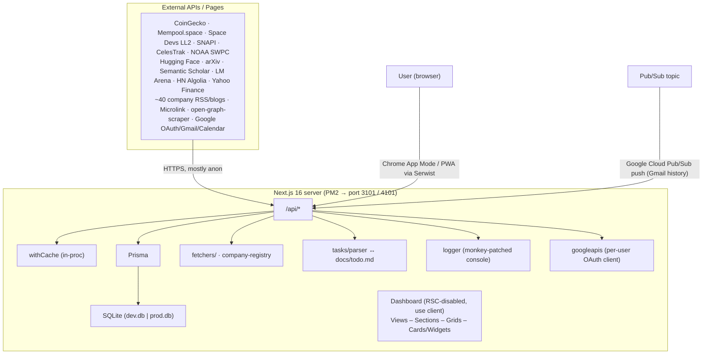

# Architecture Design Review

> **Document scope.** This is a synthesis review of the Mission Control system as it exists in the repository today. It complements the surface-level documents in `docs/` (`apis.md`, `frontend_terminology.md`, `hosting.md`, `todo.md`) by describing the system as a whole — its goals, layers, data flows, integration points, deployment model, observability, and the trade-offs and risks embedded in the current design. Where this document and the surface docs disagree, this document reflects what the code actually does.

---

## 1. Goals and Operating Context

Mission Control is a **single-user, self-hosted dashboard** that aggregates real-time and curated information across several life/work domains and exposes interactive control over a subset of them. It is not a SaaS product: it runs on the author's Mac mini at home, is reached locally (and intended to be reached from the LAN/PWA), and is consumed primarily through a Chrome "App Mode" window opened by `launch-ms.sh`.

The intentional design constraints that shape every other decision below are:

1. **Single user, single host.** Auth, session model, DB, caches, and hosting are all designed around one operator. There is no multi-tenancy, no horizontal scaling story, no role model.
2. **Always-on background process.** The production server is a persistent PM2 process; the UI is a thin client over it. Server uptime is part of the user experience.
3. **Hardware budget is small.** Mac mini RAM is the binding resource. Dev is capped at 2 GB old-space, prod at 1 GB (`package.json` scripts). Every "is it worth caching" decision is biased toward "yes."
4. **External APIs are flaky and rate-limited.** Most data does not originate here. The system's job is to wrap, normalize, cache, and degrade gracefully around a long tail of third-party APIs and HTML pages.
5. **The author is the only consumer.** "Documented" can mean "in `todo.md`," secrets can live in `.env`, and a feature can ship behind a `console.log`. This is reflected in the level of error-handling and validation throughout.

Everything that looks "weird" in the codebase — markdown-as-source-of-truth, in-process pub/sub for logs, an in-memory cache that survives HMR via `globalThis`, hand-written HTML scrapers per company — is downstream of these constraints.

---

## 2. System Context

The system has **one inbound integration that is not user-driven**: Google Cloud Pub/Sub pushes Gmail history events to `POST /api/gmail/webhook`. Everything else is initiated by the browser polling or fetching on demand.

---

## 3. Layered Architecture

The codebase is organized along the lines defined in `docs/frontend_terminology.md`. The full layering, including the server-side mirror, is:

| Layer | Location | Responsibility |
|---|---|---|
| **Hosting / Process** | `launch-ms.sh`, PM2 | Process supervision, environment loading, port management, Chrome app launcher |
| **Framework** | `next.config.ts`, `instrumentation.ts`, `middleware.ts` | Next.js (webpack), Serwist PWA wrapping, request logging, in-process logger init |
| **Persistence** | `prisma/`, `lib/prisma.ts` | SQLite via Prisma; dual DB files for dev/prod; query-level logging via `$extends` |
| **Domain libraries** | `lib/` | `cache`, `auth`, `googleapis`, `email-parser`, `company-registry`, `fetchers/*`, `tasks/parser`, `logger` |
| **HTTP API** | `app/api/**/route.ts` | Thin route handlers; dispatch to lib code; wrap with `withCache` where useful |
| **App shell** | `app/layout.tsx`, `app/page.tsx`, `app/globals.css`, `app/sw.ts` | Root providers, font loading, PWA SW, OKLCH theme variables |
| **Dashboard** | `components/Dashboard.tsx` | Slide carousel of dashes, global overlays (Launchpad, Library, AI Companion), bottom nav |
| **Views** | `components/views/*` | One per "dash" — owns data fetching for its section |
| **Sections** | `components/Section.tsx` | Thematic groupings inside a view, optional sub-headered groups |
| **Grids** | `components/grids/CardGrid.tsx` | Layout-only container; supports CSS-grid or CSS-columns masonry |
| **Cards** | `components/cards/*` | Bounded content units; receive data as props |
| **Widgets** | `components/widgets/*` | Stand-alone data/UX components (Kanban, Calendar, Graph, LaunchCalendar) |
| **Windows / Overlays** | `components/Window.tsx`, `components/overlays/*` | Floating/sliding UI that escapes the grid |
| **UI primitives** | `components/ui/*` | Card, ReloadButton, Scrollbar, PaperActions, TaskItem, CarouselControls |
| **State providers** | `components/providers/*` | NextAuth `SessionProvider`, `ThemeProvider`, Zustand stores (`themeStore`, `settingsStore`) |

A read-through of any feature touches at least four of these layers (e.g., FinanceView → CardGrid → AssetPriceCard → `/api/finance` → `withCache` → CoinGecko + Prisma).

---

## 4. Data Architecture

### 4.1 Storage choice

Persistence is **SQLite via Prisma**, with two separate database files swapped by environment:

- `prisma/dev.db` — selected by `.env.development`
- `prisma/prod.db` — selected by `.env.production`

This is appropriate for the single-host use case but means **every restart of `next dev` and `next start` works on a different dataset** unless the user is careful. There is no migration story across environments other than re-running `prisma migrate dev`.

### 4.2 Schema overview

The Prisma schema groups into four roughly orthogonal subdomains:

| Subdomain | Models | Purpose |
|---|---|---|
| **NextAuth** | `User`, `Account`, `Session`, `VerificationToken` | Standard NextAuth + Prisma adapter; stores Google refresh/access tokens on `Account` |
| **Applications pipeline** | `Application` | Job/internship/admissions tracker; owned by user; fed by Gmail webhook + manual edits |
| **Research library** | `SavedPaper`, `SelectedHistoricalPaper`, `SelectedReviewPaper` | User's saved papers + per-week deduplication ledgers for "paper of the week" features |
| **Crypto** | `CryptoPrice` | Time-series of BTC prices logged on each `/api/finance` hit and from seed scripts |
| **Tasks / Goals** | `Task`, `LifeGoal` | `Task` is a *projection* of `docs/todo.md`; `LifeGoal` is a separate, DB-native model |
| **Settings** | `GlobalSetting` | One row keyed `"global"` containing JSON of theme/dash preferences |

Notable: the `Task` table is **not** the source of truth for tasks. `docs/todo.md` is. Stable IDs are injected as inline HTML comments (`<!-- id: ... -->`) and the DB row is rewritten from the file on every mtime change.

### 4.3 Data flow patterns

The codebase uses **five distinct data-flow patterns**, each appropriate to a different class of data:

1. **External-API-only, fully cached** — most space/AI/research/news endpoints. `withCache(handler, ttl)` is the only persistence; on error, last-good is served. Examples: `/api/space/launches`, `/api/research`, `/api/ai/llmleaderboard`, `/api/company-news`.
2. **External + DB ledger** — `selectedReviewPaper` and `selectedHistoricalPaper` deduplicate weekly picks, and the historical/review endpoints check DB first before re-querying arXiv. The DB is a *commitment log*, not a cache.
3. **External + DB time-series** — `/api/finance` calls CoinGecko on every cache miss and inserts a `CryptoPrice` row, building a 24h history that the same response then reads back. The endpoint doubles as an opportunistic ingester. (`scripts/seed-crypto.ts` and `scripts/ingest-btc-history.ts` exist for backfill.)
4. **File-as-source-of-truth** — `docs/todo.md` ↔ `Task` table. `app/api/tasks/route.ts` re-syncs only when the file's mtime advances; PATCH/POST mutate the file *first*, then DB. An in-memory `Mutex` serializes file writes.
5. **External event-driven** — Google Cloud Pub/Sub pushes Gmail history events to `/api/gmail/webhook`, which decodes the base64 envelope, calls `gmail.users.history.list`, fetches new messages, and runs them through `parseApplicationEmail` (Gemini 3.0 Flash via `@ai-sdk/google`) to upsert `Application` rows. This is the only inbound integration.

Pattern 1 is the dominant one: **most endpoints are stateless cache-fronted external proxies.**

---

## 5. API Layer

### 5.1 Catalog (by feature area)

A complete inventory is maintained in `docs/apis.md`. The brief by-feature breakdown:

- **Auth** — `[...nextauth]` only. Google provider; offline access; Gmail r/o + Gmail send + Calendar events scopes.
- **System** — `/api/system` (telemetry — CPU, RSS, uptime, DB ping, cache stats), `/api/system/logs` (SSE stream).
- **AI** — `/api/ai` (HN Algolia AI stories), `/api/ai/llmleaderboard` (LM Arena scrape).
- **Research** — `/api/research`, `/research/hf`, `/research/historical`, `/research/review`, `/research/import`, `/research/saved`. Backed by Hugging Face Daily Papers, arXiv RSS, Semantic Scholar batch enrichment.
- **Finance** — `/api/finance`, `/api/finance/history`. CoinGecko, Mempool.space, Yahoo Finance for long-range BTC.
- **Space** — `/api/space` (SNAPI), `/space/launches` (Space Devs LL2), `/space/satellites` (CelesTrak), `/space/solar` (NOAA SWPC), `/space/moon` (deterministic ephemeris + hardcoded phenomena).
- **Company news** — `/api/company-news?company=<id>`. Strategy-dispatched (see §6).
- **Applications / Calendar / Gmail** — `/api/applications` (NextAuth-gated read), `/api/calendar/event` (Google Calendar GET/POST/DELETE), `/api/gmail/webhook` (Pub/Sub push).
- **Tasks / Goals / Settings** — `/api/tasks` (mtime-gated md ↔ DB sync), `/api/goals` (DB CRUD on `LifeGoal`), `/api/settings` (single JSON blob upsert).

### 5.2 Cross-cutting concerns

- **Middleware** (`middleware.ts`) — only logs `/api/*` requests via `console.info`. The matcher is narrow on purpose; broadening it sweeps assets and pages into the in-app log viewer.
- **Caching** (`lib/cache.ts`) — process-memory `Map<string, {data, expiry}>` keyed by `pathname + sorted query` (the `?v=...` cache buster is stripped before keying and forces a refresh). On handler error or non-2xx response, the last good entry is served and rewritten with a 60 s retry TTL. `Cache-Control` is `no-store` in dev and `max-age + stale-while-revalidate` in prod. Stats survive HMR via `globalThis`.
- **Auth gating** — only `/api/applications` reads the NextAuth session. `/api/calendar/event` takes `userId` as a query param and trusts it. `/api/gmail/webhook` trusts the Pub/Sub envelope's `emailAddress` to look up the user. **There is no Pub/Sub signature verification** — see §11.
- **Logging** — every route logs `[EXTERNAL API]`, `[DATABASE]`, `[CACHE HIT|MISS|FALLBACK]` lines through the patched `console`, which the SSE log stream re-broadcasts.

### 5.3 Conventions worth preserving

- `?v=<timestamp>` is the standard "force refresh" idiom across the frontend, handled inside `withCache`.
- Routes that fetch external data should be wrapped in `withCache`; bare `fetch` per request is the exception.
- Server-side logs go through `console.{info,warn,error}` so the SSE stream picks them up; introducing a separate logger would silently bypass the in-app log viewer.

---

## 6. Company News Subsystem

Out of all the per-feature subsystems, the company-news pipeline is the most engineered and deserves its own section. It is the answer to "given ~40 companies that publish through wildly different channels, how do we surface a uniform `NewsArticle[]` for each?"

### 6.1 Strategy registry

`lib/company-registry.ts` defines `COMPANY_REGISTRY: CompanyFeedConfig[]`. Each entry declares a fetch `strategy` and the strategy-specific config. Strategies (defined by `lib/fetchers/types.ts`):

- **`rss`** — `lib/fetchers/rss-fetcher.ts`. Parses an RSS/Atom feed; enriches each item with an OG image via `open-graph-scraper`. Used for NASA, ESA, Nvidia, Hugging Face, Microsoft Research, etc.
- **`scrape`** — `lib/fetchers/scrape-fetcher.ts`. Fetches a listing page, extracts `(slug, innerHTML)` pairs via a configurable `articleRegex`, optionally pulls title and date sub-regexes from the inner HTML, then enriches each via OGS. Used for Anthropic, xAI, Mistral, Qualcomm, Apple ML, ARM, Rocket Lab.
- **`snapi`** — `lib/fetchers/snapi-fetcher.ts`. Spaceflight News API search by `title_contains`. Used as a "what is third-party space press saying" feed for prime contractors and agencies that don't have RSS.
- **`google-news`** — `lib/fetchers/google-news-fetcher.ts`. Wraps Google News RSS search with a 7-day window; used as the fallback for paywalled or scrape-resistant sources (SemiAnalysis, foundries, Roscosmos, ByteDance).
- **`custom`** — inline functions in `company-registry.ts` for sources whose shape doesn't fit any of the above:
  - `fetchSpaceX` — SpaceX has its own JSON updates API.
  - `fetchOpenAI` — RSS + Microlink for images (Cloudflare blocks OGS).
  - `fetchGroq` — scrapes both `/blog` and `/newsroom` in parallel and merges by date; shifts midnight-UTC timestamps to noon-UTC to avoid timezone-rollback display bugs.
  - `fetchCerebras` — listing scrape with positional date/title pairing.
  - `fetchMetaAI` — listing scrape with proximity-based date/URL pairing because individual posts lack OG date metadata.

### 6.2 TTL discipline

Three tier presets (`TTL_STANDARD = 1h`, `TTL_LOW_VOLUME = 24h`, `TTL_VERY_LOW = 7d`) are assigned per company based on observed publishing cadence. Companies that post daily get the standard 1 h; small startups posting monthly get 7 d. This prevents the cache from constantly cycling on companies that don't change.

### 6.3 Operational implications

- **Adding a new RSS source is ~5 lines** of registry config; adding a new strategy requires a new fetcher module.
- **Custom fetchers are deliberately *inline*** — they're so per-source that abstracting them would be premature.
- **Failure mode is per-source.** A failing scraper doesn't break the view; the route returns whatever succeeds and the `withCache` layer keeps the last-good payload behind it.
- The registry is also consumed by the **frontend** — `AIView` and `SpaceView` import `COMPANY_REGISTRY` directly to know what to render and how to group it. The same file is the catalog for both fetcher dispatch *and* UI grouping.

---

## 7. Frontend Architecture

### 7.1 Shell: Dashboard as a slide carousel

`components/Dashboard.tsx` is the only top-level client component (`app/page.tsx` mounts it with `ssr: false`). It owns a `BASE_DASHES: DashConfig[]` array — currently seven entries: Space, Crypto/Finance, AI News, Internal Systems, Physics, Applications, Planning & Strategy. At any moment one dash is rendered full-screen; navigation is `←/→` buttons or the **Launchpad** overlay.

Three global overlays are owned by Dashboard:

- **LaunchpadOverlay** — grid view of all dashes with 0.25× live previews of each (real components, scaled via CSS transform inside a `pointer-events: none` mask so internal charts/inputs don't capture drags). Edit mode toggles drag-to-reorder + inline title editing. Local `localOrder` state during a drag prevents thrashing the global Zustand store and the `/api/settings` upstream sync on every frame; the `setDashOrder` call only fires on `dragend`.
- **SavedPapersOverlay** — right-sliding library panel scoped to the current dash's topic via `getTopic()`. Tabs for Waitlist / Favorites / Read / Import; the Import flow calls `POST /api/research/import` for preview, then `POST /api/research/saved` to persist.
- **AICompanion** — bottom-right floating Window receiving the current dash id as `activeContext`. **Currently a stub**: maintains local message state with a hardcoded delayed response (`AICompanion.tsx:36-42`). It does not call any API. This is the most prominent place where the UI's ambition exceeds the implementation; the surrounding work (auth scopes, Pub/Sub, Gemini integration in `email-parser.ts`) suggests the eventual implementation will use the same `@ai-sdk/google` plumbing.

### 7.2 The Dash registration contract

Adding a dash requires:

1. An entry in `BASE_DASHES` (id, title, component).
2. A topic mapping in `getTopic()` if the dash has saved papers.
3. A default title and hue in `themeStore.ts`'s `defaultDashTitles` and `viewHues`.

`syncAvailableDashes()` runs on every Dashboard mount and reconciles persisted state with current code: it purges stale ids, appends new ones, and force-pins `internal-systems` to the end of `dashOrder`. This means `themeStore` cannot accumulate dead state across code changes.

### 7.3 Per-view data ownership

Each view owns its own data fetching. There is no global polling daemon, no React Query, no SWR — just `useEffect` + `fetch` on mount and manual refresh handlers (with `?v=<ts>` cache busters). A handful of views set up intervals:

| View | Interval | What |
|---|---|---|
| `InternalView` | 5 s | `/api/system` poll + EventSource for `/api/system/logs` |
| `FinanceView` | 30 s (display) | The display-only "X minutes ago" pill rerenders; data itself is fetched on demand and via `withCache(300)` server-side |
| `SpaceView`, `AIView`, `PhysicsView` | none | Fetch on mount + manual refresh buttons; rely on server-side cache TTLs |
| `ApplicationsView` | none | Fetches on session ready |
| `PlanningView` | none | Fetches once; bumps `?force=true` on manual reload to force md re-sync |

Optimistic UI is used for state that the user mutates directly: `PlanningView` task status changes, `ResearchPaperCard` save toggles, `SavedPapersOverlay` deletes, `GoalCard` toggles. All revert on error.

### 7.4 State management

Two Zustand stores plus a few targeted browser primitives:

- **`themeStore`** (`components/providers/themeStore.ts`) — global UI preferences: `isDarkMode`, `viewHues` (per-view 0–360° hue), `viewHuesEnabled`, `dashOrder`, `dashTitles`, `defaultDashTitles`, `viewScreenshots`. **Not persisted by Zustand**: instead, `ThemeProvider` syncs the relevant subset to `/api/settings` (single-row JSON blob) on every change after first hydration. This was an explicit migration from `localStorage` to a DB-backed store so customizations follow the user across devices on the LAN (see `docs/todo.md` completed items).
- **`settingsStore`** (`components/providers/settingsStore.ts`) — feature flags (`autoResearch`, `backgroundTasks`). Persisted with Zustand `persist` middleware to `localStorage` under key `'settings-storage'`. These are device-local on purpose — they gate behaviors like background research polling that should not be active on every device simultaneously.
- **`localStorage` directly** — `mc-active-view` stores the last-viewed dash id, intentionally per-device.
- **NextAuth session** — `useSession()` in views that need the logged-in user (Applications, Internal for sign-in/out controls).

The result: **nothing about the UI requires global polling, websockets, or a Redux-like store**. The most "live" view is InternalView via SSE; everything else is fetch-on-mount with cache discipline on the server.

### 7.5 Theming

`app/globals.css` defines the design system in **OKLCH color space** parameterized by a single CSS custom property `--theme-hue: <angle>`. `ThemeProvider` writes that variable on every active-view change (`viewHuesEnabled ? viewHues[activeViewId] : 250`), and the 1 s CSS transition on `--theme-hue` makes per-dash color shifts smooth. Dark/light is toggled by adding/removing the `light` class on `<html>` and setting `colorScheme`. Light mode has a long `!important` override block because the rest of the app uses Tailwind opacity-on-black/white shorthands that need explicit inverts.

The PWA service worker (`app/sw.ts`, generated to `public/sw.js` via `@serwist/next`) is **disabled in dev** and unregistered defensively by an inline script in `app/layout.tsx` to prevent a stale dev SW from hijacking subsequent loads.

---

## 8. Cross-Cutting Subsystems

### 8.1 In-process logger

`lib/logger.ts` + `instrumentation.ts` install a 500-entry ring buffer on `globalThis` and **monkey-patch** `console.{log,info,warn,error}` and `process.stdout/stderr.write` to push every line into it. `getLogs()` and `subscribeToLogs(listener)` expose synchronous access plus a fan-out for the SSE consumer. The `inConsoleCall` re-entrancy guard prevents double-logging when the patched `console.log` itself writes to stdout.

This design has three notable consequences:

1. **Every `console.*` call from anywhere — including third-party libraries — appears in the in-app log viewer.** This is desired (it's how `[DATABASE]` and `[CACHE]` lines show up without explicit hooks) but it means a noisy dependency could flood the buffer.
2. **The buffer is global to the process, not per-request.** SSE clients see *all* server logs, not just their own. Acceptable for single-user.
3. **The fact that it's a `globalThis` ring buffer means it survives HMR**, so the Internal Systems view doesn't reset its history on every save in dev.

### 8.2 In-process cache

`lib/cache.ts` is the same pattern (a `globalThis` Map) for HTTP responses. `withCache(handler, ttl)` wraps a route handler; the wrapper:

1. Computes a cache key from `pathname + sorted query`, dropping the `v` param (and treating its presence as "force refresh").
2. On hit, returns the cached `NextResponse.json` with `X-Cache: HIT` and TTL-aware `Cache-Control`.
3. On miss, calls the handler. If it succeeds with JSON, the response is cloned, the body is parsed, and stored.
4. On handler **throw** *or* non-OK response: if a stale entry exists, it's served with `X-Cache: STALE-FALLBACK` and re-stored with a 60 s "retry window" so a flapping upstream doesn't get hammered.

This is a deliberately simple cache. There's no LRU eviction, no size cap, no per-key concurrency dedup ("thundering herd" if two clients miss simultaneously). For the single-user case those gaps are fine.

### 8.3 Auth and Google integrations

`lib/auth.ts` configures NextAuth with the Prisma adapter and a single Google provider. The provider asks for `access_type=offline` and the scopes `openid email profile https://www.googleapis.com/auth/gmail.readonly https://www.googleapis.com/auth/gmail.send https://www.googleapis.com/auth/calendar.events`. The long-lived **refresh token is stored on the `Account` row** by the Prisma adapter.

`lib/googleapis.ts:getGoogleAuthClient(userId)` rebuilds an OAuth2 client from that refresh token on demand. All server-side Gmail and Calendar code goes through this helper:

- `/api/gmail/webhook` calls it after looking up the user by `emailAddress` from the Pub/Sub envelope.
- `/api/calendar/event` calls it after pulling `userId` from the query string.

Adding a new Google scope requires bumping the `scope` string in `authOptions` and re-consenting — there's no incremental authorization flow.

### 8.4 LLM-driven email parsing

`lib/email-parser.ts:parseApplicationEmail()` calls `generateObject` from `ai` with `google("gemini-3.0-flash")` and a Zod schema (`applicationSchema`). The schema enforces the canonical fields the dashboard needs (`company`, `role?`, `status` ∈ APPLIED/UPDATED/ASSESSMENT/INTERVIEW_REQUESTED/INTERVIEW/OFFER/REJECTED, `nextSteps?`, `extractedDates[]?`). The Gmail webhook only invokes this if the subject contains "application" or "interview" — a cheap heuristic to avoid wasting LLM calls on every inbound email.

This is the **only LLM call in the system**. The author-facing AICompanion is a stub.

---

## 9. Deployment and Operations

### 9.1 Process model

- **Dev**: `npm run dev` — `NODE_OPTIONS='--max-old-space-size=2048' next dev -p 4101 --webpack`. Watches the file system; `next.config.ts` excludes `prisma/*.db`, `prisma/*.db-journal`, `public/sw.js`, `public/sw.js.map` from the watcher to prevent reload loops.
- **Prod**: `launch-ms.sh` orchestrates everything:
  1. `nvm use 24` + `cd` into the repo.
  2. `set -a && source .env` so the binary inherits secrets (the script comments note that `next start` doesn't auto-load `.env` like `next dev` does — this caused a real incident, see `todo.md` completed items).
  3. Starts `node_modules/next/dist/bin/next` (not `npm start`) under PM2 named `mission-control`, with `--max-old-space-size=1024`. Going through PM2 directly to the next binary avoids npm leaving an orphaned node process when PM2 deletes it.
  4. Polls until the port binds (IPv4 *or* IPv6) — bound to `localhost:3101` because hardcoding `127.0.0.1` broke Chrome on Node 17+ which prefers IPv6.
  5. Opens `open -n -W -a "Google Chrome" --args --app="http://localhost:$PORT"`.
- The Chrome window closing **does not stop the server**. PM2 keeps it running; logs accessed via `pm2 logs mission-control`.

### 9.2 Storage and configuration

- **DB files** in `prisma/` are gitignored. Dev and prod are *separate* files. There is no migration story between the two.
- **`.env` files** are gitignored. Two checked-in stubs (`.env.development`, `.env.production`) only contain `DATABASE_URL`. Real secrets (`GOOGLE_CLIENT_ID`, `GOOGLE_CLIENT_SECRET`, `NEXTAUTH_SECRET`, `GOOGLE_GENERATIVE_AI_API_KEY`, etc.) live in an untracked `.env`.
- **PM2 is not installed by `npm install`** — the `hosting.md` doc walks the user through `npm install -g pm2` and `pm2 startup` + `pm2 save`.

### 9.3 LAN access (planned)

`todo.md` has an open task to "broadcast the server on the local network and make it mobile-compatible." Today the binding is `localhost`, which means LAN access requires either changing the bind address in `launch-ms.sh` or proxying. The PWA + service worker pieces are already in place for the install-as-app flow once the network bind is opened.

### 9.4 Inbound webhook path

Per `todo.md`, the Gmail webhook is intended to be reached via **Cloudflare Tunnels** (`salsquared.xyz`) → Pub/Sub topic. This is the only way an external request gets to a Mac mini behind a residential NAT. Today the route works locally but the tunnel/Pub/Sub topic is an external prerequisite, not something the repo provisions.

---

## 10. Observability

The system has three observability surfaces, all in-process:

1. **`console`-based ring buffer** → `/api/system/logs` SSE → InternalView's "Event Log" panel. Provides ~500 most recent log lines with method/status colorization (`InternalView.tsx:formatLogMessage`). Server logs include request lines from `middleware.ts`, `[DATABASE]` lines from the Prisma `$extends` middleware, `[CACHE HIT|MISS|FALLBACK]` lines from `withCache`, `[EXTERNAL API]` lines from fetchers.
2. **Process telemetry** → `/api/system` polled at 5 s. Reports CPU% (delta over the polling window), RSS in GB vs. the `--max-old-space-size` parsed from `package.json`, uptime, DB connectivity (`SELECT 1`), and cache hit/miss + active entries.
3. **Cache stats** — embedded in (2). Lists active entry keys with remaining TTL. This is the only way to introspect the cache state.

**There is no external observability**: no metric export, no error reporting (Sentry, etc.), no log persistence beyond the ring buffer (lost on restart), no tracing. For a single-user system that's an explicit choice, but it means post-mortem debugging is limited to whatever was on screen.

---

## 11. Security and Threat Model

This is a **personal, LAN-bound** system, but several integration points still warrant attention:

- **Pub/Sub webhook is unauthenticated.** `/api/gmail/webhook` decodes the Pub/Sub envelope and looks up the `User` row by `emailAddress`. Anyone who can reach the endpoint and knows the user's email can synthesize a payload with a fake `historyId`. The endpoint will then call `gmail.users.history.list` against the *real* Gmail account using the stored refresh token, parse the result, and write `Application` rows. The harm is bounded (no data exfil, no token leak) but the endpoint should at minimum verify the `Authorization: Bearer` JWT that Pub/Sub attaches when push auth is enabled. **Recommendation: require Pub/Sub OIDC auth and verify the token before any side effects.**
- **Calendar endpoint trusts client-provided `userId`.** `/api/calendar/event` reads `userId` from query/body; any caller can pass any user id. On a single-user box this is a non-issue, but if LAN access opens up (per the open todo) this becomes a real privilege boundary. **Recommendation: derive `userId` from the NextAuth session, the same as `/api/applications`.**
- **`/api/goals`, `/api/research/saved`, `/api/settings`, `/api/tasks` are all unauthenticated.** Acceptable on `localhost`; not acceptable once exposed to LAN/tunnels.
- **HTML scrapers send a Mac UA and parse with regex.** Scrapers can break or hang on adversarial markup. The `withCache` STALE-FALLBACK behavior insulates the user from breakage but not from latency. Timeouts on `fetch` are not consistently set; OGS calls do set a 4 s timeout.
- **LLM input is uncontrolled email content.** A malicious sender could attempt prompt injection inside an email subject/body to coerce `parseApplicationEmail` into emitting a status it shouldn't. The Zod schema bounds the *shape* of the output but not its semantics; worst case is a wrong DB upsert.
- **Stored OAuth tokens.** Refresh tokens live in `prisma/prod.db` unencrypted. SQLite file permissions are the only defense. Acceptable for a personal Mac; not acceptable for any kind of multi-user deployment.
- **Service worker + `dangerouslySetInnerHTML` in `layout.tsx`** — only runs in dev, contents are static, no user input. Not a real risk but worth noting because it's the only `dangerouslySetInnerHTML` in the codebase.

The general posture is "trust the LAN, distrust nothing else." That's defensible given today's deployment but is brittle against the open todo "broadcast the server on the local network."

---

## 12. Performance Considerations

- **Memory budget is 1 GB in prod, 2 GB in dev.** RSS usage is monitored continuously by InternalView; the budget is what package.json declares, parsed at request time and cached.
- **Prisma query logging is per-request.** Every operation logs `[DATABASE] Executing <op> on <model>`. Cheap but not free; would be the first thing to disable if log volume becomes a problem.
- **The cache is unbounded.** A pathological caller passing arbitrary query strings could grow the in-memory map without limit. In practice the surface area is small (≈ a dozen stable cache keys at steady state).
- **Some endpoints do heavy work on the request path.** `/api/finance` writes a `CryptoPrice` row on every cache miss; `/api/space/launches` paginates LL2 results; HTML scrapers OGS-enrich every result item. The cache is what makes this acceptable.
- **OGS enrichment is sequential per article**, but `Promise.all` parallelizes within a fetch. A single failing OGS call can stall a fetch for the OGS timeout (4 s). That's bounded but visible on cold cache hits.
- **Prisma `$transaction` is used for the task sync** to make the "delete missing + upsert all" atomic. For a few hundred tasks this is fine; for thousands it would be the first place to look for slowness.

---

## 13. Trade-offs and Notable Design Decisions

| Decision | Trade-off |
|---|---|
| **SQLite in-process** | Zero-ops persistence, dual dev/prod files. No replication, no concurrent writers (`Mutex` already exists for the markdown file path). |
| **`docs/todo.md` as task source of truth** | Editing tasks in the editor *or* the UI is supported. PATCH writes the file *first*, bumps `lastSyncedMtime`, then updates the DB. The DB is a derived projection and can be rebuilt from the file at any time. |
| **In-process cache, not Redis** | Simpler, one fewer service. Loses cache on restart (mitigated by `globalThis` survival across HMR). No cross-process sharing — non-issue for single PM2 process. |
| **Monkey-patched `console`** | Every log line in the universe ends up in the in-app viewer for free. Cost: third-party library noise pollutes the feed; you can't have a "raw" `console.log` without it being captured. |
| **No React Query/SWR** | Less code, no extra dependency. Cost: every view manually wires `useEffect` + `fetch`; revalidation is ad hoc; there's no shared cache between two cards that need the same data. |
| **No tests** | Small surface, single user, fast iteration. Cost: regressions go unnoticed until the user hits them. The `scripts/tests/` directory contains *manual* test scripts (per `.agents/rules/scripts.md`), not automated ones. |
| **Webpack instead of Turbopack** | Stable, predictable. The `--webpack` flag is explicit on `next dev`/`next build`. |
| **`reactStrictMode: false`** | No double-mounts in dev. Cost: bugs that strict mode would catch (effect cleanup omissions, unstable identifiers) survive. |
| **Inline custom fetchers in the company registry** | New RSS company is 5 lines, idiosyncratic ones live next to their config. Cost: `company-registry.ts` is 900 lines and growing. |
| **Stub AICompanion** | Ships the surface area of the feature without the spend on LLM calls / persistence. Cost: mismatch between marketing copy ("Systems online. Monitoring all frequencies.") and reality. |
| **Two databases, one schema** | Clean separation between dev and prod data. Cost: no upgrade story, easy to forget which one a script is hitting. |

---

## 14. Risks and Tech Debt

Roughly ordered by severity:

1. **Pub/Sub webhook lacks signature verification.** See §11. Concrete code change: verify the `Authorization` JWT against the configured Pub/Sub push service account before processing.
2. **Calendar endpoint takes `userId` from the client.** See §11. Concrete code change: use `getServerSession` like `/api/applications` does.
3. **`/api/settings` is unauthenticated and global.** A single-row "global" config means *any* caller can rewrite the user's theme, dash order, and feature flags. Fine on localhost; problematic on LAN.
4. **Two `PrismaClient` instances.** `app/api/settings/route.ts` constructs its own `new PrismaClient()` rather than importing `lib/prisma.ts`. This means it bypasses the query-logging extension and risks connection pool exhaustion on hot reload. Concrete fix: import `prisma` from `@/lib/prisma` and delete the local construction.
5. **`/api/finance`'s opportunistic `CryptoPrice` insert** ties data ingestion to user traffic. If no one opens the FinanceView for a day, there is a gap in the time series. The seed scripts exist as a backstop but aren't scheduled. Concrete fix: a small cron-like ingester (or the new `/schedule` slash command) that calls the endpoint hourly.
6. **No automated tests.** `scripts/tests/*` are exploratory tsx scripts. Critical paths — the markdown task parser, the cache wrapper, the company registry dispatch — have no regression coverage.
7. **HTML scrapers rot silently.** When LM Arena or Anthropic redesigns its page, the regex breaks and the cache STALE-FALLBACKs forever (until restart). There is no "this fetcher is now consistently failing" alert.
8. **AICompanion is a stub.** UI promises functionality that doesn't exist; this is the most user-visible mismatch. The Gemini infrastructure already exists (`email-parser.ts`); reusing it for the chat is a small extension.
9. **Cache has no eviction.** A bug or attacker that keeps minting unique query strings will OOM the process before the 1 GB budget is hit.
10. **`scope` migration in NextAuth requires re-consent.** Adding a new Google scope silently breaks the app for the user until they re-sign-in; there's no mid-session prompt.
11. **`reactStrictMode: false`** masks effect-cleanup bugs. The interval+EventSource teardown in InternalView is correct today; nothing enforces it stays correct.
12. **Frontend interferes between sessions** — `todo.md` line 288 records this as an open issue. Two browser tabs editing the same task can cause the optimistic update to flicker / re-fetch unexpectedly. Without tests or per-tab state isolation it will keep recurring.

---

## 15. Where to Extend

Concrete extension points implied by the design — these are the seams the codebase currently exposes:

- **A new dash** → `BASE_DASHES` entry + `getTopic()` mapping + `themeStore.defaultDashTitles`/`viewHues` defaults. `syncAvailableDashes` handles the rest.
- **A new company news source (RSS)** → push a config to `COMPANY_REGISTRY`. No code.
- **A new news strategy** → new module under `lib/fetchers/`, add to the dispatch in `app/api/company-news/route.ts`, extend the `FetchStrategy` union.
- **A new external API endpoint** → route under `app/api/...`, wrap with `withCache` if cacheable, log via `console.info('[EXTERNAL API] ...')` so the SSE viewer picks it up.
- **A new Prisma model** → add to `prisma/schema.prisma`, run `npx prisma migrate dev`, import `prisma` from `@/lib/prisma` (not `new PrismaClient()`).
- **A new scheduled background job** → today there is no scheduler. The `/loop` and `/schedule` slash commands (Claude Code skills) are the de facto scheduling story. The `instrumentation.ts` register hook is also a viable home for a `setInterval`-based ingester.
- **AICompanion productionization** → reuse `@ai-sdk/google` from `email-parser.ts`. Streaming via the AI SDK's `streamText` would integrate cleanly with the existing client-side message state; the API surface (`POST /api/ai/chat` returning a stream) is the obvious next route.
- **Notification surface** (open todo) → there is no in-process scheduler today; the natural place for it is `instrumentation.ts` or a separate PM2 process. Push notifications would need a Web Push subscription stored alongside `User`.

---

## 16. Summary

Mission Control is a **single-host aggregation layer over many noisy external APIs**, presented through a single-page client carousel of "dashes" and persisted in SQLite. Its architecture is shaped by three forces: a tight RAM budget, the unreliability of upstream sources, and the fact that it has exactly one user.

The key invariants that make it work:

- **Stale-while-revalidate everything**: `withCache` makes flaky upstream APIs an internal concern, not a user-facing one.
- **Markdown ↔ DB for tasks**: the user's editor is a first-class write surface alongside the UI; the DB is a projection.
- **Console-as-bus**: every server-side `console.*` becomes an event in the in-app log viewer, no extra plumbing.
- **One source of truth per concern**: `themeStore`/`/api/settings` for cross-device prefs; `localStorage` for per-device prefs; `docs/todo.md` for tasks; `prisma` for everything else.
- **A registry, not a switch statement**: company news is a config table, not a tree of `if (company === ...)`. New sources are config; new shapes are code.

The most material open work is the **Gmail webhook auth gap**, the **stub AICompanion**, and the absence of any **automated tests**. Most other items in §14 are improvements rather than risks; together they describe a system that is comfortably correct for its current single-user, localhost deployment but would need meaningful hardening to face a wider blast radius.
