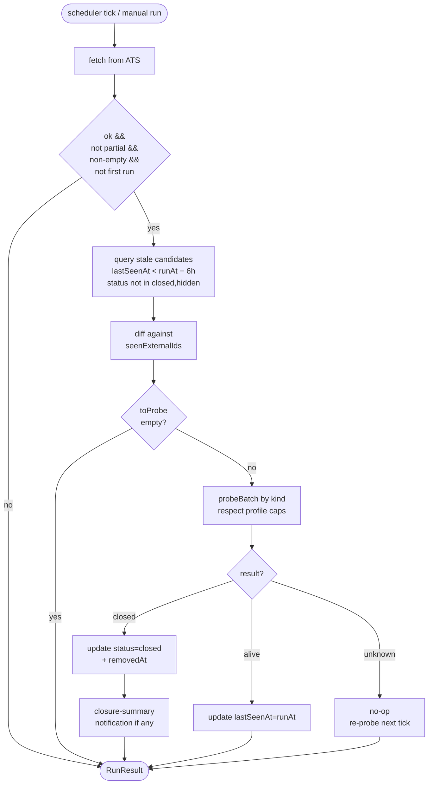

# Close-detection probe gate

> ✅ **SHIPPED — archived 2026-05-30.** This is the design doc; the feature is fully landed and live on both tiers. The runtime code is permanent (see the **Cleanup** section): `lib/postings/liveness.ts`, the `scheduler/jobs/job-watcher.ts` probe-gate, the `liveness-probe-smoke.ts` regression net, and the `recover-false-closed.ts` recovery tool. The durable, maintained reference now lives in `CLAUDE.md` ("Closed-posting detection is probe-gated") and `docs/implementation.md` (MB-2.4 + the cross-cutting table row); this file is retained as the historical design/rationale record.
>
> **What landed:** probe-gate across all 11 ATS kinds (commits `9fcd6df` `0deef8e` `9e29040` `98c57b0`), shipped to dev + prod 2026-05-25. The recovery script reopened **921 dev + 629 prod** false-closed postings.
>
> **Why archived 2 days before the literal soak window closed:** the doc's "≥7 days without regression" criterion ran 2026-05-25 → 2026-06-01 and was 2 days shy at archival. But 5 days of live logs on both tiers showed thousands of clean probe-gate runs, zero errors, and — decisively — the targeted failure modes confirmed handled: LinkedIn 24h-filtered and Workday page-capped candidates return `unknown`/`alive` and are **preserved**, never false-closed (e.g. `candidates=177 closed=1 alive=29 unknown=147`). Archived on that evidence.

**Status:** ✅ Shipped + live on both tiers. Archived 2026-05-30.
**Owner:** Sal.
**Filed:** 2026-05-25. **Landed:** 2026-05-25 (commits `9fcd6df` `0deef8e` `9e29040` `98c57b0`).

## TL;DR

`scheduler/jobs/job-watcher.ts` decides a `JobPosting` is closed based on a single heuristic: "the fetcher hasn't returned this `externalId` in the last 6 hours." That's a false-positive whenever the fetcher's view of the source is incomplete — which is the *normal* case for LinkedIn (`f_TPR=r86400` 24-hour filter + 50-posting page cap) and for Workday tenants larger than `MAX_PAGES × PAGE_SIZE = 200` jobs (Boeing, Blue Origin).

Empirical hit on dev.db (2026-05-25):

| Kind | Closed rows | Likely false-close share |
|---|---:|---|
| workday | 677 | Most. Boeing has 1,177 jobs; we cap at 200/crawl. |
| greenhouse | 369 | Some. boards-api returns the full live list; closures here are usually genuine. |
| linkedin | 201 | Almost all. The 24h filter + 50/crawl cap means any posting older than 24h or past slot 50 falls out. |
| clearcompany / ashby / lever | 16 total | Small absolute, but same risk class. |

The fix: before flipping a posting to `status="closed"`, **probe its `sourceUrl`** and only close on positive evidence of removal. Network errors / unknowns → leave alone (re-probe next tick). The lossy direction shifts from "false-close alive jobs" to "false-keep dead jobs" — a trade-off explicitly chosen because missing a live job (the user's framing: "don't miss any") is the more expensive failure.

## Goals

1. **Never auto-close a live posting** for any of the 11 supported ATS kinds.
2. **Eventually close genuinely-removed postings.** Acceptable lag: up to ~6 h after the source removes it (one stale-window).
3. **No degradation of crawl latency** for the common case (no stale candidates). Worst-case added latency bounded by the per-kind probe cap.
4. **Recover the existing false-closed backlog** on both dev and prod via a one-shot script.

## Non-goals

- Detecting "this job was edited" — only open/closed.
- Per-page closure-marker parsing for arbitrary `careers-page` sites — too site-specific. Those probes use HTTP status only.
- Replacing the existing `tracked` / `hidden` user states — they remain user-driven.
- Storing probe history (`lastProbedAt`, `probeAttempts`). Logs cover the same diagnostic need; can add later if it gets murky.

## Per-ATS probe profiles

Each kind gets its own concurrency / delay / per-tick cap / timeout. Heavier APIs that are designed for traffic (Workday, Greenhouse) get higher caps; anti-bot-sensitive sources (LinkedIn) get throttled hard; arbitrary custom sites (`careers-page`) get polite defaults.

| Kind | Concurrency | Per-hit delay | Per-tick cap | Timeout | Probe target | Rationale |
|---|---:|---:|---:|---:|---|---|
| **linkedin** | 1 | 1500 ms | 30 | 8000 ms | sourceUrl (HTML) | Anti-bot. Existing fetcher note: ≥60 min between fetches. 30/tick × 4 h cadence drains a 200-row backlog in ~28 h. |
| **workday** | 6 | 0 ms | **500** | 5000 ms | sourceUrl | Real APIs, large feeds. Workday tenant servers don't blink at parallel GETs. 500/tick drains a 700-row backlog in 2 ticks (~8 h). |
| **greenhouse** | 8 | 0 ms | 200 | 4000 ms | `boards-api.greenhouse.io/v1/boards/<slug>/jobs/<id>` | API endpoint, JSON, clean 404. Tiny payload. |
| **lever** | 6 | 0 ms | 100 | 4000 ms | `api.lever.co/v0/postings/<slug>/<id>` | Same as Greenhouse — API, clean 404. |
| **ashby** | 4 | 200 ms | 100 | 5000 ms | sourceUrl | Public board page (no good per-job API). Probes the HTML page directly. |
| **smartrecruiters** | 4 | 0 ms | 100 | 5000 ms | sourceUrl | Public posting page. 404 on removal. |
| **workable** | 4 | 0 ms | 100 | 5000 ms | sourceUrl | Same. |
| **recruitee** | 4 | 0 ms | 100 | 5000 ms | sourceUrl | Same. |
| **personio** | 4 | 0 ms | 100 | 5000 ms | sourceUrl | Same. |
| **clearcompany** | 4 | 0 ms | 100 | 5000 ms | sourceUrl | Same. |
| **careers-page** | 3 | 500 ms | 50 | 6000 ms | sourceUrl | Arbitrary external sites — be polite, conservative cap. |

The caps apply **per call to `probeBatch`**, which is **per watchlist per scheduler tick**. A single tick that touches 5 watchlists can do 5× the per-kind cap of probes total — that's fine because each watchlist's source is independent.

Caps are exported as a const map from `lib/postings/liveness.ts` so the recovery script can lift them per-batch.

## Architecture

### New module: `lib/postings/liveness.ts`

```ts
export type LivenessResult = "alive" | "closed" | "unknown";

export interface ProbeInput {
    externalId: string;  // map key for batch results
    sourceUrl: string;
}

export interface ProbeProfile {
    concurrency: number;
    perHitDelayMs: number;
    maxPerTick: number;
    timeoutMs: number;
}

export const PROBE_PROFILES: Record<WatchlistKind, ProbeProfile>;

export async function probePostingLiveness(
    posting: ProbeInput,
    kind: WatchlistKind,
    opts?: { timeoutMs?: number; signal?: AbortSignal },
): Promise<LivenessResult>;

export async function probeBatch(
    postings: ProbeInput[],
    kind: WatchlistKind,
    opts?: { profile?: Partial<ProbeProfile> },
): Promise<Map<string /* externalId */, LivenessResult>>;
```

#### Per-kind probe heuristics

| Kind | "closed" if | "alive" if | "unknown" otherwise |
|---|---|---|---|
| **linkedin** | Final URL (post-redirect) doesn't contain `/jobs/view/`, OR body contains any of `no longer accepting applications` / `job is no longer available` / `position is no longer` (case-insensitive) | 200 + `/jobs/view/` in final URL + body contains job-detail markers (`top-card-layout` / `description__text` / `apply-button` — at least one) | Anything else (5xx, network throw, timeout, ambiguous 200) |
| **greenhouse** | API 404 / 410 | API 200 with JSON body | Other |
| **lever** | API 404 / 410 | API 200 | Other |
| **ashby** | HTTP 404 / 410, OR final URL redirected to bare `jobs.ashbyhq.com/<slug>` (no posting id), OR body contains `posting could not be found` / `this job is no longer` | 200 with posting content | Other |
| **workday** | 404 / 410, OR redirect to non-`/job/` URL, OR redirect to `/login` / `/portal/login` | 200 with workday job markup (e.g. `data-automation-id`) | Other |
| **smartrecruiters / workable / recruitee / personio / clearcompany** | 404 / 410 | 200 | Other |
| **careers-page** | 404 / 410 | 200 | Other |

**Heuristic note.** The LinkedIn / Ashby / Workday body-marker lists above are *initial* heuristics derived from a small sample of probed pages. They live as a `const` array per kind inside `lib/postings/liveness.ts` so they're easy to extend without re-architecting the module. Post-deploy, monitor the logs for `[liveness] kind=<x> unknown` lines; recurring "unknown" results against URLs the user *knows* are closed are the cue to add a new marker. The API-based probes (greenhouse, lever) don't have this concern.

**Probe-target hierarchy for slug-aware kinds.** For greenhouse and lever, the probe prefers `<api host>/<slug>/<id>` parsed from `sourceUrl`. If the sourceUrl format doesn't match the expected pattern (unusual but possible with custom careers-page URLs that happen to use a greenhouse/lever board), the probe falls back to GETting `sourceUrl` directly with the generic 404-is-closed rule. Watchlist config holds the `boardSlug` as a tie-breaker for the parser.

All probes:
- Use `loggedFetch` (lands in `[EXTERNAL API]` counts on the FetcherHealthCard).
- Pass through `assertExternalHttpUrl` + `assertSafeResponseUrl`.
- Use the corresponding fetcher's User-Agent string.
- Wrap all errors → return `"unknown"`. Never let an exception escape.

#### Batch policy

- Run probes in chunks sized by `profile.concurrency`.
- Between consecutive hits to the **same host**, sleep `profile.perHitDelayMs` (matters mainly for LinkedIn).
- Cap total probes per call to `profile.maxPerTick`. Anything past the cap returns `"unknown"` in the result map so callers leave the row alone — next tick handles it.
- On a 429 from any probe, abort the rest of that batch and mark all remaining as `"unknown"` (telegraph the source asking us to back off).

### Integration: `scheduler/jobs/job-watcher.ts`

Current code path (`lines 414-449`):
```ts
const toCloseIds = staleCandidates.filter(c => !seenExternalIds.has(c.externalId)).map(c => c.id);
if (toCloseIds.length > 0) {
    const closeResult = await prisma.jobPosting.updateMany({
        where: { id: { in: toCloseIds } },
        data: { status: "closed", removedAt: runAt },
    });
    closed = closeResult.count;
}
```

New code path:
```ts
const toProbe = staleCandidates.filter(c => !seenExternalIds.has(c.externalId));
if (toProbe.length > 0) {
    const results = await probeBatch(
        toProbe.map(c => ({ externalId: c.externalId, sourceUrl: c.sourceUrl })),
        watchlist.kind as WatchlistKind,
    );
    const confirmedClosedIds: string[] = [];
    const aliveIds: string[] = [];
    for (const c of toProbe) {
        const r = results.get(c.externalId) ?? "unknown";
        if (r === "closed") confirmedClosedIds.push(c.id);
        else if (r === "alive") aliveIds.push(c.id);
    }
    if (confirmedClosedIds.length > 0) {
        const r = await prisma.jobPosting.updateMany({
            where: { id: { in: confirmedClosedIds } },
            data: { status: "closed", removedAt: runAt },
        });
        closed = r.count;
    }
    if (aliveIds.length > 0) {
        const r = await prisma.jobPosting.updateMany({
            where: { id: { in: aliveIds } },
            data: { lastSeenAt: runAt },  // resets the 6h stale clock
        });
        refreshedAlive = r.count;
    }
}
```

- `staleCandidates` query gains `sourceUrl` in its `select`.
- `RunResult` grows a `refreshedAlive: number` field.
- The closure-summary notification keeps using `closed` (now: confirmed only), so notifications stay accurate.
- The `lastSeenAt` bump for alive postings resets the 6h clock — a chronically-out-of-fetch-list-but-live posting (LinkedIn's 24h filter) gets one probe per 6h. Bounded, cheap.

### Flow



## Recovery script

`scripts/tests/debug/recover-false-closed.ts`. One-shot, manual, idempotent.

**What it does:**
1. Selects `JobPosting` rows where `status = "closed"`, optionally filtered by `--kind=<...>` / `--watchlist=<id>` / `--limit=<n>`.
2. Groups by watchlist `kind`, calls `probeBatch` per group with the per-kind profile (caps lifted via `--cap-multiplier=<n>`; default 1, meaning "respect the per-tick caps" — recommended to leave at 1 to avoid hammering).
3. For each probe result:
   - `alive` → reopen: `status = "tracked"` if an `Application.postingId` row exists, else `status = "new"`; `removedAt = null`; `lastSeenAt = now`. Broadcasts an SSE `Posting` event.
   - `closed` → leave as-is. Log the confirmation.
   - `unknown` → leave as-is. Log; next run can retry.
4. Logs a summary table: `<kind>: probed N, alive K, closed M, unknown U, reopened R`.

**Flags:**
- `--apply` — actually mutate (default is dry-run).
- `--kind=linkedin` — restrict to one ATS.
- `--watchlist=<id>` — restrict to one watchlist.
- `--limit=<n>` — cap how many rows are pulled (testing).
- `--cap-multiplier=<n>` — relax the per-kind probe cap to N× the live default. Use sparingly; defaults respect the production profile.

**Resumability:** the script is naturally idempotent — re-running it only mutates rows that probe `alive` *now*. A row probed `unknown` on the first run can be probed again on a later run.

## Rollout

| Step | Where | Action | Verify |
|---|---|---|---|
| 1 | local | Land probe module + integration commit | `npm run test:hermetic` green |
| 2 | dev | `pm2 restart mission-control-scheduler-dev --update-env` | tail logs for `[liveness]` lines on next 4h tick |
| 3 | dev | `DATABASE_URL=file:./dev.db npx tsx scripts/tests/debug/recover-false-closed.ts --kind=linkedin` (dry-run) | sanity-check the alive count |
| 4 | dev | same with `--apply` | Mattel posting flips back to `tracked`; CLOSED badge in the UI gone |
| 5 | dev | same for `--kind=workday`, `--kind=greenhouse`, others (dry-run first) | summary tables look right |
| 6 | local | Build for prod: `npm run build` | green |
| 7 | prod | `pm2 restart mission-control mission-control-scheduler-prod --update-env` | logs |
| 8 | prod | `DATABASE_URL=file:./prod.db npx tsx scripts/tests/debug/recover-false-closed.ts --kind=linkedin` (dry-run, then `--apply`) | spot-check |
| 9 | prod | same for other kinds | summary tables |
| 10 | both | Watch for 7 days | no new false-closes via `pm2 logs mission-control-scheduler-{dev,prod}` |

Recovery runs *after* the new probe-gated code is live, never before — running recovery against the old code path lets the next scheduler tick re-close everything we just reopened.

## Risks + mitigations

| Risk | Likelihood | Impact | Mitigation |
|---|---|---|---|
| LinkedIn 429s during heavy probing | Medium | Recovery stalls, future probes pollute logs | Per-kind profile already caps LinkedIn to 1 concurrency, 1.5 s delay. On 429 we abort the batch and mark remaining as unknown. Recovery is resumable. |
| LinkedIn closure-marker heuristic misses a closure pattern | Medium | False-keep (alive label on a dead posting) | Acceptable per goals — user explicitly preferred this direction. Can extend markers without breaking existing ones. |
| Workday probe storm tanks crawl latency | Low | Crawl tick takes minutes longer | Per-tick cap of 500 + 6 concurrency = ~42 s worst case at 500 ms / probe. Scheduler tick is every 10 min, watchlists run every 4 h — plenty of headroom. |
| Probe module catches an exception and silently returns `closed` | Low (defensively guarded) | False-close — the bug we're fixing | All probe paths default to `unknown` on exception. Unit tests cover this. Code review: grep the module for any path that returns `closed` without explicit positive evidence. |
| `careers-page` site returns 200 on a closed posting | Medium | Dead posting stays in the feed | Explicit non-goal — `careers-page` is too varied to parse uniformly. The user can hide / delete manually. |
| Recovery reopens a posting whose Application was already deleted | Low | Posting flips to `new` instead of `tracked` | This is correct behavior — the Application is gone, the posting is fresh-untouched. |
| Two simultaneous recoveries on the same tier | Low | Wasteful duplicate probes; no data corruption | Script doesn't acquire a lock. If the user re-runs while one is in flight, both run; the second will see most rows already reopened. Idempotent. |

## Hermetic smoke coverage

`scripts/tests/hermetic/liveness-probe-smoke.ts` (new). Wired into `scripts/pre-push.sh`.

Cases:
- Per-kind dispatch routes to the right probe (sample one URL per kind).
- LinkedIn alive (200 + markers).
- LinkedIn closed via redirect to `/jobs/search`.
- LinkedIn closed via "no longer accepting applications" body marker.
- LinkedIn ambiguous (200 but no markers) → unknown.
- Generic 404 → closed; 410 → closed; 5xx → unknown; network throw → unknown; timeout → unknown.
- `probeBatch` respects `maxPerTick` — postings past the cap come back as unknown.
- `probeBatch` respects `concurrency` — never more than N in-flight at once.
- `probeBatch` respects `perHitDelayMs` between same-host hits (timing assertion with stubbed clock).
- Integration: stub fetch + in-memory Prisma + drive `processOneInner` through one stale-candidate scenario, assert alive → `lastSeenAt` bumped + status preserved; closed → status flipped + removedAt set; unknown → row unchanged.

## File touch estimate

| File | Change | LoC |
|---|---|---:|
| `lib/postings/liveness.ts` | new | ~350 |
| `scheduler/jobs/job-watcher.ts` | replace 414–449 + `RunResult` field | ~40 net |
| `scripts/tests/hermetic/liveness-probe-smoke.ts` | new | ~400 |
| `scripts/pre-push.sh` | one new `SUITES` entry | +1 |
| `scripts/tests/debug/recover-false-closed.ts` | new | ~150 |
| `CLAUDE.md` | one sentence on probe gate in MB Phase 2a paragraph | +3 |
| `docs/implementation.md` | brief subsection cross-referencing this doc | +20 |

Net ~960 lines across 7 files.

## Commit plan

1. `feat(postings): add probePostingLiveness + per-kind profiles` — `lib/postings/liveness.ts` + smoke + pre-push wiring. Pre-push green.
2. `fix(job-watcher): probe-gate close detection across all 11 ATS kinds` — `scheduler/jobs/job-watcher.ts` integration. Pre-push green.
3. `chore(recovery): one-shot script + run against dev` — `scripts/tests/debug/recover-false-closed.ts`. No production code change; data-only diff committed via the run summary in PR description.
4. `docs: close-detection probe gate` — `CLAUDE.md` + `docs/implementation.md` deltas. (This file `docs/close-detection-probe.md` already exists from the planning stage.)

Splitting 1 and 2 lets the probe module land independently if a heuristic needs tweaking; reverting just commit 2 is a clean rollback.

## Cleanup

When archiving:
- Move `docs/close-detection-probe.md` → `docs/archive/close-detection-probe.md`.
- Keep `lib/postings/liveness.ts` permanent (it's load-bearing runtime code).
- Keep `scripts/tests/debug/recover-false-closed.ts` (it's a useful operational tool — re-run if a future fetcher bug creates a new false-close cohort).
- Keep the hermetic smoke (it's a regression net).
- The `CLAUDE.md` + `docs/implementation.md` deltas stay — they're the durable reference.
