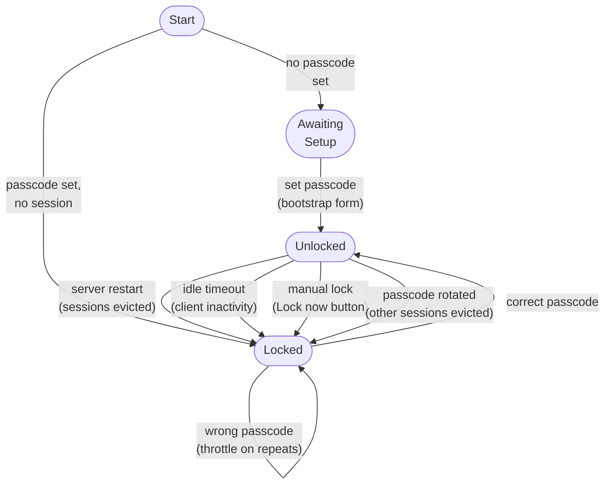

# User Stories

Working list. Priority emoji: **🔴** must-have for next ship, **🟡** important, **🔵** nice-to-have / later. **✅** = shipped end-to-end (verified against the codebase on 2026-05-15). **◐** = partial / in-scope-only (one half shipped, other half explicitly out-of-scope by Decision). **⛔** = user-declined.

**Implementation status, sub-milestones, file paths, and concrete API/schema shapes live in [`docs/implementation.md`](./implementation.md).** This doc says *what* and *why*; that one says *how* and *in what order*. Cross-session running state lives in [`docs/next_steps.md`](./next_steps.md).

Sections §1–§14 cover the applications/job-search feature set (umbrella goal: *apply to jobs*). Section §15 adds the cross-cutting application-lock infrastructure. Future cross-cutting concerns slot in as new sections in the same scheme.

## 1. Capture from email

- **S1.1** 🔴 ✅ As a job seeker, when a recruiter emails me, I want the app to detect it automatically so I don't have to manually log every confirmation, rejection, or interview invite.
- **S1.2** 🔴 ✅ As a user signing in for the first time, I want a one-click "Scan inbox" that walks the last 6 months so my pipeline isn't empty.
- **S1.3** 🔴 ✅ As a user, I want re-running a scan to be safe — no duplicate applications, no duplicate timeline rows.
- **S1.4** 🟡 ✅ As a user, I want clearly non-application emails (newsletters, generic marketing, ATS-promo blasts) to be filtered out before they hit the LLM classifier so I'm not paying tokens on noise.

## 2. Pipeline view

- **S2.1** 🔴 ✅ As a user, I want to see all my applications as a kanban (Applied / Phone Screen / Interview / Offer / Rejected) with company, role, and last-update date.
- **S2.2** 🔴 ✅ As a user, I want to drag an application between columns and have that status change persist.
- **S2.3** 🔴 ✅ As a user, I want to manually add an application that didn't come from email (e.g., I applied via a portal that doesn't send confirmation).
- **S2.4** 🔴 ✅ As a user, I want to click into an application and see its full timeline (every email, status change, interview, etc.) in chronological order.

## 3. Calendar integration

- **S3.1** 🟡 ✅ As a user, when an interview gets scheduled (by email or by me), I want it to appear on my Google Calendar automatically with the company/role in the description.
- **S3.2** 🟡 ✅ As a user, if I edit the calendar event in Google Calendar (reschedule, change notes), I want that to flow back into Mission Control.
- **S3.3** 🟡 ✅ As a user, I want to link a calendar event I already made manually ("phone screen with Acme") to an application without duplicating it.
- **S3.4** 🟡 ✅ As a user, I want the upcoming-events widget on the Applications dash to show only interviews & assessments — not every email-received row.

## 4. Manual edits

- **S4.1** 🟡 ✅ As a user, I want to edit any field on an application (company, role, status, next steps) and have it stick.
- **S4.2** 🟡 ✅ As a user, I want to add a free-form note to an application (e.g., "recruiter said decision by Friday").
- **S4.3** 🟡 ✅ As a user, I want to delete an application that was misclassified or no longer relevant.

## 5. Job discovery — crawlers & watchers

- **S5.1** 🔴 ✅ As a user, I want to declare watchlists of job-search criteria (role keywords, locations, seniority, remote ok, salary floor) so the app can hunt on my behalf.
- **S5.2** 🔴 ✅ As a user, I want to add specific company careers pages to a watchlist (e.g., rocketlabusa.com/careers, planet.com/careers, spacex.com/careers) so I get notified the moment they post a relevant role.
- **S5.3** 🟡 ✅ As a user, I want the crawler to support aggregate sources too — LinkedIn Jobs, Greenhouse-hosted boards, Lever-hosted boards, Ashby, Workday — so I don't have to maintain a list of direct URLs for every company.
- **S5.4** 🔴 ✅ As a user, I want each watchlist run to produce a deduped "new postings" feed (URL, company, title, location, posted-at, raw snippet) that I can review without leaving Mission Control.
- **S5.5** 🟡 ✅ As a user, I want to one-click "track" a posting from the feed and have it become a draft Application in `INTERESTED` status, with the listing URL and parsed metadata pre-filled.
- **S5.6** 🟡 ✅ As a user, I want crawlers to run on a schedule (e.g., hourly for LinkedIn, every 6h for direct careers pages) and respect each source's politeness limits — no aggressive scraping that gets the IP blocked.
- **S5.7** 🟡 ✅ As a user, I want the watcher to detect when a posting I've already saved gets *removed* from the source page so I know the role closed.
- **S5.8** 🔵 ✅ As a user, I want to define "negative filters" (companies, technologies, or phrases like "Series A," "on-site only") that auto-hide matching postings from my feed.
- **S5.9** 🔵 ✅ As a user, I want compensation parsed out of postings when present (range, equity hints, location adjustment) so I can sort by it. *(Shipped 2026-05-22 — `lib/postings/compensation.ts:parseCompensation` regex over `(title + snippet + location)` writes `compensationMin/Max/Currency/Cadence` columns on `JobPosting` at fetch time. Surfaced as an emerald chip on `NewPostingsCard` rows. Equity / location-adjustment storage explicitly deferred — they're free-text in the snippet and the structured-storage payoff isn't obvious yet. Sort-by-min is wiring-ready but not exposed in the UI.)*

## 6. Notification pipeline

- **S6.1** 🔴 ✅ As a user, when the crawler finds a new posting matching a high-priority watchlist, I want a notification (in-app, browser push, optionally email) within minutes — not the next time I open the dashboard.
- **S6.2** 🟡 ✅ As a user, I want a per-watchlist notification preference (e.g., "Rocket Lab — notify on anything new", "LinkedIn — daily digest only") so I'm not pinged for every fuzzy match.
- **S6.3** 🟡 ✅ As a user, I want notifications for application-side events too — interview scheduled, offer received, no response in N days, decision deadline approaching — using the same delivery mechanism as the crawler.
- **S6.4** 🔵 ✅ As a user, I want a "quiet hours" window so notifications don't fire while I'm asleep. *(Shipped 2026-05-22 — `GlobalSetting.quietHoursStart/End/Timezone` columns. `dispatchNotification` strips `email` from the channels of any non-critical dispatch that lands inside the window; the in-app surface keeps firing so the bell catches up at wake time. Critical tier (offers, interview-scheduled) bypasses the window — the user opted into the "ping me regardless" semantics for those. Wrap-around windows (22:00 → 08:00) handled correctly.)*

## 7. Resume & professional history

- **S7.1** 🔴 ✅ As a user, I want a structured profile of my work history (roles, companies, dates, responsibilities, skills, accomplishments with metrics) stored once and reused everywhere — not retyped per resume.
- **S7.2** 🔴 ✅ As a user, I want to import my profile from an existing resume (PDF / DOCX / LinkedIn export) so I don't bootstrap it by hand.
- **S7.3** 🔴 ✅ As a user, I want my profile to act as a master repository of resume material I can tailor from — not a single "current" resume. I want to upload one resume or many (over time, across roles), and have the LLM recognize duplicate items (same role, same bullet, near-identical wording across uploads) and merge them with what I've already captured, while adding any genuinely new items. Over months of applications this should *accumulate* into a richer pool, never overwrite it, so any future tailored resume can pull the strongest evidence from across my whole history.
- **S7.4** 🟡 ✅ As a user, I want to edit any history entry (add a bullet, fix a date, retire a role) and have the change flow into every future generated resume.
- **S7.5** 🟡 ✅ As a user, I want to tag bullets and accomplishments with skills/keywords (e.g., "Go", "distributed systems", "leadership") so I can filter and surface the right ones per role.
- **S7.6** 🔵 ◐ As a user, I want versioned snapshots of my profile so I can see how my history has been described over time and roll back unintended edits. *(Capture side shipped 2026-05-22 — `ProfileSnapshot` table, button-triggered "Snapshot now" + list with delete on `ProfileView`. Rollback / restore-from-snapshot intentionally deferred until the read-only safety net proves useful.)*
- **S7.7** 🟡 As a user adding a fresh WorkRole / Project / Education entry with no bullets yet, I want a "Draft with LLM" button that generates 3–5 starter bullets grounded in the entry's spine (company / title / dates / location), tag-overlapping bullets from sibling entries in my profile, **and matching spans from my uploaded-resume archive (S7.9)** — so the draft can recover wording or specifics from a prior version of the resume that didn't survive the merge into the current profile. I'm not staring at an empty card every time I add a new role. Generated bullets land as normal editable rows (`locked: false`, `excluded: false`) for me to refine, lock, or exclude.
- **S7.8** 🔵 As a user with an existing bullet that reads awkwardly, I want a per-bullet "Rewrite with LLM" affordance that shows the proposal as a diff (original → proposed) with Accept / Discard buttons — same bullet `id`, same tags, only the text changes — so I can polish wording without retyping and without a silent overwrite. The rewrite prompt grounds on the bullet's current text + tags, sibling tag-overlap context, **and archive spans (S7.9) where the same role / company appears with different framing** — so the LLM can borrow from a stronger phrasing in a prior version rather than inventing one. Locked bullets are excluded from the rewrite UI; everything else (including excluded and imported-but-never-edited bullets) is eligible.
- **S7.9** 🟡 As a user who has uploaded multiple resume versions over time, I want the system to retain each raw upload as a queryable archive (raw text + the LLM-extracted structured form + original file bytes), so that future LLM-driven features (bullet assist S7.7/S7.8, tailored generation, anything else) can reach back into prior versions to (a) surface alternative framings — a 2022 "Built TypeScript distributed system" and a 2024 "Engineered Go microservice cluster" describe the same role and the prompt should see both, and (b) recover details that lived in an old upload but didn't survive the current profile's merge. The archive is append-only — uploading a new resume never deletes a prior one. Today's M7.4 import pipeline extracts → merges → discards; this story closes the discard so the merge becomes lossless going forward.

## 8. Tailored resume generation

- **S8.1** 🔴 ✅ As a user, given a job posting (URL or pasted text), I want the app to generate a tailored resume that pulls only the most relevant bullets from my profile and reorders them to match the role's emphasis.
- **S8.2** 🟡 ✅ As a user, I want to see *why* each bullet was selected (which keyword in the posting it maps to) so I can sanity-check the output before sending.
- **S8.3** 🟡 ✅ As a user, I want to lock specific bullets as "always include" (e.g., my current role's headline) and exclude others entirely.
- **S8.4** 🟡 ⛔ As a user, I want to pick a visual template/style for the generated resume (single-column, two-column, ATS-plain) and have generation respect it. *(User decision 2026-05-15: every target company runs resumes through an ATS parser; visual-polish gain isn't worth the parsing risk on a non-plain template. `ats-plain.tsx` is final. See `implementation.md` M8 Phase 3.)*
- **S8.5** 🔴 ✅ As a user, I want the generated resume to be exportable as PDF and DOCX, with the same content rendered identically across both.
- **S8.6** 🟡 ✅ As a user, I want every generated resume archived against the Application it was sent for so I can later say "what version did I send Acme on March 5?"
- **S8.7** 🔵 ⛔ As a user, I want a generated cover letter alongside the resume, with the same posting/profile context. *(User decision: writing cover letters by hand. OOS.)*
- **S8.8** 🔵 ✅ As a user, I want a "skills gap" report — keywords the posting emphasizes that my profile lacks evidence for — so I know what to address in the cover letter or upskill on.
- **S8.9** 🟡 As a user generating a tailored resume, I want the LLM to *automatically* tag my profile bullets with the posting's keywords whenever the bullet's existing wording already evidences the work that keyword describes — writing into the existing [[S7.5]] tag column so new tags show up in the regular tag-edit UI for review or removal. **No fabrication:** the LLM only tags what the bullet text already supports. Tags persist (not posting-scoped), so coverage accumulates and the same bullet is recognized on later postings without re-tagging. Closes [[S8.8]] "gap" cases that were really tagging misses; gaps the LLM can't justify stay in the report.
- **S8.10** 🟡 As a user, once auto-tags from [[S8.9]] are in place (and I've optionally pruned ones I disagree with — i.e. "locked in" what I stand behind), I want the resume rewrite pass to fold those keywords into the selected bullets' wording on the next generate — verbatim where natural, skipped where forced. Tags already drive bullet *selection*; fold-in puts the keyword on the page so an ATS picks it up. The trace ([[S8.2]]) shows which keywords were folded.
- **S8.11** 🟡 As a user on the `GenerateResumeCard`, I want a global dropdown (next to or replacing "Download last") listing *every* previously generated resume regardless of which application it was attached to — filename, company / title, date, PDF/DOCX chip — so I can re-download a prior resume without drilling into its Application's overlay. The archive is the existing `GeneratedResume` table + `data/resumes/` directory; no new storage path — this is purely a global read-surface over what's already persisted.
- **S8.12** 🟡 As a user with applications already sitting in the "Interested" column of my kanban (often landed there via [[S5.5]] "track posting"), I want to generate a tailored resume against one of them directly from the `GenerateResumeCard` — single-pick, no bulk — without re-pasting the URL I already curated. The application's stored posting URL feeds the existing generate flow, and the resulting `GeneratedResume` row auto-links back to that Application via [[S8.6]]'s `applicationId` so the artifact attaches to the kanban card's timeline with no extra step.
- **S8.13** 🟡 As a user, the `GenerateResumeCard` should expose its three input modes — **Pipeline ([[S8.12]]) / URL / Paste** — as a segmented control at the top of the input area, only one input visible at a time (the three modes are mutually exclusive per generate). **Pipeline is the default tab** because most postings I generate resumes for come from the Interested column.

## 9. GitHub-driven project metrics

- **S9.1** 🟡 ✅ As a user, I want to connect my GitHub account so the app can keep an updated list of my repos, languages used, stars, commit cadence, and notable PRs. *(Per Decision 5: public API only, no OAuth — user sets `githubRepo` per Project.)*
- **S9.2** 🟡 ✅ As a user, I want to flag specific repos as "portfolio" so they're surfaced as project bullets on generated resumes with auto-summarized descriptions and metrics (LOC, language mix, "X commits over Y months", deploy/users if I provide them).
- **S9.3** 🟡 ✅ As a user, I want the project summaries to refresh on a schedule so a resume generated today reflects last week's progress, not a stale snapshot.
- **S9.4** 🔵 ✅ As a user, I want suggested portfolio-bullet rewrites when a repo's metrics meaningfully change (crossed a star threshold, shipped a new language, big release) so my resume stays sharp without me babysitting it. *(Shipped 2026-05-22 — `lib/profile/metric-deltas.ts:computeMetricDeltas` runs on every github-metrics scheduler tick. Detects star-threshold crossings (5/10/25/50/100/250/500/1k/2.5k/5k), primary-language flips, new ≥5%-share languages, and 25%-or-more commit-count jumps with absolute floor of +10. Each delta dispatches a `kind='system' tier='standard'` `Notification` keyed `portfolio-rewrite:${projectId}:${type}:${milestone}` so a milestone fires at most once. First-ingest (no prior metrics) is silent.)*
- **S9.5** 🔵 ✅ As a user, I want to pull READMEs into the profile as source material for bullet generation, not just commit metadata. *(Shipped 2026-05-22 — `Project.readme` + `readmeUpdatedAt` columns. New `fetchGithubReadme` in `lib/fetchers/github-public-fetcher.ts`, refreshed on a weekly cadence by `scheduler/jobs/github-metrics.ts`. Resume rewrite prompt includes a "Project READMEs" section keyed by sourceId for any project-source bullet in the selection — capped at 2 KB per project. Markdown is stored truncated at 16 KB to keep DB rows bounded.)*

## 10. Application document tracking

- **S10.1** 🟡 ◐ As a user, I want to attach the exact resume and cover letter I sent to each Application so the timeline shows the artifacts, not just the events. *(Resume side ✅ — `GeneratedResume.applicationId` links each gen to its app. Cover-letter side is OOS — see story S8.7.)*
- **S10.2** 🔵 ✅ As a user, I want a diff view between two resume versions sent to different companies so I can see what I changed and why. *(Shipped 2026-05-22 — `lib/resumes/diff.ts:computeResumeDiff` + `/api/resumes/diff`. UI: multi-select two rows in the Resumes section on `ApplicationDetailOverlay`, "Compare selected" reveals an inline panel with posting-keyword deltas, bullet-selection deltas, and shared-bullet rewrite differences side-by-side.)*

## 11. Follow-up & nudges

- **S11.1** 🟡 ✅ As a user, I want the app to flag applications where I've had no response in N days (configurable per stage) and offer to draft a follow-up email.
- **S11.2** 🔵 ✅ As a user, I want to track recruiter/hiring-manager contacts per application (name, email, last touched) so follow-ups are addressed to the right person. *(Shipped 2026-05-22 — `Contact` table per Application, CRUD via `/api/applications/contacts`, expandable "Contacts" section on `ApplicationDetailOverlay`. Stale-application nudges (story S11.1) now address the suggestion to the primary contact by first name when one exists.)*

## 12. Multi-kind applications

- **S12.1** 🔵 ✅ As a user, I want the same pipeline to handle non-job applications — citizenship, grad school, grants, accelerators — since the schema already supports `kind`. (Decide at MVP: keep the UI job-focused but don't paint into a corner.)

## 13. Side-work pipeline

Story S12.1 already proved the schema can carry multiple `kind`s through one pipeline. This section is the next axis: a parallel pipeline for *gig / blue-collar / pay-the-bills* applications, run alongside the career pipeline on the same dash. Background: the user is working as a security guard at Crypto Arena while career-hunting, and gig leads (barista, warehouse, delivery driver) shouldn't dilute the career kanban or vice-versa. Watchlists for this side are keyword-first (job type) rather than employer-first.

- **S13.1** 🔴 ✅ As a user juggling a security-guard job at Crypto Arena, I want a second pipeline for gig / blue-collar applications so leads I send for "barista" or "warehouse" don't dilute my career kanban.
- **S13.2** 🔴 ✅ As a user, I want side-track watchlists to take *keywords* (job-type queries like "delivery driver Los Angeles") instead of specific companies, since gig hunting is type-first not employer-first.
- **S13.3** 🔴 ✅ As a user, I want a separate kanban for side-track applications with the same status columns (Interested → Applied → … → Rejected) so the workflow is familiar.
- **S13.4** 🔴 ✅ As a user, I want side-track new-postings to surface in their own feed card so I can scan gig leads independently of career leads.
- **S13.5** 🟡 ✅ As a user, when a gig employer cold-emails me (no prior watchlist), I want the application to default to career and be easy to reclassify with one click — I'd rather flip a wrong one than train a classifier.
- **S13.6** 🟡 ✅ As a user, I want the same Calendar widget and Account Status card to serve both tracks — interviews are interviews, and I only have one Gmail account.
- **S13.7** 🔵 ✅ As a user, I want the same employer to be allowed in both tracks as separate applications (e.g., Starbucks barista in side, Starbucks corporate role in career) so dedup doesn't silently merge them.
- **S13.8** 🔵 ✅ As a user, I want to bulk-move applications between tracks if I miscategorize a batch (e.g., realized after the fact a Costco "operations associate" was actually corporate). *(Shipped 2026-05-22 — `CheckSquare` button on each kanban header enters select mode; checkboxes appear on cards; a "Move to <other-track>" action moves the whole selection in one transactional `POST /api/applications/bulk-track`. Same-employer-both-tracks conflicts surface as a 409 with the offending rows listed, no partial state.)*

## 14. Future / out of scope for now

- **S14.1** 🔵 Browser extension for one-click "save this posting" from any careers page (avoids needing every site supported by the crawler).
- **S14.2** 🔵 Auto-fill of application forms (Greenhouse / Workday / Lever) from the stored profile.
- **S14.3** 🔵 Interview prep tracker — questions asked per company, my answers, what to brush up on.
- **S14.4** 🔵 Salary research per company (Levels.fyi / public filings / glassdoor) auto-attached to applications.

## 15. Local auth — app-wide passcode gate

*Draft 2026-05-23. No code yet — stories below define what the gate should do; implementation order moves into `implementation.md` once approved. **Open questions** at the bottom of this section need user input before building begins.*

**Why this exists.** Mission Control is a single-user personal app exposed two ways: directly on the LAN (`localhost`, `mc.local`, phone-on-WiFi) and to the public internet through a Cloudflare tunnel. Today the only thing standing between the open internet and the UI is the Google OAuth sign-in screen — which was never intended as the front door. It was added so Gmail / Calendar features could read tokens, and grew into the de-facto application lock by accident. Concretely, over cellular today: `app/page.tsx` is `"use client"` with `ssr: false`, so the React shell + dash carousel + Launchpad render for *anyone* who reaches the hostname; data-heavy routes 401 cleanly via `requireSession` but the empty card frames are already visible. That's the "spotty" feel. The fix is a small, separate, application-level passcode that gates the entire UI surface and every protected API route, regardless of network. Google OAuth then goes back to its real job: holding Gmail / Calendar tokens for the features that actually need them.

**Goals.**
- Every page render and every protected API call require Local Auth — same gate from LAN, WiFi, cellular, tunnel, PWA install. No network-based exceptions.
- Google OAuth is decoupled and demoted to a feature-level capability ("connect Google" rather than "sign in").
- A locked browser sees a single overlay over a blank shell. No dash content, no launchpad, no AI Companion, no internal-systems telemetry leakage.
- Server restart = everyone is Locked again. Acceptable trade-off for a personal app; doubles as a panic-button (`pm2 restart mission-control` = "lock everything").
- Idle auto-lock so an unattended laptop or backgrounded phone tab eventually requires the passcode again.
- Easy local recovery: forgot password = edit a config file / DB row on the host, no out-of-band identity-verification dance.

**Non-goals.** Multi-user accounts. Federated identity, magic links, MFA, hardware-key support. Replacing service-token auth (Pulsar / scheduler keep `requireServiceToken`). Replacing OIDC verification on the Gmail Pub/Sub webhook (the OIDC JWT is the auth). Brute-force hardening beyond a basic per-IP throttle. Per-feature secondary passcodes. Biometric unlock (passkeys are a possible follow-up but not v1). Encrypting data at rest based on the passcode (the SQLite file remains plaintext locally; it's already encrypted at backup-time per RAH-13).

**Glossary.**
- **Local Auth** — the new app-wide passcode gate. Single secret, no username. Server-side session. Independent of any external identity provider.
- **Google OAuth** — existing NextAuth sign-in with `access_type=offline`. Sole purpose post-redesign: hold a refresh token for Gmail readonly/send and Calendar events. Not a UI gate.
- **Locked / Unlocked** — Local Auth states for the current browser. Unlocked = the server has issued a Local Auth session cookie that's still valid.
- **Signed in (to Google) / Not signed in** — orthogonal to Locked/Unlocked. You can be Unlocked but Not signed in, in which case Gmail/Calendar-dependent features degrade gracefully.

**State machine.**

**Bootstrap (first run).**
- **S15.1** 🔴 As the sole user, on the very first time the app starts after this feature lands, I want to be guided through setting a Local Auth passcode before the UI becomes usable, so the gate is never accidentally left off.
- **S15.2** 🔴 As the user, I want the bootstrap form to enforce a minimum passcode length (e.g. ≥ 8 chars) and require confirming the entry, so I don't lock myself out by typo on the very first set.
- **S15.3** 🟡 As the user, I want the option to set the bootstrap passcode via an env var or one-time CLI flow on the host, so I can stand the app up over SSH without first exposing an unprotected `/setup` page.
- **S15.4** 🟡 As the user, until I've set a passcode, the app must refuse to serve any UI or protected API beyond the bootstrap surface — even on the LAN. No "you haven't set a password yet, here's your dashboard anyway."

**Daily unlock flow.**
- **S15.5** 🔴 As the user, when I open the app and I'm not currently in an Unlocked session, I see a full-screen lock overlay with a single passcode field — no other UI is visible behind it.
- **S15.6** 🔴 As the user, after I enter the correct passcode, the overlay dismisses and the dashboard hydrates normally — no manual refresh, no re-navigation.
- **S15.7** 🔴 As the user, when I enter the wrong passcode, I get an immediate inline error and the field stays focused. After N consecutive failures from the same IP (suggest 5), the API delays its response by an increasing backoff (suggest 1s → 2s → 4s, capped). No silent lockout — just rate limiting.
- **S15.8** 🟡 As the user, the lock overlay supports paste (for password managers) and submits on Enter. On iOS it should not trigger autocomplete heuristics (`autocomplete="current-password"` + `inputmode` appropriate so 1Password / iCloud Keychain offers fill).
- **S15.9** 🟡 As the user, I want to see a small "you'll be locked again on server restart" hint on the overlay so the ephemeral-session behavior isn't surprising.

**Session lifetime + idle sleep.**
- **S15.10** 🔴 As the user, an Unlocked session persists across browser tab close/reopen as long as the server process keeps running. When the server (PM2 process) restarts, every existing session is invalid and every browser drops back to the lock overlay on the next request.
- **S15.11** 🔴 As the user, after the UI has been idle for some configurable duration (default: 30 minutes, no mouse / keyboard / touch / scroll), the frontend transitions to Locked locally *and* notifies the server to invalidate that session. Re-opening any other tab from the same browser is also Locked (sessions are server-side).
- **S15.12** 🟡 As the user, idle timeout is configurable from the Profile/Settings dash — values like 5 min, 15 min, 30 min, 1 h, 4 h, "never (only manual + restart)". Default 30 minutes; "never" is allowed and stored in `GlobalSetting`.
- **S15.13** 🟡 As the user, there's a "Lock now" action somewhere always-reachable (top-right menu, Internal Systems dash, keyboard shortcut — at least one). Useful when stepping away from the desk.
- **S15.14** 🔵 As the user, if my browser tab is backgrounded for longer than the idle threshold, I want the next time I switch back to the tab to find the lock overlay already up — not a stale dashboard that flashes data for 200 ms before the API call returns 401.

**Google OAuth interaction (the decoupling).**
- **S15.15** 🔴 As the user, when I'm Unlocked but have not signed in with Google, the dashboard loads and every feature that *doesn't* need Gmail/Calendar works normally (tasks, life goals, watchlists, postings, research, internal systems). Features that need Google show an inline "Connect Google to enable" affordance instead of an empty error state.
- **S15.16** 🔴 As the user, the Google sign-in flow is reachable from inside the Unlocked app (e.g. a "Connect Google" button in Settings, or directly inline on the first card that needs it) — *not* the front door.
- **S15.17** 🔴 As the user, if my Google session/refresh-token is revoked or expires, the app stays Unlocked and only the Google-dependent surfaces degrade. I'm not booted to a sign-in screen.
- **S15.18** 🟡 As the user, I want a single source of truth in the UI for "Google capabilities currently available" (scopes granted, last successful Gmail call, last successful Calendar call) so I can tell at a glance whether the degradation is on my side or theirs.
- **S15.19** 🟡 As the user, signing out of Google does *not* lock the app. Locking the app does *not* sign me out of Google.

**Multi-device / multi-network.**
- **S15.20** 🔴 As the user, the same gate applies whether I reach the app via `localhost`, `mc.local`, the phone-on-WiFi LAN IP, or the public Cloudflare-tunnel hostname. No network-based bypass. (This explicitly replaces `requireLocalOrSession`'s LAN-trusts-the-network behavior for browser-facing routes.)
- **S15.21** 🔴 As the user, each browser maintains its own Unlocked session — unlocking on my laptop does not unlock my phone. The shared secret is the passcode, not the session.
- **S15.22** 🟡 As the user, I can see a list of currently-active Local Auth sessions (rough identifier: User-Agent + IP + last-seen) on an "Active sessions" surface, with a per-row "Revoke" button.
- **S15.23** 🟡 As the user, "Revoke all other sessions" is a single button on the same surface. Useful after I've rotated the passcode or after I think I left a session open somewhere.
- **S15.24** 🔵 As the user, I want a notification (via the existing in-app `Notification` table) when a new device unlocks for the first time, so the first successful auth from a brand-new IP/User-Agent is visible to me after the fact.

**Passcode rotation.**
- **S15.25** 🔴 As the user, I can change my Local Auth passcode from inside the Unlocked app. The change requires the current passcode (typed) plus the new passcode (twice).
- **S15.26** 🔴 As the user, rotating the passcode immediately invalidates every other Local Auth session, but does *not* lock the session that performed the rotation. (One less surprise: the device I just typed the new password on stays usable.)
- **S15.27** 🟡 As the user, the same rotation flow lets me update the idle-timeout setting at the same time without a separate trip to Settings.

**Recovery / lockout.**
- **S15.28** 🔴 As the user, if I forget the passcode, the documented recovery path is: SSH to the host, run a one-liner (e.g. `npx tsx scripts/reset-local-auth.ts`) that clears the stored hash, then visit the app and re-bootstrap via S15.1. No emailed reset links, no recovery questions.
- **S15.29** 🔴 As the user, the recovery script must require the host's filesystem access (i.e. it manipulates the SQLite DB directly) and not be exposed as an API endpoint. The point is that physical/SSH access to the host is the recovery factor; nothing else.
- **S15.30** 🟡 As the user, the runbook for S15.28 lives in CLAUDE.md (or a linked doc) so a future me/Claude session can find it without rediscovery.

**Bypass allowlist (system + integrations).** The gate must *not* block these — they have their own stronger auth or no auth by design:

- **S15.31** 🔴 The NextAuth OAuth callback routes (`/api/auth/[...nextauth]/*`) must be reachable without Local Auth. They handle the Google OAuth handshake itself — gating them would create a chicken-and-egg loop.
- **S15.32** 🔴 The Gmail Pub/Sub webhook (`/api/gmail/webhook`) bypasses Local Auth. It's OIDC-verified via `verifyPubSubOIDC` — that's a stronger gate than a single shared passcode.
- **S15.33** 🔴 Service-token routes (anything currently using `requireServiceToken` / `requireSessionOrService` with a configured bearer) bypass Local Auth when the bearer matches. Pulsar / scheduler call paths shouldn't be required to know a UI passcode.
- **S15.34** 🔴 Static assets, `/manifest.json`, the service worker (`/sw.js`), favicons, and Next.js's build assets (`/_next/*`) bypass. (Otherwise the lock overlay itself can't load.)
- **S15.35** 🟡 A small unauthenticated healthcheck (`GET /api/health` returning `{ ok: true }` with no app-internal info) so external uptime monitoring doesn't need to be passcode-aware.
- **S15.36** 🟡 The Local Auth API itself (`POST /api/local-auth/unlock`, `GET /api/local-auth/session`) is unauthenticated for obvious reasons; the `unlock` endpoint must implement the S15.7 backoff.

**Server-side enforcement (truth, not just UX).**
- **S15.37** 🔴 As a security property, the overlay is the UX but never the truth. Every page route (`/`) and every non-bypass API route checks Local Auth server-side. A motivated attacker stripping the overlay client-side still gets 401s on every fetch and an empty HTML body on the page render.
- **S15.38** 🔴 As a refactor target, all current `requireSession` and `requireLocalOrSession` call sites should compose with a new `requireLocalAuth` such that the API layer enforces the gate in exactly one well-named place. Concretely: `requireLocalAuth` becomes the always-required outermost check; `requireGoogleSession` (renamed from today's `requireSession`) is layered on only where the route actually needs the Google identity.
- **S15.39** 🟡 `requireLocalOrSession`'s LAN-bypass behavior is removed for browser-facing routes. The two callers it currently has (`/api/settings`, `/api/system`) move to `requireLocalAuth` like everything else. (If a true LAN-only endpoint emerges later — e.g. local-network admin — it can use a renamed `requireLocalOrigin` without the session fallback.)

**Open questions for §15 (need user input before implementation):**

1. **Server-side session storage.** Three reasonable options for "lives as long as the server is alive":
   - **(a) In-memory only** — `Map<sessionId, expiresAt>` on `globalThis`, HMR-safe like the cache. Cleanest match to "as long as the server is alive"; restart = everyone Locked. Loses sessions on dev HMR though.
   - **(b) Signed cookie + server secret** — JWT signed by a process-startup secret. Restart rotates the secret → all old cookies invalid. Survives HMR.
   - **(c) DB-backed session table** — Survives restart unless you also wipe the table. Doesn't match "as long as the server is alive."

   Leaning **(a)** with **(b)** as a fallback if HMR pain is real.

2. **Where the password hash lives.** Options: a new `LocalAuthConfig` table (1 row), a new field on the existing single-row `GlobalSetting`, or a file at `~/.config/mission-control/local-auth.json`. The `GlobalSetting` route is the lightest touch. The file route makes recovery from another tool trivial.

3. **Default idle timeout.** Proposed 30 min. macOS screensaver is typically 5–15. Tighter (15) or looser (1 h)?

4. **Where the unlock UI mounts.** Two natural homes:
   - **As a sibling overlay in `components/Dashboard.tsx`** (alongside Launchpad / SavedPapers / AICompanion) — minimal blast radius, matches the existing overlay pattern.
   - **Wrapping `app/layout.tsx`** as a `LocalAuthGate` provider that holds children until the session check resolves — guarantees nothing renders pre-check (even auth-irrelevant UI primitives).

   Leaning overlay-in-Dashboard for symmetry; layout-level is slightly safer against accidental leakage of pre-unlock chrome.

5. **Internal Systems dash while Locked?** Argument for: it's how you'd debug a stuck unlock loop. Argument against: "all views require auth" was the explicit ask. Default to **no exception** unless overridden.

6. **PWA / installed-app behavior.** When installed via the manifest, the same lock applies. Anything we want differently for the installed PWA, e.g. a shorter idle timeout because the device is more likely to be a phone?

7. **Naming.** Using "Local Auth" / "passcode" throughout. Alternatives: "App Lock", "Site password", "Console password". Picking now keeps later renames cheap.

---

## Status snapshot (2026-05-23)

- **Sections §1–§14 (applications): all 🔴 must-haves shipped** (20/20 including §13 side-track 🔴 stories S13.1–S13.4). The end-to-end "apply ASAP" loop — capture, kanban, drill-in, watchlists, notifications, profile + import, tailored resume with PDF + DOCX, plus the parallel side-work pipeline — is in production.
- **🟡: 34 total, 25 ✅ + 1 ◐ + 1 ⛔ + 7 ⏳.** Story **S10.1** is ◐ partial — resume side shipped, cover-letter side OOS by user decision (story S8.7). Story **S8.4** is ⛔ user-declined (2026-05-15). Open 🟡: **S7.7** (⏳ LLM bullet fill) and **S7.9** (⏳ resume-upload archive) — both added 2026-05-23, both ship together as M7.6. **S8.9** (⏳ LLM auto-tag pass) + **S8.10** (⏳ rewrite-time keyword fold-in) + **S8.11** (⏳ global previous-resumes dropdown) + **S8.12** (⏳ generate against an Interested-column application, auto-attach via [[S8.6]]) + **S8.13** (⏳ Pipeline / URL / Paste segmented input control, Pipeline default) added 2026-05-24.
- **🔵: 14 total, 12 ✅ + 1 ◐ + 1 ⛔ + 1 ⏳** (shipped: **S5.8** negative filters, **S5.9** comp parsing, **S6.4** quiet hours, **S8.8** skills-gap, **S9.4** suggested rewrites, **S9.5** README ingestion, **S10.2** resume diff, **S11.2** recruiter contacts, **S12.1** multi-kind, **S13.7** same-employer-both-tracks, **S13.8** bulk-move tracks, **S7.6** ◐ capture-only). User-declined: **S8.7** (cover letter). Open: **S7.8** (⏳ LLM bullet rewrite, added 2026-05-23) and **S7.6**'s deferred rollback half.
- **🔵 future / OOS:** S14.1–S14.4.
- **Section §15 (local auth): greenfield as of 2026-05-23.** 22 🔴, 15 🟡, 2 🔵 — all unbuilt. Sees no code change until the seven Open Questions inside §15 are answered.

**Next-up candidates** (small surface, real leverage): **M7.6** — ships S7.9 (resume-upload archive) → S7.7 (LLM bullet fill, uses the archive) → S7.8 (LLM bullet rewrite, uses the archive) in that order. **M8.4 — Resume card v2 UX** (S8.11 + S8.12 + S8.13) and **M8.5 — Resume card v2 LLM coverage** (S8.9 + S8.10) queued behind Decision 6 (2026-05-24); M8.4 ships first. **S7.6** rollback UX remains deferred-by-design. **M14 (local auth)** queues behind §15 question-resolution.

---

## Decisions

### ✅ 1. Crawler runtime — `mission-control-scheduler` (NOT Pulsar)

Pulsar is strictly financial ingestion (crypto, stocks, FRED) and that boundary is load-bearing. Crawlers, watchers, and any non-financial recurring jobs live in the existing `mission-control-scheduler` PM2 process (`scheduler/index.ts`), which already shares the Prisma client and `prisma/prod.db` with the web tier under SQLite WAL.

Implication: new files for this work go under `scheduler/jobs/` (e.g., `scheduler/jobs/job-watcher.ts`). The web tier exposes read/write API routes; the scheduler ticks the cron and writes results into the shared DB. Mission Control is "just a frontend and interface" — it does not host the long-running crawlers in-process.

### ✅ 2. Notification delivery — in-app + email

Email is in scope; we'll need it for other notification surfaces in Mission Control anyway, so the work amortizes. SMS / push are deferred. Provider TBD when we wire it up (Resend / Postmark / nodemailer-via-Gmail are all on the table; pick when implementing).

### ✅ 3. Resume rendering — HTML → print-to-PDF (headless browser)

Templates live as React/HTML components. PDF export goes through a headless-Chromium print job (Puppeteer or Playwright). DOCX export comes later from the same templated HTML via an HTML→DOCX converter, so visual templates are defined once.

### ✅ 4. Profile schema — Option C (hybrid spine + JSON bullets)

A small set of "spine" tables for queryable structure, with bullets stored as JSON arrays on the entity that owns them. Picked over fully-normalized (A) and pure blob (B) as the right balance of selection ergonomics and schema stability for a single-user dataset.

Tables:
- `Profile` (userId, headline, summary, location, email, phone, linksJson)
- `WorkRole` (profileId, company, title, location, startDate, endDate, bulletsJson, order)
- `Project` (profileId, name, description, repoUrl, liveUrl, bulletsJson, metricsJson, order)
- `Education` (profileId, institution, degree, field, startDate, endDate, bulletsJson, order)

Each `bulletsJson` is `[{ id, text, tags: string[], locked: bool, excluded: bool }]` — bullet `id` is stable (cuid generated client- or server-side, stored inside the JSON).

Why this shape:
- **Selection (story S8.1)** stays SQL-ish: pull all bullets for a user (a handful of rows → a few hundred bullets total), filter by tag overlap with posting keywords in JS. LLM only rewrites the chosen bullets; it doesn't select.
- **Traceability (35) / lock / exclude (36)** all key off the stable bullet id.
- **Edit a bullet (31)** reads the owning row, mutates the JSON array, writes the row. Cheap for one user.
- **Skill tags** are denormalized strings inside each bullet — no `Skill`/`BulletSkill` join tables. Re-tagging means re-running the LLM tagger.
- **Versioning (33)** = snapshot table per spine entity (each row's prior state copied on edit), simpler than per-bullet audit rows.
- **Schema churn** stays low: adding "Publications" or "Talks" later is one new spine table, not a four-table migration.

Disfavored alternatives:
- **Option A (fully normalized)** — `Bullet`, `Skill`, `BulletSkill`, etc. Most ergonomic at query time, but 6–8 tables and the most schema-churn risk as the profile model evolves.
- **Option B (single JSON blob)** — fastest to ship but every generation pays LLM tokens to re-read the whole profile, and lock/exclude needs ids inside the blob anyway.
- **Option D (blob + denormalized BulletIndex)** — blob as canonical with a projected index. Rejected because the projection becomes the new thing that can silently drift.

### ✅ 5. GitHub access — public API only

No OAuth scope to maintain. We pull public repo metadata (commits, languages, stars, READMEs). Private repos are out of scope; if you want one represented on a resume you can add it manually as a `Project` row.

### ✅ 6. S8.9–S8.13 resume-card v2 — five product calls

Locked 2026-05-24 to unblock implementation.md milestones **M8.4** (UX) and **M8.5** (LLM coverage). Numbering = ship order, so M8.4 ships first.

1. **Re-tag tombstone (S8.9).** Per-bullet blocklist. Schema adds `removedTags: string[]` to each bullet's JSON shape. Auto-tag pass excludes any keyword already in the bullet's blocklist. One prune sticks; the user is the durable truth source. Rationale: matches "automatic, but I'm the truth source" without per-tag provenance complexity. Cheap migration.
2. **Auto-tag model tier (S8.9).** `MODEL_LITE` (`gemini-3.1-flash-lite`) — same tier as bullet-assist. Per-(bullet, keyword) yes/no is a tight judgment; LITE should hold quality. Cheapest spend per generate. Promote to `MODEL_FLASH` only if Promptfoo evals show it's subjectively poor.
3. **Auto-tag UI provenance (S8.9).** Subtle "auto" badge on auto-added tags until the user touches them (confirm-or-remove via the existing tag-edit UI). Once saved, the badge falls off and the tag becomes indistinguishable from a user-set tag. Cleanest provenance signal at review time; doesn't create permanent visual noise once accepted.
4. **No-URL Interested apps (S8.12).** Hidden from the Pipeline picker. The Pipeline tab lists only Interested apps with a URL — the URL is what the generate flow consumes. Manual-add-without-URL falls back to the URL or Paste tabs of the same segmented control ([[S8.13]]). Cleanest UX.
5. **Ship granularity.** Two milestones, sequenced UX-first:
   - **M8.4 — Resume card v2 UX** = [[S8.11]] + [[S8.12]] + [[S8.13]] (global previous-resumes dropdown, Pipeline input source, segmented control). Ships first — smaller surface, faster, immediate user-facing improvement. Mostly frontend + one endpoint extension.
   - **M8.5 — Resume card v2 LLM coverage** = [[S8.9]] + [[S8.10]] (auto-tag pass + rewrite-time fold-in). Ships second once the M8.4 ergonomics are in real-world use and the new auto-tag prompt has Promptfoo fixtures.

---

## Milestones

Tracks are independent (different code surfaces, can be sequenced or parallelized). Each milestone scopes to the 🔴 stories in its section; 🟡/🔵 stories live in a follow-up milestone of the same track.

### Track A — Pipeline UX & manual edits
Sections §2, §4, §10–12. Frontend-heavy; builds on existing `Application` + `ApplicationEvent`. Closest to user-visible value.

Current state (what already works): the Kanban view in `components/views/ApplicationsView.tsx` renders applications grouped by status across five columns (Applied / Assessment / Interviewing / Offer / Archive). `KanbanWidget` already supports drag-and-drop via an `onStatusChange` callback. The Gmail webhook + multi-kind classifier ingests new applications and writes `ApplicationEvent` rows. What's missing is *every write path from the UI* — status, manual add, edits, notes, delete — plus the per-application drill-in.

#### MA — Pipeline writes + drill-in (🔴 stories S2.1, S2.2, S2.3, S2.4) ✅ shipped

Verified end-to-end on 2026-05-15 (`scripts/tests/integration/applications-api-smoke.ts`, 10/10 green): POST manual create, PATCH status auto-emits a `STATUS_CHANGED` event with correct `fromStatus`/`toStatus`, POST `NOTE` events, GET timeline returns chronological events, DELETE removes from list, empty PATCH validates 400. The work below was already implemented (route + UI + api-client) before MA was reviewed — flagging here for traceability:

- **MA.1 — Write API.** Extend `app/api/applications/route.ts` with `POST` (manual create — story S2.3), `PATCH` (status + any field — story S2.2/13), `DELETE` (story S4.3, deferred until MA-followup but the schema supports it cleanly via cascade). All routes session-gated through `getServerSession` → `findUserByEmail` → ownership check on `Application.userId`. Zod schemas in a new `lib/schemas/applications.ts`. PATCH writes an `ApplicationEvent` of `kind: STATUS_CHANGED` (with `fromStatus`/`toStatus`) whenever status moves — so story S2.4's drill-in shows status flips alongside email events automatically.
- **MA.2 — Drag-to-status wiring (story S2.2).** `ApplicationsView` gets an `onStatusChange={(id, newStatus) => api.applications.update({id, status: newStatus})}` on the KanbanWidget, with optimistic update via TanStack `setQueryData` and rollback on error (mirroring the `PlanningView` pattern). Broadcast `Application.upsert` on the server side.
- **MA.3 — Manual add (story S2.3).** "Add application" button on the Applications dash header opens a small modal: company, role, status (default `APPLIED`), kind (`job` / `internship` / `college` / `other`), optional URL, optional date applied. POST creates the row and (if dateApplied is set) an `ApplicationEvent kind: APPLIED`. No email linkage required.
- **MA.4 — Drill-in timeline (story S2.4).** Click an application card → opens an overlay (`components/overlays/ApplicationDetailOverlay.tsx`) showing: header (company, role, status as editable chip, dates), timeline (every `ApplicationEvent` for this application, chronologically — `EMAIL_RECEIVED`, `STATUS_CHANGED`, `INTERVIEW_SCHEDULED`, etc., with each event's `title`/`notes`/`scheduledAt`/`occurredAt`), and a footer "Add note" composer. Pulls from the existing `/api/applications/events?applicationId=<id>` route; no new read endpoint needed.
- **MA.5 — Add-note composer (story S4.2, pulled forward).** The footer in MA.4 calls a new `POST /api/applications/events` with `{applicationId, kind: 'NOTE', title, notes, occurredAt: now}`. Notes are first-class timeline rows, not a separate `Application.notes` column — keeps the timeline as the only thing the user has to read to understand the application's state.
- **MA.6 — API client + types.** New `api.applications.update`, `api.applications.create`, `api.applications.delete`, `api.applications.events.create` in `lib/api-client.ts`. Zod response schemas; query key fanout: `['applications']`, `['applications', 'events', id]`.

**MA-followup ✅ also shipped:** inline-edit of `company` / `role` / `nextSteps` on the overlay (story S4.1 — `EditingField` state in `ApplicationDetailOverlay.tsx:37`), delete confirmation UI (story S4.3 — `Trash2` button + `window.confirm` at line 218), kind toggle UI on existing rows (story S12.1 — `kind` patch wired at line 146).

**MA-2 (🟡): partial.** Resume-side of stories S10.1–S10.2 ships via `GeneratedResume.applicationId` linkage. Cover-letter side OOS per story S8.7 user-decline. Story S11.1 follow-up nudges ✅ shipped via `scheduler/jobs/stale-applications.ts`. Story S11.2 recruiter contacts still open.

### Track B — Job discovery + notifications
Sections §5, §6. Self-contained server work: new scheduler jobs, new tables, a new fetcher strategy. Per Decision 1, all crawler work runs in `mission-control-scheduler` (NOT Pulsar — that boundary is load-bearing).

Current state: `scheduler/index.ts` is a simple `setInterval` runner with one job (`cache-prune`). `lib/fetchers/` has four strategies (rss, scrape, snapi, google-news) used by the company news pipeline. None of the watchlist / posting / notification schema exists yet.

#### MB — Watchlists, crawler, in-app notifications (🔴 stories S5.1, S5.2, S5.4, S6.1) ✅ shipped

- **MB.1 — Schema.** Three new tables:
  - `Watchlist` (id, userId, name, kind: `'careers-page' | 'keyword'`, config JSON, scheduleMinutes Int, lastRunAt DateTime?, lastSuccessAt DateTime?, lastError String?, active Boolean default true). For `careers-page` the config is `{ rootUrl, listingSelector, titleSelector, linkSelector, locationSelector?, postedAtSelector?, snippetSelector? }`. For `keyword` (deferred): `{ source, query, filters }`.
  - `JobPosting` (id, watchlistId, externalId String — stable hash of company+title+link when no native id, company, title, location, postedAt?, snippet?, sourceUrl, status: `'new' | 'tracked' | 'hidden' | 'closed'`, firstSeenAt, lastSeenAt, removedAt?, raw JSON). `@@unique([watchlistId, externalId])` for dedup.
  - `Notification` (id, userId, kind: `'posting' | 'application' | 'system'`, title, body, payload JSON, channels: `'in_app,email'`, createdAt, readAt?, dismissedAt?). Index `[userId, createdAt]`.

  Migration name: `add_watchlists_postings_notifications`. Add `User.watchlists`, `User.notifications` relations.

- **MB.2 — Generic careers-page fetcher.** New `lib/fetchers/careers-page-fetcher.ts`: given the `careers-page` config, fetch the root URL with a politeness-respecting client (single concurrent request per host, 2s min delay between requests to the same host, User-Agent identifying the bot), parse with cheerio, run the configured selectors, return `RawPosting[]`. Reused by the scheduler job — never called from web tier. Errors are reported but don't throw (writes `lastError` on the Watchlist).

- **MB.3 — Scheduler job.** New `scheduler/jobs/job-watcher.ts` exporting `runJobWatcher()`. Registered in `scheduler/index.ts` JOBS array, runs every 10 minutes.

- **MB.4 — Read/write API.** `app/api/watchlists`, `app/api/postings`, `app/api/notifications`.

- **MB.5 — In-app notification surface.** Global bell overlay reachable from every dash (`components/overlays/NotificationBell.tsx`), critical-tier pinning + red border.

- **MB.6 — Watchlists & feed view.** `WatchlistsCard` + `NewPostingsCard` on the Applications dash.

**MB-followup ✅ also shipped:**
- **Aggregator strategies** (story S5.3) — `greenhouse-fetcher.ts`, `lever-fetcher.ts`, `ashby-fetcher.ts`, `workday-fetcher.ts`, `linkedin-fetcher.ts`. Six fetchers total covering the source matrix.
- **LinkedIn** (story S5.6's hourly cadence + politeness-sensitive source) — guest scraper, fragile by design; per-page `AbortSignal` + Chrome UA.
- **"Track" → draft Application** (story S5.5) — `POST /api/postings/[id]/track-as-application` creates an `Application` with `status: 'INTERESTED'` prefilled from posting; writes a NOTE timeline event with the source URL.
- **Closed-posting UI** (story S5.7) — surfaced as `status: 'closed'` + `removedAt` in the postings feed.
- **Application-side notifications** (story S6.3) — central `lib/notifications/dispatch.ts` fires on application events.
- **Email delivery** (Decision 2) — Gmail OAuth via `lib/email/send.ts`; `EMAIL_ENABLED` master kill-switch gates dispatch.

**Still open in MB-followup:**
- **Per-watchlist notification preferences** (story S6.2) — would add `notificationMode: 'each' | 'digest'` to Watchlist + a daily digest scheduler job.

**🔵 round:** negative filters (story S5.8) ✅ shipped. Still open: compensation parsing (story S5.9), quiet hours (story S6.4).

### Track C — Profile + resume + GitHub
Sections §7, §8, §9. Unblocked by Decision 4 (Option C). Largest new surface area.

#### M7 — Profile spine + import (🔴 stories S7.1, S7.2) ✅ shipped

- **M7.1 — Schema.** `Profile`, `WorkRole`, `Project`, `Education` in `prisma/schema.prisma`. `bullets` JSON column shaped `[{id, text, tags[], locked, excluded}]`. Migration `add_profile_spine` applied.
- **M7.2 — Read/write API.** `app/api/profile/route.ts` + `work-roles`, `projects`, `education` subroutes.
- **M7.3 — `ProfileView` dash.** Mounted, default title + hue, cards stacked.
- **M7.4 — Import.** `POST /api/profile/import` with PDF / DOCX / TXT / JSON, multi-file in one upload, LLM extract → dedupe → append-merge.
- **M7.5 — Wiring.** TanStack keys + SSE invalidation.

**M7-followup ✅ also shipped:** tag editing UI on bullets (story S7.5), lock/exclude toggles + persistent badges (story S8.3). Still open: profile snapshots/versioning (story S7.6).

#### M8 — Tailored resume generation ✅ shipped (Phases 1 + 2 + 3)

🔴 stories S8.1, S8.5.

**Phase 1 — PDF MVP** ✅ shipped via `b2cbeb6`. `lib/ai/gemini.ts`, `lib/resumes/posting.ts`, `lib/resumes/select.ts` (deterministic; honors `locked` / `excluded`), `lib/resumes/rewrite.ts`, `lib/resumes/templates/ats-plain.tsx`, `lib/resumes/render-pdf.ts`, `app/api/resumes/route.ts`, `GenerateResumeCard`.

**Phase 2 — archival + traceability** ✅ shipped via `43404ed`. `GeneratedResume` table with `applicationId` linkage (story S8.6). "Why these bullets?" trace UI on `GenerateResumeCard` (story S8.2).

**Phase 3 — DOCX** ✅ shipped via `12bfa8c`. Same template feeds an HTML→DOCX converter.

**M8-followup still open:**
- Multiple templates (story S8.4) — only `ats-plain.tsx` exists.

**🔵 round:** skills-gap (story S8.8) open. Cover letter (story S8.7) declined.

#### M8.4 — Resume card v2: UX refactor ⏳ queued

Stories: [[S8.11]] + [[S8.12]] + [[S8.13]]. Ships **first** of the two M8 v2 milestones per Decision 6. Surface: `components/cards/GenerateResumeCard.tsx`. Touch points: global previous-resumes dropdown (extends `app/api/resumes/route.ts` GET); Pipeline input source pulling Interested-column applications (URL-less apps hidden per Decision 6.4); **Pipeline / URL / Paste** segmented control with Pipeline as default tab. No new LLM callsite; auto-link to Application via existing [[S8.6]] `applicationId` linkage. Implementation tasks land in `docs/implementation.md` Track C.

#### M8.5 — Resume card v2: LLM keyword coverage ⏳ queued

Stories: [[S8.9]] + [[S8.10]]. Ships **after** M8.4 per Decision 6. New LLM callsite (slug TBD, e.g. `bullet-auto-tag`) on `MODEL_LITE`; new prompt under `docs/llm-prompts/`; new Promptfoo fixture suite under `eval/suites/`. Schema migration adds `removedTags: string[]` to the bullet JSON shape (per-bullet blocklist, Decision 6.1). Subtle "auto" badge on auto-added tags in the existing tag-edit UI (Decision 6.3). Fold-in mechanic ([[S8.10]]) modifies the existing `lib/resumes/rewrite.ts` prompt to inject matched keywords verbatim where natural. Implementation tasks land in `docs/implementation.md` Track C.

#### M9 — GitHub-driven project metrics ✅ shipped

🟡 stories S9.1–S9.3. `scheduler/jobs/github-metrics.ts` hits the public GitHub API for `Project.githubRepo`-flagged rows and writes into `Project.metrics`. `Project.portfolio` flag drives which repos refresh + surface on resumes (story S9.2). Per Decision 5 — no OAuth, user specifies `githubRepo` per Project.

**M9-followup (🔵) still open:** suggested portfolio rewrites (story S9.4), README ingestion (story S9.5).
